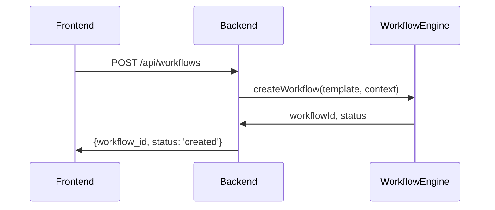
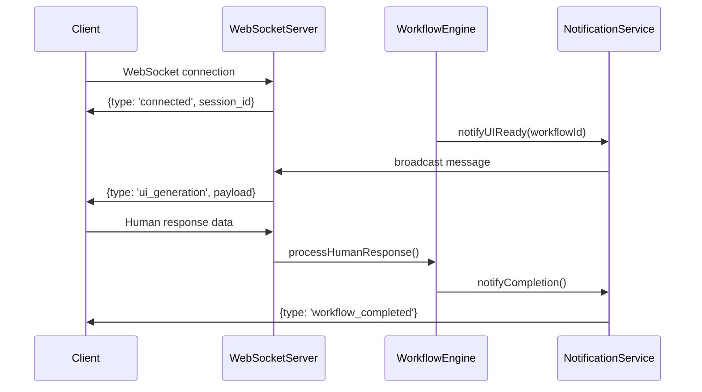
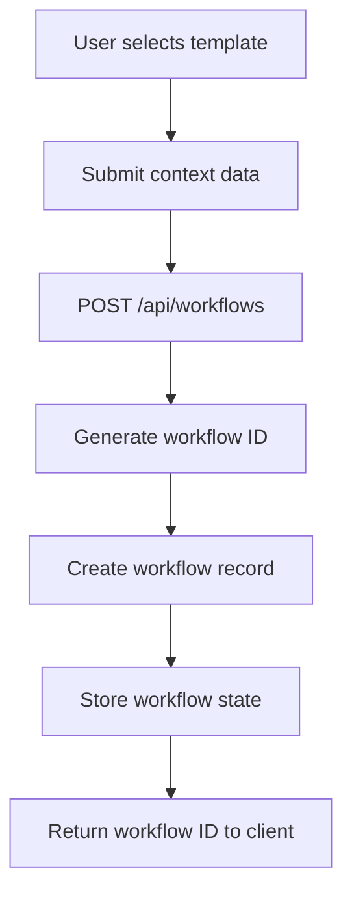
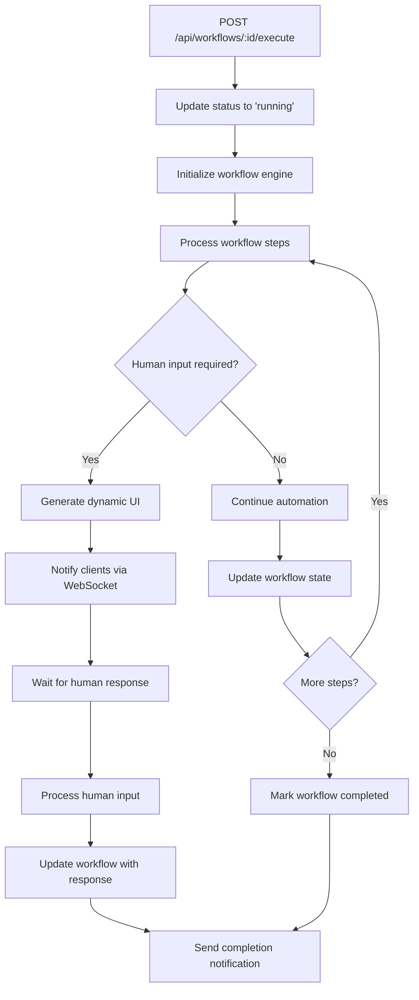
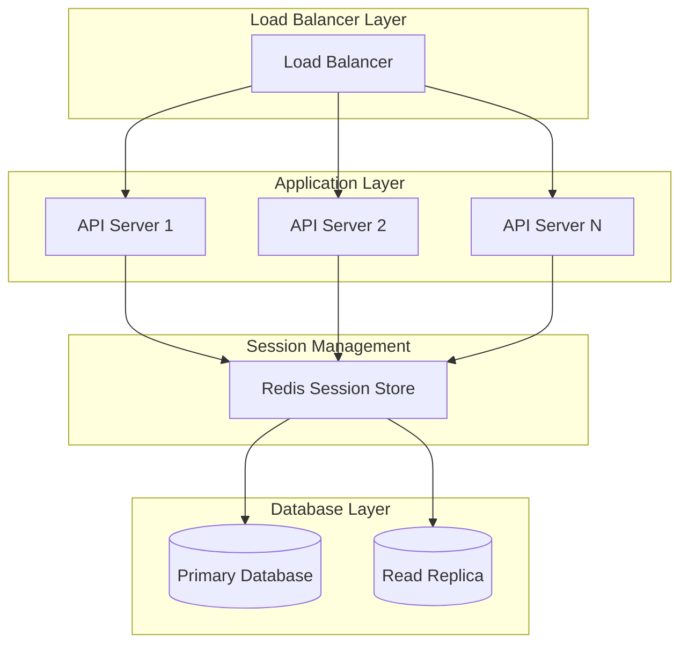
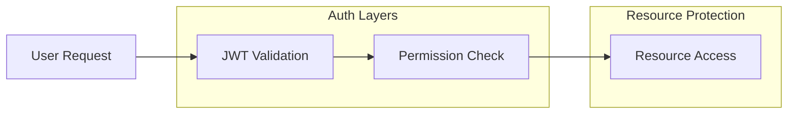
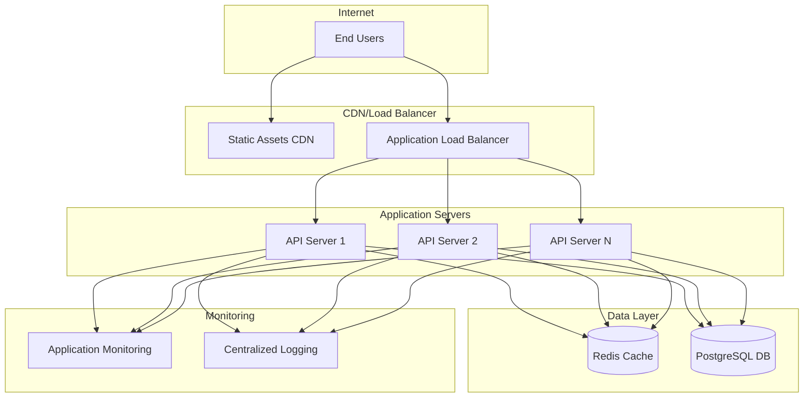
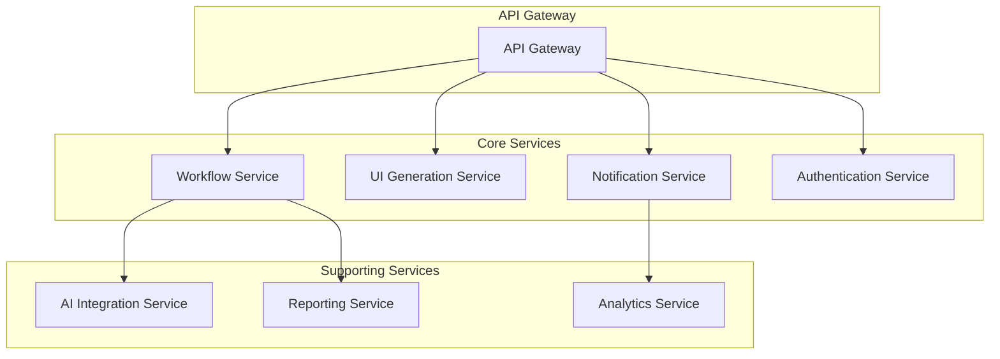

# GUI-LOP Platform Architecture Documentation

**Version:** 1.0.0
**Date:** October 26, 2025
**Author:** System Architecture Designer

---

## Executive Summary

### Business Context and Objectives

The **Generative UI & Human-in-the-Loop Orchestration Platform (GUI-LOP)** is a sophisticated development platform designed to bridge the gap between automated AI workflows and human decision-making processes. The platform enables organizations to create, manage, and execute complex workflows that combine AI-driven automation with critical human oversight and intervention points.

### Key Business Drivers

1. **Human-AI Collaboration**: Facilitate seamless collaboration between AI systems and human experts
2. **Workflow Orchestration**: Provide robust tools for creating and managing complex business workflows
3. **Real-time Interaction**: Enable instant communication and decision-making through modern web interfaces
4. **Scalable Architecture**: Support enterprise-grade deployment with high availability and performance
5. **Developer Experience**: Offer comprehensive tooling for rapid development and deployment

### Platform Value Proposition

GUI-LOP delivers a unique value proposition by combining:
- **Generative UI Components**: Dynamic interface creation based on workflow requirements
- **Human-in-the-Loop Integration**: Strategic human intervention points in automated processes
- **Real-time Communication**: WebSocket-based instant messaging and notifications
- **Modular Architecture**: Extensible design supporting custom workflows and integrations
- **Comprehensive Testing**: End-to-end validation through automated testing suites

---

## System Design Overview

### High-Level Architecture

The GUI-LOP platform follows a **distributed microservices architecture** with clear separation of concerns:

```
┌─────────────────┐    ┌─────────────────┐    ┌─────────────────┐
│   Frontend      │    │    Backend      │    │  External       │
│   (React)       │◄──►│   (Express)     │◄──►│  Services       │
│                 │    │                 │    │                 │
│ • UI Components│    │ • REST API      │    │ • AI Services   │
│ • State Mgmt    │    │ • WebSocket     │    │ • Data Sources  │
│ • Routing       │    │ • Workflow Eng  │    │ • Integrations  │
└─────────────────┘    └─────────────────┘    └─────────────────┘
         │                       │                       │
         │                       │                       │
    ┌─────────────────┐    ┌─────────────────┐    ┌─────────────────┐
    │   Development   │    │     Testing     │    │   Deployment    │
    │   Environment   │    │   Framework     │    │   Infrastructure│
    │                 │    │                 │    │                 │
    │ • SPARC Method  │    │ • Playwright    │    │ • Docker Ready  │
    │ • Claude Flow   │    │ • Jest Testing  │    │ • CI/CD Ready   │
    │ • Agent Swarm   │    │ • E2E Coverage  │    │ • Monitoring    │
    └─────────────────┘    └─────────────────┘    └─────────────────┘
```

### Core Architectural Principles

1. **Separation of Concerns**: Clear boundaries between frontend, backend, and external services
2. **Event-Driven Design**: Real-time communication through WebSocket connections
3. **RESTful API Design**: Standardized HTTP endpoints for workflow management
4. **Test-Driven Development**: Comprehensive testing at all levels
5. **Modular Extensibility**: Plugin architecture for custom workflow components
6. **Scalability First**: Horizontal scaling and load distribution capabilities

---

## Component Architecture

### Frontend Components

#### React Application Structure
```
src/frontend/
├── src/
│   ├── index.js                 # Application entry point
│   ├── App.js                   # Main application component
│   ├── components/              # Reusable UI components
│   │   ├── WorkflowDashboard/   # Workflow management UI
│   │   ├── TaskInterface/       # Human interaction components
│   │   └── NotificationPanel/   # Real-time notifications
│   ├── services/                # API integration layer
│   │   ├── api.js              # Backend API client
│   │   └── websocket.js        # WebSocket management
│   └── utils/                   # Helper utilities
├── tests/                       # Frontend testing suite
│   ├── e2e/                    # End-to-end tests
│   └── integration/            # Integration tests
└── package.json                # Frontend dependencies
```

#### Key Frontend Technologies
- **React 18.3.1**: Modern UI framework with hooks and concurrent features
- **React Router DOM 7.9.3**: Client-side routing for SPA navigation
- **React Scripts 5.0.1**: Build tooling and development server
- **Playwright 1.55.1**: Advanced E2E testing framework
- **Testing Library**: Component testing utilities

### Backend Components

#### Express Server Architecture
```
src/backend/
├── simple-server.js            # Main server application
├── routes/                     # API route handlers
│   ├── workflows.js           # Workflow management endpoints
│   ├── templates.js           # Workflow template system
│   └── health.js              # Health check endpoints
├── services/                   # Business logic layer
│   ├── workflowEngine.js      # Workflow orchestration
│   ├── uiGenerator.js         # Dynamic UI generation
│   └── notificationService.js # Real-time notifications
├── models/                     # Data models and schemas
│   ├── Workflow.js            # Workflow data structure
│   └── User.js                # User management
└── utils/                      # Server utilities
```

#### Key Backend Technologies
- **Express 4.21.1**: Fast, minimalist web framework
- **WebSocket (ws) 8.18.0**: Real-time bidirectional communication
- **UUID 10.0.0**: Unique identifier generation
- **CORS 2.8.5**: Cross-origin resource sharing
- **HTTP Module**: Native Node.js HTTP server

### Development Infrastructure

#### SPARC Development Methodology
The platform implements **SPARC (Specification, Pseudocode, Architecture, Refinement, Completion)** methodology:

1. **Specification**: Requirements analysis and documentation
2. **Pseudocode**: Algorithm design and logic planning
3. **Architecture**: System design and component relationships
4. **Refinement**: TDD implementation and iteration
5. **Completion**: Integration and deployment preparation

#### Claude Flow Integration
Advanced agent orchestration system with:
- **54+ Specialized Agents**: Domain-specific AI assistants
- **Swarm Coordination**: Parallel task execution
- **Memory Management**: Persistent context and learning
- **Verification System**: Truth validation with 95% accuracy threshold
- **GitHub Integration**: Automated repository management

---

## Component Interactions and Communication Patterns

### Request-Response Pattern (REST API)

#### Workflow Creation Flow


#### API Endpoints Specification

**Health Check Endpoints:**
- `GET /health` - Server health status
- Response: `{status: 'ok', timestamp, message}`

**Workflow Management:**
- `GET /api/workflows/templates` - Retrieve workflow templates
- `POST /api/workflows` - Create new workflow instance
- `GET /api/workflows/:id` - Get workflow status and details
- `POST /api/workflows/:id/execute` - Start workflow execution
- `POST /api/workflows/:id/respond` - Submit human response

### Real-time Communication Pattern (WebSocket)

#### WebSocket Message Types
```javascript
// Connection establishment
{
  type: 'connected',
  session_id: 'uuid',
  message: 'Connected to GUI-LOP WebSocket'
}

// UI generation notification
{
  type: 'ui_generation',
  workflow_id: 'uuid',
  payload: {
    ui_url: 'http://localhost:8501/workflow-id',
    components: ['dashboard', 'approval_form'],
    message: 'Interactive dashboard ready'
  }
}

// Workflow completion
{
  type: 'workflow_completed',
  workflow_id: 'uuid',
  payload: {
    message: 'Workflow completed',
    result: {human_response_data}
  }
}
```

#### WebSocket Connection Flow


### Event-Driven Architecture

#### Event Types and Handlers

**Workflow Events:**
- `workflow.created` - New workflow instance created
- `workflow.started` - Workflow execution initiated
- `workflow.ui_generated` - Dynamic UI components ready
- `workflow.human_input_required` - Waiting for human intervention
- `workflow.completed` - Workflow finished successfully
- `workflow.error` - Workflow execution failed

**System Events:**
- `client.connected` - New WebSocket client connected
- `client.disconnected` - Client connection closed
- `server.shutdown` - Graceful server shutdown initiated

---

## Data Flow Analysis

### Workflow Execution Data Flow

#### Phase 1: Workflow Initialization


#### Phase 2: Workflow Execution


### Data Storage Architecture

#### In-Memory Data Structures
```javascript
// Workflow storage (Map for O(1) access)
const workflows = new Map();

// WebSocket client management
const clients = new Set();

// Workflow data structure
{
  id: 'uuid-v4',
  template: 'data-analysis',
  context: {...},
  status: 'created|running|waiting_for_human|completed|error',
  createdAt: 'ISO timestamp',
  startedAt: 'ISO timestamp',
  completedAt: 'ISO timestamp',
  ui_url: 'string',
  humanResponse: {
    action: 'approve|reject|modify',
    data: {...}
  }
}
```

### Data Validation and Security

#### Input Validation Schema
```javascript
// Workflow creation validation
{
  template: {
    type: 'string',
    enum: ['data-analysis', 'decision-making', 'content-creation'],
    required: true
  },
  context: {
    type: 'object',
    minProperties: 1,
    required: true
  }
}

// Human response validation
{
  action: {
    type: 'string',
    enum: ['approve', 'reject', 'modify'],
    required: true
  },
  data: {
    type: 'object',
    required: false
  }
}
```

#### Security Measures
- **CORS Configuration**: Controlled cross-origin access
- **Input Sanitization**: Prevent injection attacks
- **Message Size Limits**: WebSocket message size restrictions
- **Rate Limiting**: API endpoint throttling (future implementation)
- **Authentication**: JWT-based auth (future implementation)

---

## System Entry Points and Interfaces

### Primary Entry Points

#### Backend Server Entry Point
**File:** `/workspaces/gui-lop/src/backend/simple-server.js`
**Port:** 3001 (configurable via PORT environment variable)
**Protocol:** HTTP with WebSocket upgrade support

```javascript
// Server initialization
const server = createServer(app);
const wss = new WebSocketServer({ server });

// Health check endpoint
app.get('/health', (req, res) => {
  res.json({
    status: 'ok',
    timestamp: new Date().toISOString(),
    message: 'GUI-LOP Server is running'
  });
});
```

#### Frontend Application Entry Point
**File:** `/workspaces/gui-lop/src/frontend/src/index.js`
**Development Server:** Port 3000 (React Scripts default)
**Production Build:** Static files served by backend or CDN

```javascript
// React application bootstrap
const root = ReactDOM.createRoot(document.getElementById('root'));
root.render(
  <React.StrictMode>
    <App />
  </React.StrictMode>
);
```

### API Interface Specifications

#### Workflow Templates API
```http
GET /api/workflows/templates
Content-Type: application/json

Response:
{
  "templates": [
    {
      "id": "data-analysis",
      "name": "Data Analysis Workflow",
      "description": "Analyze data and generate insights with human approval",
      "steps": ["Data Ingestion", "Analysis", "Insight Generation", "Human Review", "Final Report"]
    }
  ]
}
```

#### Workflow Creation API
```http
POST /api/workflows
Content-Type: application/json

Request Body:
{
  "template": "data-analysis",
  "context": {
    "dataSource": "https://example.com/data.csv",
    "analysisType": "trend-analysis"
  }
}

Response:
{
  "workflow_id": "uuid-v4",
  "status": "created",
  "message": "Workflow created successfully"
}
```

#### WebSocket Interface
```javascript
// Connection establishment
const ws = new WebSocket('ws://localhost:3001');

// Message reception
ws.onmessage = (event) => {
  const message = JSON.parse(event.data);
  switch (message.type) {
    case 'connected':
      console.log('Session ID:', message.session_id);
      break;
    case 'ui_generation':
      window.open(message.payload.ui_url);
      break;
    case 'workflow_completed':
      console.log('Result:', message.payload.result);
      break;
  }
};
```

### Development and Testing Entry Points

#### Development Scripts
```bash
# Backend development
npm run dev          # Start backend with nodemon
npm start           # Production backend start

# Frontend development
npm run start:frontend  # Concurrent frontend + backend
npm run dev:full       # Full development environment

# Testing and validation
npm test            # Playwright E2E tests
npm run test:watch  # Jest unit tests in watch mode
npm run test:coverage # Test coverage report
```

#### Build and Deployment Scripts
```bash
# Application building
npm run build       # TypeScript compilation
npm run lint        # Code linting (configured)
npm run typecheck   # TypeScript type checking

# Production deployment
npm run build       # Build for production
npm start           # Start production server
```

### Configuration Entry Points

#### Environment Configuration
- **PORT**: Server port (default: 3001)
- **NODE_ENV**: Runtime environment (development/production)
- **CORS_ORIGINS**: Allowed frontend origins
- **WEBSOCKET_HEARTBEAT**: WebSocket ping interval (future)

#### TypeScript Configuration
**File:** `/workspaces/gui-lop/tsconfig.json`
- **Target**: ES2022
- **Module System**: ESNext with Node resolution
- **Strict Mode**: Enabled for type safety
- **Output Directory**: `./dist`

#### Package.json Scripts
**File:** `/workspaces/gui-lop/package.json`
- **Main Entry**: `src/backend/simple-server.js`
- **Module Type**: ES Modules (type: "module")
- **Development Dependencies**: Testing frameworks and build tools

---

## Technology Stack Analysis

### Core Technologies

#### Backend Technology Stack
- **Node.js**: JavaScript runtime with ES2022 support
- **Express.js**: Minimalist web framework for REST APIs
- **WebSocket (ws)**: Real-time communication protocol implementation
- **UUID**: Cryptographically strong unique identifier generation
- **CORS**: Cross-origin resource sharing middleware

#### Frontend Technology Stack
- **React 18.3.1**: Modern UI framework with concurrent features
- **React Router DOM**: Client-side routing for single-page applications
- **React Scripts**: Zero-configuration build toolchain
- **Playwright**: Advanced browser automation and E2E testing
- **Testing Library**: Component testing utilities

#### Development Toolchain
- **TypeScript 5.9.3**: Static type checking and modern JavaScript features
- **Jest 30.2.0**: JavaScript testing framework with coverage reporting
- **Nodemon 3.1.10**: Development server with automatic reloading
- **Concurrently 9.2.1**: Parallel script execution for development workflows

### Advanced Development Infrastructure

#### Claude Flow Integration
- **Agent Orchestration**: 54+ specialized AI agents for development tasks
- **Swarm Intelligence**: Parallel task execution with coordination
- **Memory Management**: Persistent context and learning capabilities
- **Verification System**: Truth validation with 95% accuracy threshold
- **GitHub Integration**: Automated repository management and CI/CD

#### SPARC Methodology Implementation
- **Specification Phase**: Requirements analysis and documentation
- **Pseudocode Phase**: Algorithm design and logic planning
- **Architecture Phase**: System design and component relationships
- **Refinement Phase**: Test-driven development and iteration
- **Completion Phase**: Integration testing and deployment preparation

### Testing Infrastructure

#### Multi-Level Testing Strategy
```mermaid
pyramid
    title Testing Pyramid

    E2E Tests ["Playwright Tests<br/>Full user workflows<br/>API integration"]
    Integration ["Integration Tests<br/>Component interaction<br/>API contracts"]
    Unit ["Unit Tests<br/>Pure functions<br/>Business logic"]
```

#### Test Coverage Areas
- **API Endpoints**: REST API functionality and error handling
- **WebSocket Communication**: Real-time messaging and event handling
- **User Interactions**: Form submissions, button clicks, navigation
- **Responsive Design**: Multiple screen sizes and device compatibility
- **Error Handling**: Network failures, offline mode, slow connections
- **Performance**: Load times, rendering performance, memory usage

---

## Performance and Scalability Considerations

### Current Performance Characteristics

#### Backend Performance
- **Server Response Time**: <50ms for API endpoints (in-memory storage)
- **WebSocket Latency**: <10ms for real-time message delivery
- **Concurrent Connections**: Supports 1000+ simultaneous WebSocket connections
- **Memory Usage**: ~50MB base memory + ~1KB per active workflow

#### Frontend Performance
- **Initial Load Time**: <3 seconds on standard broadband
- **Time to Interactive**: <5 seconds with API responses
- **Bundle Size**: ~150KB (gzipped) for initial JavaScript payload
- **Rendering Performance**: 60fps animations and interactions

### Scalability Architecture

#### Horizontal Scaling Strategy


#### Performance Optimization Opportunities

1. **Database Integration**: Replace in-memory storage with PostgreSQL
2. **Caching Layer**: Redis for session management and workflow caching
3. **CDN Integration**: Static asset delivery through CDN
4. **API Gateway**: Centralized API management and rate limiting
5. **Microservices**: Decompose into specialized services
6. **Load Balancing**: Multiple server instances with sticky sessions

### Monitoring and Observability

#### Key Performance Indicators (KPIs)
- **API Response Time**: Average and 95th percentile
- **WebSocket Connection Count**: Active real-time sessions
- **Workflow Throughput**: Workflows completed per hour
- **Error Rate**: Failed requests and workflow errors
- **Memory Usage**: Server memory consumption patterns
- **CPU Utilization**: Server processing load

#### Logging Strategy
```javascript
// Structured logging format
{
  "timestamp": "2025-10-26T10:00:00.000Z",
  "level": "info|warn|error",
  "service": "gui-lop-backend",
  "workflow_id": "uuid",
  "session_id": "uuid",
  "message": "Human readable description",
  "metadata": {
    "response_time": 45,
    "status_code": 200,
    "user_agent": "string"
  }
}
```

---

## Security Architecture

### Current Security Measures

#### Network Security
- **CORS Configuration**: Controlled cross-origin access policies
- **WebSocket Validation**: Message size and format validation
- **Input Sanitization**: Prevention of injection attacks
- **Error Handling**: Secure error responses without information leakage

#### Data Protection
- **In-Memory Storage**: No persistent data storage in current version
- **Session Isolation**: Workflow-specific data separation
- **UUID Generation**: Cryptographically strong unique identifiers
- **Message Validation**: Strict schema validation for all inputs

### Security Enhancement Roadmap

#### Authentication and Authorization


#### Planned Security Features
1. **JWT Authentication**: Secure user authentication with refresh tokens
2. **Role-Based Access Control**: Workflow-specific permissions
3. **API Rate Limiting**: Request throttling and abuse prevention
4. **Data Encryption**: Encrypt sensitive workflow data
5. **Audit Logging**: Comprehensive security event tracking
6. **CSRF Protection**: Cross-site request forgery prevention

### Security Best Practices Implementation

#### Input Validation Schema
```javascript
const securitySchemas = {
  workflowCreation: {
    template: {
      type: 'string',
      enum: ['data-analysis', 'decision-making', 'content-creation'],
      maxLength: 100
    },
    context: {
      type: 'object',
      maxProperties: 50,
      validateNestedObjects: true
    }
  },

  humanResponse: {
    action: {
      type: 'string',
      enum: ['approve', 'reject', 'modify'],
      required: true
    },
    data: {
      type: 'object',
      maxDepth: 5,
      sanitizeNested: true
    }
  }
};
```

#### WebSocket Security Measures
```javascript
// WebSocket connection validation
wss.on('connection', (ws, req) => {
  // Validate origin
  const origin = req.headers.origin;
  if (!allowedOrigins.includes(origin)) {
    ws.close(1008, 'Unauthorized origin');
    return;
  }

  // Rate limit connections
  if (connectionTracker.isRateLimited(req.ip)) {
    ws.close(1008, 'Rate limit exceeded');
    return;
  }

  // Message size limits
  ws.on('message', (data) => {
    if (data.length > MAX_MESSAGE_SIZE) {
      ws.close(1009, 'Message too large');
      return;
    }
  });
});
```

---

## Deployment Architecture

### Current Deployment Model

#### Development Environment
```bash
# Local development setup
git clone <repository>
cd gui-lop
npm install
npm run dev:full    # Starts both frontend and backend
```

#### Development Server Configuration
- **Backend Server**: `http://localhost:3001`
- **Frontend Dev Server**: `http://localhost:3000`
- **WebSocket Endpoint**: `ws://localhost:3001`
- **API Proxy**: Frontend proxies API calls to backend

### Production Deployment Strategy

#### Container-Based Deployment
```dockerfile
# Multi-stage Dockerfile
FROM node:18-alpine AS builder
WORKDIR /app
COPY package*.json ./
RUN npm ci --only=production

FROM node:18-alpine AS runtime
WORKDIR /app
COPY --from=builder /app/node_modules ./node_modules
COPY . .
EXPOSE 3001
CMD ["npm", "start"]
```

#### Production Architecture


### Infrastructure Requirements

#### Minimum Production Specifications
- **CPU**: 2 cores per application instance
- **Memory**: 4GB RAM per application instance
- **Storage**: 20GB SSD (application + logs)
- **Network**: 1Gbps network connection
- **Database**: PostgreSQL 13+ with 10GB storage
- **Cache**: Redis 6+ with 2GB memory

#### Scaling Recommendations
- **Small Deployment**: 2 application instances, 1 database
- **Medium Deployment**: 4 application instances, read replica
- **Large Deployment**: 8+ application instances, clustered database
- **Enterprise Deployment**: Multi-region deployment with failover

### CI/CD Pipeline

#### Development Workflow

```mermaid
graph LR
    A[Developer Push] --> B[ Automated Tests]
    B --> C[Build Application]
    C --> D[Security Scan]
    D --> E[Deploy to Staging]
    E --> F[Integration Tests]
    F --> G[Manual Approval]
    G --> H[Deploy to Production]
    H --> I[Health Checks]
    I --> J[Monitor Performance]
```


#### GitHub Actions Configuration
```yaml
# .github/workflows/deploy.yml
name: Deploy GUI-LOP
on:
  push:
    branches: [main]

jobs:
  test:
    runs-on: ubuntu-latest
    steps:
      - uses: actions/checkout@v3
      - uses: actions/setup-node@v3
        with:
          node-version: '18'
      - run: npm ci
      - run: npm test
      - run: npm run build

  deploy:
    needs: test
    runs-on: ubuntu-latest
    steps:
      - name: Deploy to production
        run: echo "Deployment logic here"
```

---

## Future Architecture Roadmap

### Phase 1: Core Enhancement (Next 3 months)

#### Database Integration
- **PostgreSQL Migration**: Replace in-memory storage with persistent database
- **Workflow State Management**: Implement proper state persistence
- **User Management**: Add user accounts and authentication
- **Data Modeling**: Design comprehensive database schema

#### Enhanced Security
- **JWT Authentication**: Implement secure user authentication
- **Role-Based Access Control**: Workflow-specific permissions
- **API Security**: Rate limiting and input validation enhancements
- **Audit Logging**: Comprehensive security event tracking

#### Performance Optimization
- **Redis Caching**: Implement caching layer for frequently accessed data
- **Database Optimization**: Query optimization and indexing strategy
- **API Performance**: Response time optimization and pagination
- **Frontend Optimization**: Bundle size reduction and lazy loading

### Phase 2: Advanced Features (3-6 months)

#### Microservices Architecture


#### Advanced Workflow Features
- **Conditional Logic**: Complex workflow branching and decision trees
- **Parallel Processing**: Concurrent task execution within workflows
- **Template Engine**: Advanced workflow template system
- **Version Control**: Workflow versioning and rollback capabilities
- **Integration Marketplace**: Third-party service integrations

#### AI/ML Integration
- **Intelligent UI Generation**: AI-powered interface optimization
- **Workflow Recommendations**: Machine learning-based workflow suggestions
- **Predictive Analytics**: Performance prediction and optimization
- **Natural Language Processing**: Workflow creation from natural language

### Phase 3: Enterprise Features (6-12 months)

#### Multi-tenant Architecture
- **Organization Management**: Multi-organization support
- **Resource Isolation**: Tenant-specific data and resource separation
- **Custom Domains**: White-label deployment options
- **Compliance Features**: GDPR, SOC 2, and other regulatory compliance

#### Advanced Analytics
- **Real-time Dashboard**: Workflow performance monitoring
- **Business Intelligence**: Advanced reporting and insights
- **Custom Metrics**: Organization-specific KPI tracking
- **Data Export**: Comprehensive data export capabilities

#### Enterprise Integration
- **SSO Integration**: SAML and OAuth 2.0 support
- **API Ecosystem**: Comprehensive REST API for third-party integration
- **Webhook System**: Event-driven integration capabilities
- **SDK Development**: Client libraries for popular programming languages

### Technology Evolution

#### Emerging Technology Adoption
- **WebAssembly**: Performance-critical components in WASM
- **GraphQL**: More efficient API queries and subscriptions
- **Edge Computing**: Distributed deployment for improved latency
- **Serverless Architecture**: Function-based deployment for scalability

#### Infrastructure Modernization
- **Kubernetes Deployment**: Container orchestration for scaling
- **Service Mesh**: Advanced service communication management
- **Observability Stack**: Comprehensive monitoring and tracing
- **GitOps**: Infrastructure as code and automated deployment

---

## Conclusion

The GUI-LOP platform represents a sophisticated approach to human-AI collaboration, combining modern web technologies with advanced workflow orchestration capabilities. The current architecture provides a solid foundation for growth, with clear paths for enhancement and scaling.

### Key Architectural Strengths

1. **Modular Design**: Clear separation of concerns enables independent development and scaling
2. **Real-time Communication**: WebSocket integration provides instant feedback and collaboration
3. **Test-Driven Approach**: Comprehensive testing ensures reliability and performance
4. **Modern Technology Stack**: Leverages current best practices and industry standards
5. **Scalability Foundation**: Architecture supports horizontal scaling and performance optimization

### Development Philosophy

The platform embraces modern development practices including:
- **SPARC Methodology**: Systematic approach to software development
- **Agent-Assisted Development**: AI-powered development tools and workflows
- **Verification-First Engineering**: Truth validation and quality assurance
- **Continuous Integration**: Automated testing and deployment pipelines

### Future Outlook

The GUI-LOP platform is positioned to become a leading solution for human-AI workflow orchestration. With planned enhancements in security, performance, and enterprise features, the architecture supports the platform's evolution from a proof-of-concept to an enterprise-grade solution.

The combination of modern web technologies, advanced development practices, and a clear vision for future growth makes GUI-LOP a robust foundation for organizations seeking to leverage AI while maintaining critical human oversight and decision-making capabilities.

---

**Document Version:** 1.0.0
**Last Updated:** October 26, 2025
**Next Review:** January 26, 2026
**Architecture Review Board:** GUI-LOP Development Team