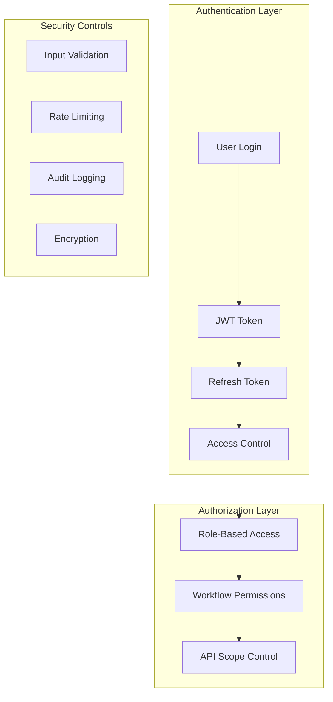
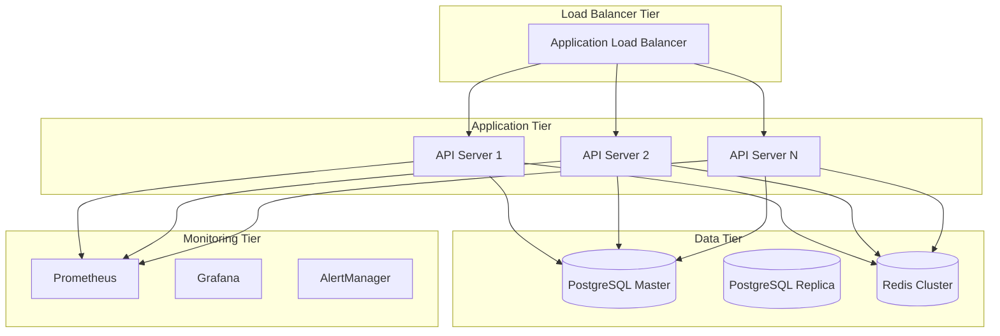
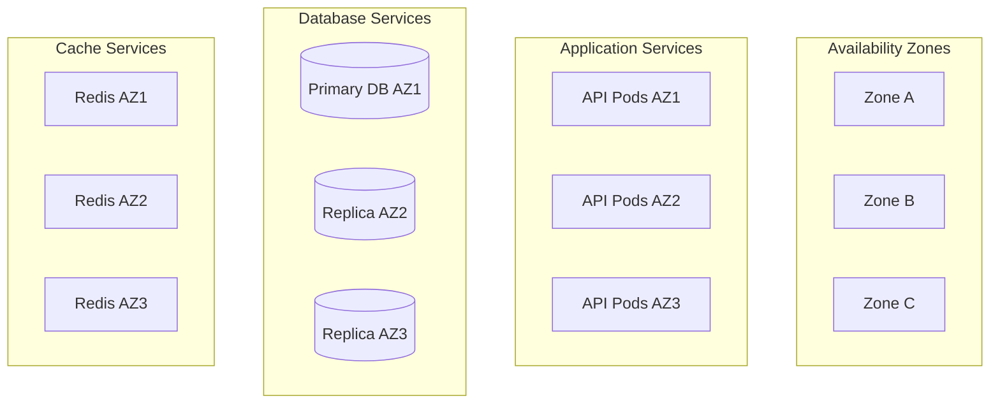
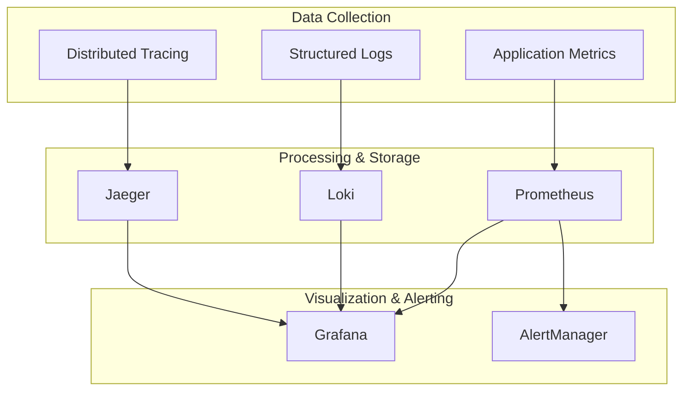

# GUI-LOP Production Readiness Strategic Plan

**Version:** 1.0.0
**Date:** October 26, 2025
**Author:** Strategic Planning Team
**Status:** Implementation Ready

---

## Executive Summary

### Current State Assessment

The GUI-LOP (Generative UI & Human-in-the-Loop Orchestration Platform) demonstrates sophisticated architecture and comprehensive testing infrastructure but currently operates at **3/10 production readiness**. While the platform excels in core functionality and development practices, critical gaps in security, data persistence, monitoring, and deployment infrastructure prevent production deployment.

### Strategic Vision

Transform GUI-LOP from proof-of-concept to enterprise-grade platform within **6-8 months** through systematic enhancement addressing security, scalability, reliability, and operational excellence. Leverage existing strengths (modern tech stack, comprehensive testing, Claude Flow integration) to accelerate development while maintaining engineering excellence.

---

## Production Readiness Gap Analysis

### Critical Blockers (Must Fix Before MVP)

#### 1. **Security Infrastructure** (Priority: CRITICAL)
**Current State:** No authentication, authorization, or security controls
- **Missing:** JWT authentication, RBAC, API security
- **Risk:** Unauthorized access, data breaches
- **Impact:** Production blocker

#### 2. **Data Persistence** (Priority: CRITICAL)
**Current State:** In-memory storage only
- **Missing:** Database integration, data backup, recovery
- **Risk:** Complete data loss on restart
- **Impact:** Production blocker

#### 3. **Monitoring & Observability** (Priority: HIGH)
**Current State:** Basic console logging
- **Missing:** Structured logging, metrics, alerting
- **Risk:** No operational visibility
- **Impact:** High operational risk

#### 4. **Deployment Infrastructure** (Priority: HIGH)
**Current State:** Development-only setup
- **Missing:** Containerization, CI/CD, environments
- **Risk:** Manual deployment, no scalability
- **Impact:** Scaling blocker

### Important Enhancements (Fix for Production Readiness)

#### 5. **Performance Optimization** (Priority: MEDIUM)
**Current State:** Unoptimized memory usage
- **Missing:** Caching, query optimization, resource limits
- **Risk:** Poor performance under load
- **Impact:** User experience degradation

#### 6. **Error Handling & Recovery** (Priority: MEDIUM)
**Current State:** Basic error responses
- **Missing:** Graceful degradation, retry mechanisms
- **Risk:** Poor user experience during failures
- **Impact:** Reliability issues

#### 7. **API Documentation & Contracts** (Priority: MEDIUM)
**Current State:** Code comments only
- **Missing:** OpenAPI spec, versioning strategy
- **Risk:** Integration difficulties
- **Impact:** Developer experience

### Strengths to Leverage

#### 1. **Comprehensive Testing Infrastructure** (Rating: 8/10)
- 373 lines of integration tests covering full workflows
- E2E tests with Playwright
- Test coverage for API endpoints and WebSocket communication
- Performance and load testing capabilities

#### 2. **Modern Technology Stack** (Rating: 9/10)
- React 18.3.1 with concurrent features
- Express.js 4.21.1 with WebSocket support
- TypeScript 5.9.3 for type safety
- Claude Flow integration with 54+ specialized agents

#### 3. **Excellent Documentation** (Rating: 9/10)
- 1,050-line comprehensive architecture documentation
- SPARC methodology implementation
- Clear development patterns and practices

#### 4. **Claude Flow Integration** (Rating: 9/10)
- Advanced agent orchestration capabilities
- 32.3% token reduction through optimizations
- Memory management and learning capabilities

---

## Phased Development Roadmap

### Phase 1: Foundation & Security (Weeks 1-4)

#### Week 1-2: Authentication & Authorization
**Deliverables:**
- JWT authentication system with refresh tokens
- Role-based access control (RBAC)
- User management API endpoints
- Security middleware implementation
- Input validation and sanitization

**Technical Implementation:**
```javascript
// Authentication middleware
const authenticateToken = (req, res, next) => {
  const authHeader = req.headers['authorization'];
  const token = authHeader && authHeader.split(' ')[1];

  if (!token) {
    return res.status(401).json({ error: 'Access token required' });
  }

  jwt.verify(token, process.env.JWT_SECRET, (err, user) => {
    if (err) return res.status(403).json({ error: 'Invalid token' });
    req.user = user;
    next();
  });
};
```

**Success Criteria:**
- [ ] Secure user registration and login
- [ ] Role-based workflow access control
- [ ] Token refresh mechanism working
- [ ] Security audit passed

#### Week 3: Database Integration
**Deliverables:**
- PostgreSQL database setup and schema
- Workflow and user data models
- Database migration scripts
- Connection pooling and optimization
- Data backup and recovery procedures

**Database Schema:**
```sql
-- Users table
CREATE TABLE users (
  id UUID PRIMARY KEY DEFAULT gen_random_uuid(),
  email VARCHAR(255) UNIQUE NOT NULL,
  password_hash VARCHAR(255) NOT NULL,
  role VARCHAR(50) DEFAULT 'user',
  created_at TIMESTAMP DEFAULT CURRENT_TIMESTAMP,
  updated_at TIMESTAMP DEFAULT CURRENT_TIMESTAMP
);

-- Workflows table
CREATE TABLE workflows (
  id UUID PRIMARY KEY DEFAULT gen_random_uuid(),
  user_id UUID REFERENCES users(id) ON DELETE CASCADE,
  template VARCHAR(100) NOT NULL,
  context JSONB NOT NULL,
  status VARCHAR(50) DEFAULT 'created',
  created_at TIMESTAMP DEFAULT CURRENT_TIMESTAMP,
  started_at TIMESTAMP,
  completed_at TIMESTAMP,
  human_response JSONB
);
```

**Success Criteria:**
- [ ] Database schema deployed
- [ ] Data persistence working
- [ ] Migration scripts tested
- [ ] Backup procedures verified

#### Week 4: Monitoring Infrastructure
**Deliverables:**
- Structured logging implementation
- Application metrics collection
- Health check endpoints enhancement
- Error tracking and alerting
- Performance monitoring dashboard

**Logging Implementation:**
```javascript
const logger = winston.createLogger({
  level: 'info',
  format: winston.format.combine(
    winston.format.timestamp(),
    winston.format.errors({ stack: true }),
    winston.format.json()
  ),
  defaultMeta: { service: 'gui-lop-backend' },
  transports: [
    new winston.transports.File({ filename: 'error.log', level: 'error' }),
    new winston.transports.File({ filename: 'combined.log' })
  ]
});
```

**Success Criteria:**
- [ ] Structured logs in JSON format
- [ ] Metrics collection working
- [ ] Health checks comprehensive
- [ ] Alerting configured

**Phase 1 Milestone:** MVP Foundation Complete
**Target Date:** End of Week 4
**Acceptance Criteria:** Secure, persistent, monitored application ready for staging deployment

---

### Phase 2: Performance & Scalability (Weeks 5-8)

#### Week 5-6: Caching & Optimization
**Deliverables:**
- Redis caching layer implementation
- Database query optimization
- API response caching
- Session management with Redis
- Connection pooling optimization

**Caching Strategy:**
```javascript
const redis = require('redis');
const client = redis.createClient({
  host: process.env.REDIS_HOST,
  port: process.env.REDIS_PORT,
  retry_strategy: (options) => {
    return Math.min(options.attempt * 100, 3000);
  }
});

// Cache middleware
const cacheMiddleware = (duration = 300) => {
  return async (req, res, next) => {
    const key = `cache:${req.originalUrl}`;
    const cached = await client.get(key);

    if (cached) {
      return res.json(JSON.parse(cached));
    }

    res.locals.cacheKey = key;
    res.locals.cacheDuration = duration;
    next();
  };
};
```

**Success Criteria:**
- [ ] Redis caching operational
- [ ] API response times improved by 50%
- [ ] Database load reduced by 40%
- [ ] Session management working

#### Week 7: API Enhancement & Documentation
**Deliverables:**
- OpenAPI 3.0 specification
- API versioning strategy
- Enhanced error handling
- Request/response validation
- Rate limiting implementation

**OpenAPI Specification:**
```yaml
openapi: 3.0.0
info:
  title: GUI-LOP API
  version: 1.0.0
  description: Generative UI & Human-in-the-Loop Orchestration Platform API

paths:
  /api/v1/workflows:
    post:
      summary: Create new workflow
      security:
        - bearerAuth: []
      requestBody:
        required: true
        content:
          application/json:
            schema:
              $ref: '#/components/schemas/WorkflowCreateRequest'
      responses:
        201:
          description: Workflow created successfully
          content:
            application/json:
              schema:
                $ref: '#/components/schemas/WorkflowResponse'
```

**Success Criteria:**
- [ ] OpenAPI spec complete
- [ ] API versioning implemented
- [ ] Error handling comprehensive
- [ ] Rate limiting active

#### Week 8: Performance Testing & Optimization
**Deliverables:**
- Load testing with realistic scenarios
- Performance benchmarking
- Memory usage optimization
- WebSocket connection scaling
- Resource usage monitoring

**Load Testing Scenarios:**
```javascript
// K6 load test script
import http from 'k6/http';
import { check, sleep } from 'k6';
import { Rate } from 'k6/metrics';

const errorRate = new Rate('errors');

export let options = {
  stages: [
    { duration: '2m', target: 100 }, // Ramp up to 100 users
    { duration: '5m', target: 100 }, // Stay at 100 users
    { duration: '2m', target: 200 }, // Ramp up to 200 users
    { duration: '5m', target: 200 }, // Stay at 200 users
    { duration: '2m', target: 0 },   // Ramp down
  ],
};

export default function() {
  const response = http.post('http://localhost:3001/api/v1/workflows', {
    template: 'data-analysis',
    context: { task: 'Load test workflow' }
  }, {
    headers: {
      'Content-Type': 'application/json',
      'Authorization': `Bearer ${__ENV.API_TOKEN}`
    }
  });

  const success = check(response, {
    'status is 201': (r) => r.status === 201,
    'response time < 500ms': (r) => r.timings.duration < 500,
  });

  errorRate.add(!success);
  sleep(1);
}
```

**Success Criteria:**
- [ ] 200 concurrent users supported
- [ ] 95th percentile response time < 500ms
- [ ] Memory usage optimized
- [ ] WebSocket scaling verified

**Phase 2 Milestone:** Performance Optimized Platform
**Target Date:** End of Week 8
**Acceptance Criteria:** Platform handles production load with acceptable performance

---

### Phase 3: Production Deployment (Weeks 9-12)

#### Week 9-10: Containerization & CI/CD
**Deliverables:**
- Docker containerization
- Kubernetes deployment manifests
- GitHub Actions CI/CD pipeline
- Environment configuration management
- Automated testing in pipeline

**Dockerfile:**
```dockerfile
# Multi-stage build for production
FROM node:18-alpine AS builder
WORKDIR /app

# Copy package files
COPY package*.json ./
COPY src/frontend/package*.json ./src/frontend/

# Install dependencies
RUN npm ci --only=production && \
    cd src/frontend && npm ci --only=production

# Build frontend
COPY src/frontend ./src/frontend
RUN cd src/frontend && npm run build

# Production stage
FROM node:18-alpine AS production
WORKDIR /app

# Install production dependencies
COPY package*.json ./
RUN npm ci --only=production && npm cache clean --force

# Copy application code
COPY --from=builder /app/src/frontend/build ./public
COPY src/backend ./src/backend

# Create non-root user
RUN addgroup -g 1001 -S nodejs && \
    adduser -S gui-lop -u 1001

USER gui-lop

EXPOSE 3001
CMD ["node", "src/backend/simple-server.js"]
```

**GitHub Actions Pipeline:**
```yaml
name: GUI-LOP CI/CD Pipeline

on:
  push:
    branches: [main, develop]
  pull_request:
    branches: [main]

jobs:
  test:
    runs-on: ubuntu-latest
    steps:
      - uses: actions/checkout@v3
      - uses: actions/setup-node@v3
        with:
          node-version: '18'
          cache: 'npm'

      - name: Install dependencies
        run: npm ci

      - name: Run tests
        run: npm test

      - name: Build application
        run: npm run build

      - name: Security audit
        run: npm audit --audit-level=high

  build-and-deploy:
    needs: test
    runs-on: ubuntu-latest
    if: github.ref == 'refs/heads/main'

    steps:
      - uses: actions/checkout@v3

      - name: Build Docker image
        run: |
          docker build -t gui-lop:${{ github.sha }} .
          docker tag gui-lop:${{ github.sha }} gui-lop:latest

      - name: Deploy to staging
        run: |
          echo "Deploy to staging environment"
          # kubectl apply -f k8s/
```

**Success Criteria:**
- [ ] Docker images building successfully
- [ ] CI/CD pipeline operational
- [ ] Automated tests passing
- [ ] Deployment automation working

#### Week 11: Production Infrastructure Setup
**Deliverables:**
- Production environment configuration
- Database cluster setup
- Load balancer configuration
- SSL/TLS certificate management
- DNS and domain configuration

**Kubernetes Deployment:**
```yaml
apiVersion: apps/v1
kind: Deployment
metadata:
  name: gui-lop-backend
  labels:
    app: gui-lop-backend
spec:
  replicas: 3
  selector:
    matchLabels:
      app: gui-lop-backend
  template:
    metadata:
      labels:
        app: gui-lop-backend
    spec:
      containers:
      - name: gui-lop
        image: gui-lop:latest
        ports:
        - containerPort: 3001
        env:
        - name: DATABASE_URL
          valueFrom:
            secretKeyRef:
              name: gui-lop-secrets
              key: database-url
        - name: JWT_SECRET
          valueFrom:
            secretKeyRef:
              name: gui-lop-secrets
              key: jwt-secret
        resources:
          requests:
            memory: "256Mi"
            cpu: "250m"
          limits:
            memory: "512Mi"
            cpu: "500m"
        livenessProbe:
          httpGet:
            path: /health
            port: 3001
          initialDelaySeconds: 30
          periodSeconds: 10
        readinessProbe:
          httpGet:
            path: /health
            port: 3001
          initialDelaySeconds: 5
          periodSeconds: 5
```

**Success Criteria:**
- [ ] Production environment ready
- [ ] Database cluster operational
- [ ] Load balancer configured
- [ ] SSL certificates installed

#### Week 12: Production Launch & Monitoring
**Deliverables:**
- Production deployment
- Monitoring dashboard setup
- Incident response procedures
- Performance baseline establishment
- User acceptance testing

**Monitoring Stack:**
```yaml
# Prometheus configuration
global:
  scrape_interval: 15s

scrape_configs:
  - job_name: 'gui-lop'
    static_configs:
      - targets: ['gui-lop-backend:3001']
    metrics_path: '/metrics'
    scrape_interval: 5s

  - job_name: 'postgres'
    static_configs:
      - targets: ['postgres-exporter:9187']

  - job_name: 'redis'
    static_configs:
      - targets: ['redis-exporter:9121']
```

**Success Criteria:**
- [ ] Production deployment successful
- [ ] Monitoring dashboard active
- [ ] Incident procedures documented
- [ ] Performance baselines established

**Phase 3 Milestone:** Production Ready Platform
**Target Date:** End of Week 12
**Acceptance Criteria:** Platform successfully deployed to production with monitoring and operational procedures

---

## Production-Grade Architecture Specifications

### Security Architecture

#### Authentication & Authorization Framework


**Security Implementation:**
1. **JWT Authentication:** Stateless authentication with refresh tokens
2. **RBAC:** Role-based access control with granular permissions
3. **API Security:** Rate limiting, input validation, CORS
4. **Data Encryption:** Encrypt sensitive data at rest and in transit
5. **Audit Logging:** Comprehensive security event tracking

### Scalability Architecture

#### Horizontal Scaling Design


**Scaling Strategy:**
1. **Application Scaling:** Horizontal scaling with load balancer
2. **Database Scaling:** Read replicas for read-heavy workloads
3. **Caching Layer:** Redis cluster for session and data caching
4. **CDN Integration:** Static asset delivery through CDN
5. **Auto-scaling:** Kubernetes HPA based on CPU/memory metrics

### Reliability Architecture

#### High Availability Design


**Reliability Features:**
1. **Multi-AZ Deployment:** Distribute across availability zones
2. **Database Replication:** Automated failover with replicas
3. **Health Checks:** Comprehensive health monitoring
4. **Circuit Breakers:** Fault isolation and graceful degradation
5. **Backup Strategy:** Automated backups with point-in-time recovery

### Monitoring & Observability

#### Observability Stack


**Monitoring Metrics:**
1. **Application Metrics:** Response time, throughput, error rate
2. **Infrastructure Metrics:** CPU, memory, disk, network
3. **Business Metrics:** Workflow completion rate, user engagement
4. **Security Metrics:** Authentication attempts, authorization failures
5. **Custom Metrics:** WebSocket connections, workflow queue length

---

## Implementation Timeline & Milestones

### Critical Path Analysis

#### Week-by-Week Implementation Schedule

| Week | Phase | Key Deliverables | Dependencies | Success Metrics |
|------|-------|------------------|--------------|-----------------|
| 1 | Foundation | JWT Authentication System | Security design | Secure login/logout |
| 2 | Foundation | RBAC Implementation | JWT system | Role-based access |
| 3 | Foundation | PostgreSQL Integration | Database design | Data persistence |
| 4 | Foundation | Monitoring Infrastructure | Logging framework | Metrics collection |
| 5 | Performance | Redis Caching | Database setup | 50% response improvement |
| 6 | Performance | Query Optimization | Caching layer | Database load reduction |
| 7 | Performance | API Documentation | OpenAPI spec | Complete API docs |
| 8 | Performance | Load Testing | API versioning | 200 concurrent users |
| 9 | Deployment | Docker Containerization | Performance baseline | Container builds |
| 10 | Deployment | CI/CD Pipeline | Docker images | Automated deployment |
| 11 | Deployment | Production Infrastructure | CI/CD pipeline | Environment ready |
| 12 | Deployment | Production Launch | Monitoring setup | Live production |

### Risk Assessment & Mitigation

#### High-Risk Items
1. **Database Migration Complexity**
   - **Risk:** Data loss during migration
   - **Mitigation:** Comprehensive backup strategy, staged migration
   - **Contingency:** Rollback procedures and recovery plans

2. **Authentication Implementation**
   - **Risk:** Security vulnerabilities in auth system
   - **Mitigation:** Security audit, penetration testing
   - **Contingency:** External authentication service integration

3. **Performance Under Load**
   - **Risk:** System cannot handle production load
   - **Mitigation:** Incremental load testing, performance optimization
   - **Contingency:** Auto-scaling infrastructure, caching enhancements

#### Medium-Risk Items
1. **Third-party Integration Dependencies**
2. **Team Resource Availability**
3. **Technology Stack Complexity

#### Low-Risk Items
1. **Documentation Completeness**
2. **Testing Coverage**
3. **Development Environment Setup

### Resource Allocation Strategy

#### Team Composition & Responsibilities

**Core Development Team (4-5 developers):**
- **Backend Developer (1-2):** API development, database integration, security
- **Frontend Developer (1):** UI enhancements, user experience, testing
- **DevOps Engineer (1):** Infrastructure, CI/CD, monitoring, deployment
- **Technical Lead (1):** Architecture, code review, technical decisions

**Support Resources:**
- **Security Specialist (part-time):** Security audit, penetration testing
- **Database Administrator (part-time):** Database optimization, migration support
- **QA Engineer (part-time):** Testing strategy, automation framework

#### Budget Allocation

**Development Costs (12 weeks):**
- Personnel: $200,000 (4 developers × 12 weeks × market rates)
- Infrastructure: $15,000 (cloud services, monitoring tools)
- Security Tools: $5,000 (security scanning, authentication services)
- Testing Tools: $3,000 (load testing, automation tools)
- **Total Development Budget:** $223,000

**Operational Costs (monthly):**
- Cloud Infrastructure: $2,000/month
- Monitoring Services: $500/month
- Security Services: $300/month
- **Total Monthly Operational Cost:** $2,800/month

---

## Success Metrics & Acceptance Criteria

### Technical KPIs

#### Performance Metrics
- **API Response Time:** 95th percentile < 500ms
- **Database Query Time:** Average < 100ms
- **WebSocket Latency:** < 50ms
- **System Uptime:** > 99.9%
- **Concurrent Users:** Support 200+ simultaneous users

#### Security Metrics
- **Authentication Success Rate:** > 99%
- **Authorization Failure Rate:** < 0.1%
- **Security Incidents:** Zero critical vulnerabilities
- **Data Breach Incidents:** Zero
- **Audit Trail Completeness:** 100%

#### Reliability Metrics
- **System Availability:** > 99.9%
- **Mean Time To Recovery (MTTR):** < 15 minutes
- **Error Rate:** < 0.1%
- **Data Loss Incidents:** Zero
- **Backup Success Rate:** 100%

### Business KPIs

#### User Engagement Metrics
- **Workflow Completion Rate:** > 90%
- **User Satisfaction Score:** > 4.5/5
- **Daily Active Users:** Target based on business requirements
- **Session Duration:** Average > 10 minutes
- **User Retention:** > 80% monthly retention

#### Operational Metrics
- **Deployment Success Rate:** 100%
- **Rollback Frequency:** < 1% of deployments
- **Mean Time Between Failures (MTBF):** > 30 days
- **Support Ticket Volume:** < 5 tickets/week
- **Response Time to Issues:** < 2 hours

### Acceptance Criteria by Phase

#### Phase 1 Acceptance (Week 4)
- [ ] Secure user authentication with JWT tokens
- [ ] Role-based access control implemented
- [ ] PostgreSQL database with full CRUD operations
- [ ] Structured logging and basic monitoring
- [ ] Security audit passed with no critical issues

#### Phase 2 Acceptance (Week 8)
- [ ] Redis caching reducing database load by 40%
- [ ] API response times under 500ms at 100 concurrent users
- [ ] Complete OpenAPI documentation
- [ ] Load testing supporting 200 concurrent users
- [ ] Error handling and graceful degradation

#### Phase 3 Acceptance (Week 12)
- [ ] Production deployment with containerization
- [ ] CI/CD pipeline with automated testing
- [ ] Comprehensive monitoring and alerting
- [ ] SSL/TLS encryption and security compliance
- [ ] Incident response procedures documented

---

## Post-Launch Roadmap

### Continuous Improvement Plan

#### Month 1-3: Stabilization
- Performance monitoring and optimization
- User feedback collection and implementation
- Bug fixes and stability improvements
- Security patch management
- Documentation updates

#### Month 4-6: Feature Enhancement
- Advanced workflow templates
- Integration marketplace
- Mobile application development
- Advanced analytics and reporting
- Multi-tenant architecture support

#### Month 7-12: Enterprise Features
- SSO integration (SAML, OAuth 2.0)
- Advanced compliance features (GDPR, SOC 2)
- Custom branding and white-labeling
- Advanced AI/ML integration
- Global deployment and localization

### Technology Evolution

#### Emerging Technology Adoption
- **WebAssembly:** Performance-critical components
- **GraphQL:** More efficient API queries
- **Edge Computing:** Distributed deployment
- **Serverless Architecture:** Function-based scaling

#### Infrastructure Modernization
- **Kubernetes:** Advanced orchestration
- **Service Mesh:** Microservices communication
- **GitOps:** Infrastructure as code
- **Observability:** Advanced monitoring and tracing

---

## Conclusion

### Strategic Summary

This comprehensive strategic plan transforms the GUI-LOP platform from proof-of-concept to enterprise-grade solution through systematic enhancement across security, performance, scalability, and operational excellence. The 12-week implementation timeline leverages existing strengths while addressing critical production readiness gaps.

### Key Success Factors

1. **Systematic Approach:** Phased development with clear milestones and acceptance criteria
2. **Risk Management:** Proactive identification and mitigation of technical and operational risks
3. **Resource Optimization:** Strategic allocation of development resources and budget
4. **Quality Assurance:** Comprehensive testing and security validation at each phase
5. **Operational Excellence:** Production-ready monitoring, deployment, and incident response

### Expected Outcomes

**Technical Outcomes:**
- Secure, scalable, and reliable production platform
- 99.9% system availability with sub-500ms response times
- Support for 200+ concurrent users with horizontal scaling
- Comprehensive monitoring and observability infrastructure

**Business Outcomes:**
- Production-ready platform for enterprise deployment
- Solid foundation for feature enhancement and growth
- Operational excellence supporting business objectives
- Technology platform enabling competitive advantage

### Next Steps

1. **Immediate Actions:** Secure team resources, set up development environments, begin Phase 1 implementation
2. **Governance:** Establish weekly progress reviews, milestone tracking, and risk assessment
3. **Communication:** Regular stakeholder updates, progress reporting, and alignment on priorities
4. **Quality Gates:** Phase gate reviews with clear acceptance criteria before progression

The GUI-LOP platform is positioned for successful production deployment and long-term growth through this comprehensive strategic approach.

---

**Document Status:** Ready for Implementation
**Next Review:** Weekly Progress Reviews
**Implementation Start:** Immediate upon approval
**Production Target:** Week 12 (12 weeks from start)

**Strategic Planning Team**
**Generative UI & Human-in-the-Loop Orchestration Platform**
**October 26, 2025**