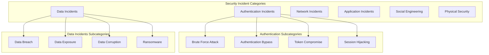

# GUI-LOP Security Incident Response Procedures

**Version:** 1.0.0
**Date:** October 26, 2025
**Classification:** Confidential - Incident Response Plan
**Author:** Security Operations Team

---

## Executive Summary

### Incident Response Overview

This document defines comprehensive security incident response procedures for the **Generative UI & Human-in-the-Loop Orchestration Platform (GUI-LOP)**. The procedures provide a structured approach to detecting, analyzing, containing, and recovering from security incidents while minimizing impact and ensuring regulatory compliance.

### Response Objectives

1. **Rapid Detection**: Identify security incidents within minutes of occurrence
2. **Effective Containment**: Limit incident scope and prevent further damage
3. **Thorough Analysis**: Understand incident cause, scope, and impact
4. **Efficient Recovery**: Restore normal operations with minimal downtime
5. **Comprehensive Documentation**: Maintain detailed records for compliance and improvement

---

## Incident Response Framework

### Incident Classification System

#### Severity Levels

**Critical (Severity 1)**
- Impact: System-wide compromise, massive data breach, service outage
- Response Time: Immediate (within 15 minutes)
- Escalation: Executive leadership, legal, PR teams
- Examples: Production database compromise, ransomware attack, complete service outage

**High (Severity 2)**
- Impact: Significant data exposure, service degradation, multiple users affected
- Response Time: Within 1 hour
- Escalation: Security leadership, engineering management
- Examples: Authentication bypass, major data leak, significant service degradation

**Medium (Severity 3)**
- Impact: Limited data exposure, minor service issues, few users affected
- Response Time: Within 4 hours
- Escalation: Security team lead, relevant engineering teams
- Examples: Single account compromise, minor service disruption, limited data exposure

**Low (Severity 4)**
- Impact: Minimal impact, preventive measures needed
- Response Time: Within 24 hours
- Escalation: Security team members
- Examples: Failed login attempts, suspicious activity, policy violations

#### Incident Categories



### Incident Response Team Structure

#### Core Response Team

**Incident Commander (IC)**
- **Role**: Overall incident coordination and decision-making
- **Responsibilities**:
  - Declare incident severity and scope
  - Coordinate response team activities
  - Manage communications and escalations
  - Make critical decisions during incident
- **Backup**: Deputy Incident Commander

**Security Analyst (SA)**
- **Role**: Technical investigation and analysis
- **Responsibilities**:
  - Analyze logs and forensic evidence
  - Identify attack vectors and scope
  - Assess system vulnerabilities
  - Document technical findings
- **Skills**: Log analysis, forensics, threat intelligence

**Infrastructure Engineer (IE)**
- **Role**: System containment and recovery
- **Responsibilities**:
  - Implement containment measures
  - Patch vulnerabilities
  - Restore affected systems
  - Monitor system stability
- **Skills**: System administration, network security, cloud infrastructure

**Communications Lead (CL)**
- **Role**: Internal and external communications
- **Responsibilities**:
  - Draft incident notifications
  - Manage stakeholder communications
  - Coordinate with legal and PR teams
  - Update incident status
- **Skills**: Technical writing, crisis communications

**Legal/Compliance Officer (LCO)**
- **Role**: Regulatory compliance and legal guidance
- **Responsibilities**:
  - Assess regulatory impact
  - Ensure compliance with notification requirements
  - Coordinate with legal counsel
  - Document compliance actions
- **Skills**: Regulatory knowledge, legal procedures

#### Extended Response Team

**Development Team Lead (DTL)**
- Code review and application patches
- Application security analysis
- Deployment coordination

**Database Administrator (DBA)**
- Database security assessment
- Data recovery procedures
- Forensic data extraction

**Customer Support Lead (CSL)**
- Customer communications
- Support ticket management
- User impact assessment

---

## Incident Detection and Analysis

### Automated Detection Systems

#### Security Monitoring Dashboard

```javascript
// monitoring/incident-detection.js
class IncidentDetectionSystem {
  constructor() {
    this.alertThresholds = {
      failedLogins: { threshold: 10, window: 300000, severity: 'medium' }, // 5 minutes
      tokenAnomalies: { threshold: 5, window: 600000, severity: 'high' }, // 10 minutes
      dataExfiltration: { threshold: 1000000, window: 60000, severity: 'critical' }, // 1GB in 1 minute
      serviceOutage: { threshold: 0.95, window: 120000, severity: 'high' }, // 95% failure rate in 2 minutes
      unusualAccess: { threshold: 3, window: 1800000, severity: 'medium' } // 3 anomalies in 30 minutes
    };

    this.activeIncidents = new Map();
    this.alertQueue = [];
    this.monitoringService = new SecurityMonitoringService();
  }

  async analyzeSecurityEvent(event) {
    const analysis = {
      timestamp: new Date().toISOString(),
      eventId: event.id,
      eventType: event.type,
      severity: 'low',
      indicators: [],
      recommendations: [],
      autoActions: []
    };

    // Analyze event patterns
    const relatedEvents = await this.findRelatedEvents(event);
    analysis.indicators.push(...await this.detectIndicators(event, relatedEvents));

    // Assess severity
    analysis.severity = this.assessSeverity(event, analysis.indicators);

    // Generate recommendations
    analysis.recommendations = this.generateRecommendations(event, analysis);

    // Determine automated actions
    analysis.autoActions = this.determineAutoActions(event, analysis);

    // Check for incident creation
    if (this.shouldCreateIncident(analysis)) {
      await this.createIncident(analysis);
    }

    return analysis;
  }

  async detectIndicators(event, relatedEvents) {
    const indicators = [];

    // Check for brute force patterns
    const bruteForceIndicators = await this.detectBruteForce(event, relatedEvents);
    indicators.push(...bruteForceIndicators);

    // Check for token abuse patterns
    const tokenAbuseIndicators = await this.detectTokenAbuse(event, relatedEvents);
    indicators.push(...tokenAbuseIndicators);

    // Check for data exfiltration patterns
    const exfiltrationIndicators = await this.detectDataExfiltration(event, relatedEvents);
    indicators.push(...exfiltrationIndicators);

    // Check for service degradation
    const serviceIndicators = await this.detectServiceDegradation(event, relatedEvents);
    indicators.push(...serviceIndicators);

    return indicators;
  }

  async detectBruteForce(event, relatedEvents) {
    const indicators = [];
    const timeWindow = 5 * 60 * 1000; // 5 minutes

    if (event.type === 'AUTH_FAILURE') {
      const recentFailures = relatedEvents.filter(e =>
        e.type === 'AUTH_FAILURE' &&
        e.sourceIP === event.sourceIP &&
        (Date.now() - e.timestamp) < timeWindow
      );

      if (recentFailures.length >= this.alertThresholds.failedLogins.threshold) {
        indicators.push({
          type: 'BRUTE_FORCE_ATTACK',
          confidence: 0.9,
          details: {
            sourceIP: event.sourceIP,
            attempts: recentFailures.length,
            timeWindow: timeWindow / 1000 / 60,
            targetAccounts: [...new Set(recentFailures.map(e => e.targetUser))]
          }
        });
      }
    }

    return indicators;
  }

  async detectTokenAbuse(event, relatedEvents) {
    const indicators = [];

    if (event.type === 'TOKEN_USAGE') {
      // Check for simultaneous usage from different locations
      const concurrentUsage = relatedEvents.filter(e =>
        e.type === 'TOKEN_USAGE' &&
        e.tokenId === event.tokenId &&
        e.sourceIP !== event.sourceIP &&
        (Date.now() - e.timestamp) < 60000 // 1 minute
      );

      if (concurrentUsage.length > 0) {
        indicators.push({
          type: 'TOKEN_SHARING_OR_THEFT',
          confidence: 0.8,
          details: {
            tokenId: event.tokenId,
            userId: event.userId,
            locations: [...new Set([event.sourceIP, ...concurrentUsage.map(e => e.sourceIP)])],
            concurrentSessions: concurrentUsage.length + 1
          }
        });
      }

      // Check for unusual usage patterns
      const usagePattern = await this.analyzeUsagePattern(event.tokenId, event.userId);
      if (usagePattern.anomaly) {
        indicators.push({
          type: 'UNUSUAL_TOKEN_USAGE',
          confidence: usagePattern.confidence,
          details: usagePattern.details
        });
      }
    }

    return indicators;
  }

  async detectDataExfiltration(event, relatedEvents) {
    const indicators = [];

    if (event.type === 'DATA_ACCESS' || event.type === 'DATA_EXPORT') {
      const recentExports = relatedEvents.filter(e =>
        (e.type === 'DATA_ACCESS' || e.type === 'DATA_EXPORT') &&
        e.userId === event.userId &&
        (Date.now() - e.timestamp) < 60000 // 1 minute
      );

      const totalDataSize = recentExports.reduce((sum, e) => sum + (e.dataSize || 0), 0);

      if (totalDataSize > this.alertThresholds.dataExfiltration.threshold) {
        indicators.push({
          type: 'POTENTIAL_DATA_EXFILTRATION',
          confidence: 0.85,
          details: {
            userId: event.userId,
            totalSize: totalDataSize,
            timeWindow: 60, // seconds
            filesAccessed: recentExports.length,
            sensitiveDataFlag: this.checkSensitiveDataAccess(recentExports)
          }
        });
      }
    }

    return indicators;
  }

  assessSeverity(event, indicators) {
    let severity = 'low';
    let severityScore = 0;

    // Score based on indicators
    indicators.forEach(indicator => {
      switch (indicator.type) {
        case 'BRUTE_FORCE_ATTACK':
          severityScore += 2;
          break;
        case 'TOKEN_SHARING_OR_THEFT':
          severityScore += 4;
          break;
        case 'POTENTIAL_DATA_EXFILTRATION':
          severityScore += 5;
          break;
        case 'SERVICE_OUTAGE':
          severityScore += 4;
          break;
        case 'UNAUTHORIZED_ACCESS':
          severityScore += 3;
          break;
        default:
          severityScore += 1;
      }
    });

    // Consider event type
    switch (event.type) {
      case 'SYSTEM_BREACH':
        severityScore += 5;
        break;
      case 'DATA_BREACH':
        severityScore += 4;
        break;
      case 'SERVICE_OUTAGE':
        severityScore += 3;
        break;
      case 'AUTH_BYPASS':
        severityScore += 3;
        break;
    }

    // Convert score to severity
    if (severityScore >= 8) severity = 'critical';
    else if (severityScore >= 5) severity = 'high';
    else if (severityScore >= 2) severity = 'medium';

    return severity;
  }

  async createIncident(analysis) {
    const incident = {
      id: uuidv4(),
      status: 'active',
      severity: analysis.severity,
      category: this.categorizeIncident(analysis),
      title: this.generateIncidentTitle(analysis),
      description: this.generateIncidentDescription(analysis),
      createdAt: new Date().toISOString(),
      updatedAt: new Date().toISOString(),
      triggeredBy: analysis.eventId,
      indicators: analysis.indicators,
      recommendations: analysis.recommendations,
      autoActions: analysis.autoActions,
      assignee: this.determineAssignee(analysis),
      estimatedImpact: this.estimateImpact(analysis),
      affectedSystems: await this.identifyAffectedSystems(analysis),
      stakeholders: this.identifyStakeholders(analysis)
    };

    // Store incident
    await this.incidentRepository.create(incident);
    this.activeIncidents.set(incident.id, incident);

    // Execute automated actions
    await this.executeAutoActions(incident.autoActions, incident);

    // Notify response team
    await this.notifyResponseTeam(incident);

    // Create initial timeline entry
    await this.createTimelineEntry(incident.id, 'incident_created', {
      severity: incident.severity,
      indicators: incident.indicators.length,
      autoActions: incident.autoActions.length
    });

    return incident;
  }
}
```

#### Real-time Alerting System

```javascript
// monitoring/alert-system.js
class SecurityAlertSystem {
  constructor() {
    this.alertChannels = {
      email: new EmailAlertChannel(),
      slack: new SlackAlertChannel(),
      sms: new SMSAlertChannel(),
      pager: new PagerAlertChannel(),
      webhook: new WebhookAlertChannel()
    };

    this.alertEscalation = {
      'critical': [
        { channel: 'pager', delay: 0 },
        { channel: 'sms', delay: 0 },
        { channel: 'slack', delay: 0 },
        { channel: 'email', delay: 300000 } // 5 minutes
      ],
      'high': [
        { channel: 'slack', delay: 0 },
        { channel: 'sms', delay: 300000 }, // 5 minutes
        { channel: 'email', delay: 600000 }  // 10 minutes
      ],
      'medium': [
        { channel: 'slack', delay: 0 },
        { channel: 'email', delay: 900000 } // 15 minutes
      ],
      'low': [
        { channel: 'email', delay: 1800000 } // 30 minutes
      ]
    };
  }

  async sendAlert(incident, alertType = 'incident_created') {
    const alert = this.createAlert(incident, alertType);
    const escalationPlan = this.alertEscalation[incident.severity] || this.alertEscalation['low'];

    // Send initial alerts
    const immediateAlerts = escalationPlan.filter(e => e.delay === 0);
    await Promise.all(
      immediateAlerts.map(async (escalation) => {
        await this.sendAlertChannel(alert, escalation.channel);
      })
    );

    // Schedule escalated alerts
    const delayedAlerts = escalationPlan.filter(e => e.delay > 0);
    delayedAlerts.forEach(async (escalation) => {
      setTimeout(async () => {
        // Check if incident is still active and hasn't been acknowledged
        const currentIncident = await this.incidentRepository.findById(incident.id);
        if (currentIncident && currentIncident.status === 'active' && !currentIncident.acknowledgedAt) {
          await this.sendAlertChannel(alert, escalation.channel);
        }
      }, escalation.delay);
    });
  }

  createAlert(incident, alertType) {
    return {
      id: uuidv4(),
      incidentId: incident.id,
      type: alertType,
      severity: incident.severity,
      title: this.generateAlertTitle(incident, alertType),
      message: this.generateAlertMessage(incident, alertType),
      details: {
        incident: {
          id: incident.id,
          severity: incident.severity,
          category: incident.category,
          createdAt: incident.createdAt,
          estimatedImpact: incident.estimatedImpact
        },
        indicators: incident.indicators,
        recommendations: incident.recommendations.slice(0, 3), // Top 3 recommendations
        affectedSystems: incident.affectedSystems
      },
      actions: [
        {
          type: 'acknowledge',
          label: 'Acknowledge Incident',
          url: `${process.env.DASHBOARD_URL}/incidents/${incident.id}/acknowledge`
        },
        {
          type: 'view',
          label: 'View Incident',
          url: `${process.env.DASHBOARD_URL}/incidents/${incident.id}`
        }
      ],
      createdAt: new Date().toISOString()
    };
  }

  async sendAlertChannel(alert, channel) {
    try {
      await this.alertChannels[channel].send(alert);
      await this.logAlert(alert.id, channel, 'sent');
    } catch (error) {
      console.error(`Failed to send alert via ${channel}:`, error);
      await this.logAlert(alert.id, channel, 'failed', error.message);

      // Fallback to email if other channels fail
      if (channel !== 'email') {
        await this.sendAlertChannel(alert, 'email');
      }
    }
  }
}
```

---

## Incident Containment Procedures

### Immediate Containment Actions

#### Authentication Security Incidents

**Token Compromise Containment**
```javascript
// incident-response/token-compromise.js
class TokenCompromiseHandler {
  async handleTokenCompromise(incident) {
    const containmentPlan = {
      immediate: [],
      shortTerm: [],
      longTerm: []
    };

    // Immediate actions (within 5 minutes)
    containmentPlan.immediate.push(
      await this.revokeCompromisedTokens(incident),
      await this.forcePasswordReset(incident),
      await this.blockMaliciousIPs(incident),
      await this.enableAdditionalMonitoring(incident)
    );

    // Short-term actions (within 1 hour)
    containmentPlan.shortTerm.push(
      await this.reviewUserSessions(incident),
      await this.analyzeAccessPatterns(incident),
      await this.updateSecurityPolicies(incident),
      await this.notifyAffectedUsers(incident)
    );

    // Long-term actions (within 24 hours)
    containmentPlan.longTerm.push(
      await this.conductSecurityAudit(incident),
      await this.updateDetectionRules(incident),
      await this.implementAdditionalControls(incident),
      await this.documentLessonsLearned(incident)
    );

    await this.executeContainmentPlan(containmentPlan, incident);
    return containmentPlan;
  }

  async revokeCompromisedTokens(incident) {
    const action = {
      id: uuidv4(),
      type: 'revoke_tokens',
      description: 'Revoke all tokens associated with compromised accounts',
      status: 'in_progress',
      startedAt: new Date().toISOString(),
      results: {}
    };

    try {
      // Identify all tokens to revoke
      const compromisedAccounts = this.extractCompromisedAccounts(incident);
      const tokensToRevoke = await this.tokenRepository.findByUserIds(compromisedAccounts);

      // Revoke tokens in batches
      const batchSize = 100;
      for (let i = 0; i < tokensToRevoke.length; i += batchSize) {
        const batch = tokensToRevoke.slice(i, i + batchSize);
        await Promise.all(
          batch.map(token => this.tokenService.revokeToken(token.id, 'SECURITY_INCIDENT'))
        );
      }

      action.results.tokensRevoked = tokensToRevoke.length;
      action.status = 'completed';
      action.completedAt = new Date().toISOString();

    } catch (error) {
      action.status = 'failed';
      action.error = error.message;
    }

    await this.logContainmentAction(action, incident.id);
    return action;
  }

  async forcePasswordReset(incident) {
    const action = {
      id: uuidv4(),
      type: 'force_password_reset',
      description: 'Force password reset for all compromised accounts',
      status: 'in_progress',
      startedAt: new Date().toISOString(),
      results: {}
    };

    try {
      const compromisedAccounts = this.extractCompromisedAccounts(incident);
      let resetCount = 0;

      for (const userId of compromisedAccounts) {
        // Invalidate current password
        await this.userService.invalidatePassword(userId);

        // Generate secure reset token
        const resetToken = await this.userService.generatePasswordResetToken(userId);

        // Send secure reset notification
        await this.notificationService.sendSecurePasswordReset(userId, resetToken);

        resetCount++;
      }

      action.results.accountsReset = resetCount;
      action.status = 'completed';
      action.completedAt = new Date().toISOString();

    } catch (error) {
      action.status = 'failed';
      action.error = error.message;
    }

    await this.logContainmentAction(action, incident.id);
    return action;
  }

  async blockMaliciousIPs(incident) {
    const action = {
      id: uuidv4(),
      type: 'block_malicious_ips',
      description: 'Block IP addresses associated with malicious activity',
      status: 'in_progress',
      startedAt: new Date().toISOString(),
      results: {}
    };

    try {
      const maliciousIPs = this.extractMaliciousIPs(incident);
      let blockedCount = 0;

      for (const ip of maliciousIPs) {
        // Add to firewall block list
        await this.firewallService.blockIP(ip, {
          reason: 'Security incident',
          incidentId: incident.id,
          duration: 24 * 60 * 60 * 1000, // 24 hours
          severity: incident.severity
        });

        // Add to application-level block list
        await this.blocklistService.addIP(ip, {
          reason: 'Security incident',
          incidentId: incident.id,
          expiresAt: new Date(Date.now() + 24 * 60 * 60 * 1000)
        });

        blockedCount++;
      }

      action.results.ipsBlocked = blockedCount;
      action.status = 'completed';
      action.completedAt = new Date().toISOString();

    } catch (error) {
      action.status = 'failed';
      action.error = error.message;
    }

    await this.logContainmentAction(action, incident.id);
    return action;
  }
}
```

#### Data Breach Containment

**Data Breach Response Handler**
```javascript
// incident-response/data-breach.js
class DataBreachHandler {
  async handleDataBreach(incident) {
    const containmentActions = [];

    // Immediate containment (within 15 minutes)
    containmentActions.push(
      await this.isolateAffectedSystems(incident),
      await this.preserveEvidence(incident),
      await this.assessDataScope(incident),
      await this.notifyLegalTeam(incident)
    );

    // Short-term containment (within 2 hours)
    containmentActions.push(
      await this.securePerimeters(incident),
      await this.identifyAffectedUsers(incident),
      await this.initiateForensicAnalysis(incident),
      await this.prepareUserNotifications(incident)
    );

    // Long-term containment (within 24 hours)
    containmentActions.push(
      await this.completeForensicAnalysis(incident),
      await this.sendUserNotifications(incident),
      await this.notifyRegulatoryAuthorities(incident),
      await this.implementRemediationControls(incident)
    );

    return containmentActions;
  }

  async isolateAffectedSystems(incident) {
    const action = {
      id: uuidv4(),
      type: 'isolate_systems',
      description: 'Isolate systems potentially affected by data breach',
      status: 'in_progress',
      startedAt: new Date().toISOString(),
      results: {}
    };

    try {
      const affectedSystems = incident.affectedSystems || [];
      let isolatedCount = 0;

      for (const system of affectedSystems) {
        // Create network isolation
        await this.networkService.isolateSystem(system.id, {
          reason: 'Data breach containment',
          incidentId: incident.id,
          allowedConnections: ['security-team', 'backup-systems']
        });

        // Stop non-essential services
        await this.systemService.stopNonEssentialServices(system.id);

        // Enable enhanced monitoring
        await this.monitoringService.enableEnhancedMonitoring(system.id, {
          logAllActivity: true,
          networkCapture: true,
          processMonitoring: true
        });

        isolatedCount++;
      }

      action.results.systemsIsolated = isolatedCount;
      action.status = 'completed';
      action.completedAt = new Date().toISOString();

    } catch (error) {
      action.status = 'failed';
      action.error = error.message;
    }

    await this.logContainmentAction(action, incident.id);
    return action;
  }

  async preserveEvidence(incident) {
    const action = {
      id: uuidv4(),
      type: 'preserve_evidence',
      description: 'Preserve digital evidence for forensic analysis',
      status: 'in_progress',
      startedAt: new Date().toISOString(),
      results: {}
    };

    try {
      const evidence = {
        timestamp: new Date().toISOString(),
        incidentId: incident.id,
        collectedAt: new Date().toISOString(),
        evidence: []
      };

      // Collect system snapshots
      const affectedSystems = incident.affectedSystems || [];
      for (const system of affectedSystems) {
        const systemSnapshot = await this.forensicService.createSystemSnapshot(system.id);
        evidence.evidence.push({
          type: 'system_snapshot',
          systemId: system.id,
          snapshotId: systemSnapshot.id,
          checksum: systemSnapshot.checksum
        });
      }

      // Collect network traffic captures
      const networkCapture = await this.networkService.captureTraffic({
        timeRange: {
          start: new Date(Date.now() - 24 * 60 * 60 * 1000), // Last 24 hours
          end: new Date()
        },
        filters: {
          sourceIPs: this.extractSuspiciousIPs(incident),
          destinationPorts: [80, 443, 3001, 5432] // Web and database ports
        }
      });

      evidence.evidence.push({
        type: 'network_capture',
        captureId: networkCapture.id,
        duration: networkCapture.duration,
        size: networkCapture.size
      });

      // Collect application logs
      const logs = await this.logService.collectLogs({
        timeRange: {
          start: new Date(Date.now() - 24 * 60 * 60 * 1000),
          end: new Date()
        },
        levels: ['error', 'warn', 'info'],
        sources: ['auth', 'api', 'database', 'security']
      });

      evidence.evidence.push({
        type: 'application_logs',
        logCount: logs.length,
        size: logs.reduce((sum, log) => sum + log.size, 0)
      });

      // Store evidence securely
      await this.evidenceRepository.store(evidence);

      action.results.evidenceItems = evidence.evidence.length;
      action.results.evidenceId = evidence.id;
      action.status = 'completed';
      action.completedAt = new Date().toISOString();

    } catch (error) {
      action.status = 'failed';
      action.error = error.message;
    }

    await this.logContainmentAction(action, incident.id);
    return action;
  }

  async assessDataScope(incident) {
    const action = {
      id: uuidv4(),
      type: 'assess_data_scope',
      description: 'Assess scope of potentially compromised data',
      status: 'in_progress',
      startedAt: new Date().toISOString(),
      results: {}
    };

    try {
      const assessment = {
        personalData: {
          recordsAffected: 0,
          dataTypes: [],
          piiFields: []
        },
        systemData: {
          recordsAffected: 0,
          dataTypes: [],
          criticality: []
        },
        auditData: {
          logsAffected: 0,
          timeRange: {},
          accessPatterns: []
        }
      };

      // Analyze database access patterns
      const dbAnalysis = await this.databaseService.analyzeAccess({
        timeRange: {
          start: incident.createdAt,
          end: new Date()
        },
        suspiciousUsers: this.extractSuspiciousUsers(incident),
        suspiciousIPs: this.extractSuspiciousIPs(incident)
      });

      assessment.personalData.recordsAffected = dbAnalysis.personalRecordsAccessed;
      assessment.personalData.dataTypes = dbAnalysis.dataTypesAccessed;
      assessment.systemData.recordsAffected = dbAnalysis.systemRecordsAccessed;

      // Check for file access
      const fileAnalysis = await this.fileService.analyzeAccess({
        timeRange: {
          start: incident.createdAt,
          end: new Date()
        },
        suspiciousUsers: this.extractSuspiciousUsers(incident),
        suspiciousIPs: this.extractSuspiciousIPs(incident)
      });

      assessment.personalData.recordsAffected += fileAnalysis.personalFilesAccessed;
      assessment.systemData.recordsAffected += fileAnalysis.systemFilesAccessed;

      // Determine regulatory impact
      assessment.regulatoryImpact = await this.assessRegulatoryImpact(assessment);

      action.results.assessment = assessment;
      action.status = 'completed';
      action.completedAt = new Date().toISOString();

    } catch (error) {
      action.status = 'failed';
      action.error = error.message;
    }

    await this.logContainmentAction(action, incident.id);
    return action;
  }
}
```

### Communication Procedures

#### Internal Communication Protocol

**Incident Communication Plan**
```javascript
// incident-response/communications.js
class IncidentCommunications {
  constructor() {
    this.communicationTemplates = this.loadTemplates();
    this.stakeholderRegistry = this.loadStakeholders();
  }

  async executeCommunicationPlan(incident, phase) {
    const communications = [];

    switch (phase) {
      case 'initial':
        communications.push(
          await this.notifyResponseTeam(incident),
          await this.notifyManagement(incident),
          await this.initializeStatusPage(incident)
        );
        break;

      case 'containment':
        communications.push(
          await this.updateManagement(incident),
          await this.updateResponseTeam(incident),
          await this.prepareCustomerComms(incident)
        );
        break;

      case 'recovery':
        communications.push(
          await this.notifyRecovery(incident),
          await this.updateStatusPage(incident),
          await this.preparePostMortem(incident)
        );
        break;

      case 'resolution':
        communications.push(
          await this.sendFinalUpdates(incident),
          await this.scheduleReview(incident),
          await this.archiveCommunications(incident)
        );
        break;
    }

    return communications;
  }

  async notifyResponseTeam(incident) {
    const communication = {
      id: uuidv4(),
      incidentId: incident.id,
      type: 'team_notification',
      channel: 'slack',
      audience: 'response_team',
      status: 'pending',
      createdAt: new Date().toISOString()
    };

    try {
      const message = this.buildTeamNotification(incident, 'initial');

      await this.slackService.sendMessage({
        channel: '#security-incident',
        message: message.text,
        blocks: message.blocks,
        emergency: incident.severity === 'critical'
      });

      // Send individual notifications to team members
      const teamMembers = this.getResponseTeamMembers(incident.severity);
      await Promise.all(
        teamMembers.map(member =>
          this.notificationService.send({
            type: 'sms',
            recipient: member.phone,
            message: `🚨 Security Incident: ${incident.title}. Severity: ${incident.severity}. Please check Slack for details.`
          })
        )
      );

      communication.status = 'sent';
      communication.sentAt = new Date().toISOString();
      communication.recipients = teamMembers.length + 1; // +1 for channel

    } catch (error) {
      communication.status = 'failed';
      communication.error = error.message;
    }

    await this.logCommunication(communication);
    return communication;
  }

  buildTeamNotification(incident, phase) {
    const templates = this.communicationTemplates.team[phase];

    return {
      text: templates.text.replace('{{incidentTitle}}', incident.title)
                         .replace('{{severity}}', incident.severity.toUpperCase())
                         .replace('{{incidentId}}', incident.id),
      blocks: [
        {
          type: "header",
          text: {
            type: "plain_text",
            text: `🚨 ${incident.severity.toUpperCase()} Security Incident`
          }
        },
        {
          type: "section",
          fields: [
            {
              type: "mrkdwn",
              text: `*Incident ID:*\n${incident.id}`
            },
            {
              type: "mrkdwn",
              text: `*Severity:*\n${incident.severity.toUpperCase()}`
            },
            {
              type: "mrkdwn",
              text: `*Category:*\n${incident.category}`
            },
            {
              type: "mrkdwn",
              text: `*Time:*\n${new Date(incident.createdAt).toLocaleString()}`
            }
          ]
        },
        {
          type: "section",
          text: {
            type: "mrkdwn",
            text: `*Description:*\n${incident.description}`
          }
        },
        {
          type: "actions",
          elements: [
            {
              type: "button",
              text: {
                type: "plain_text",
                text: "View Incident"
              },
              url: `${process.env.DASHBOARD_URL}/incidents/${incident.id}`
            },
            {
              type: "button",
              text: {
                type: "plain_text",
                text: "Acknowledge"
              },
              url: `${process.env.DASHBOARD_URL}/incidents/${incident.id}/acknowledge`
            }
          ]
        }
      ]
    };
  }

  async prepareCustomerComms(incident) {
    const communication = {
      id: uuidv4(),
      incidentId: incident.id,
      type: 'customer_communication',
      channel: 'email',
      audience: 'customers',
      status: 'draft',
      createdAt: new Date().toISOString()
    };

    try {
      // Assess customer impact
      const impactAssessment = await this.assessCustomerImpact(incident);

      if (impactAssessment.affected) {
        const draft = await this.createCustomerNotification(incident, impactAssessment);

        communication.content = draft;
        communication.impactAssessment = impactAssessment;
        communication.status = 'ready_for_review';

        // Store for legal review
        await this.legalReviewService.submit(draft, {
          incidentId: incident.id,
          urgency: incident.severity === 'critical' ? 'high' : 'normal'
        });
      } else {
        communication.status = 'no_customer_impact';
        communication.reason = 'No customer impact detected';
      }

    } catch (error) {
      communication.status = 'failed';
      communication.error = error.message;
    }

    await this.logCommunication(communication);
    return communication;
  }

  async createCustomerNotification(incident, impactAssessment) {
    const template = this.communicationTemplates.customer[impactAssessment.severity];

    return {
      subject: template.subject.replace('{{service}}', 'GUI-LOP Platform'),
      body: template.body
        .replace('{{incidentType}}', incident.category)
        .replace('{{incidentTime}}', new Date(incident.createdAt).toLocaleString())
        .replace('{{affectedFeatures}}', impactAssessment.affectedFeatures.join(', '))
        .replace('{{estimatedResolution}}', impactAssessment.estimatedResolution || 'currently unknown'),
        .replace('{{supportContact}}', 'security@gui-lop.com'),
      recipients: impactAssessment.affectedUsers,
      sendAt: this.determineSendTime(incident, impactAssessment),
      legalReviewRequired: true
    };
  }

  async initializeStatusPage(incident) {
    const communication = {
      id: uuidv4(),
      incidentId: incident.id,
      type: 'status_page',
      channel: 'status_page',
      audience: 'public',
      status: 'pending',
      createdAt: new Date().toISOString()
    };

    try {
      const statusUpdate = {
        incidentId: incident.id,
        title: incident.title,
        severity: incident.severity,
        status: 'investigating',
        message: 'We are investigating a security incident. More information will be available shortly.',
        affectedServices: incident.affectedSystems.map(s => s.name),
        startedAt: incident.createdAt,
        updatedAt: new Date().toISOString()
      };

      await this.statusPageService.createIncident(statusUpdate);

      communication.status = 'created';
      communication.statusPageId = statusUpdate.id;
      communication.publicUrl = `${process.env.STATUS_PAGE_URL}/incidents/${statusUpdate.id}`;

    } catch (error) {
      communication.status = 'failed';
      communication.error = error.message;
    }

    await this.logCommunication(communication);
    return communication;
  }
}
```

### Recovery and Post-Incident Activities

#### System Recovery Procedures

**Recovery Orchestrator**
```javascript
// incident-response/recovery.js
class IncidentRecoveryOrchestrator {
  async executeRecoveryPlan(incident) {
    const recoveryPlan = await this.createRecoveryPlan(incident);
    const recoveryResults = {
      plan: recoveryPlan,
      executed: [],
      failed: [],
      completed: false,
      startedAt: new Date().toISOString()
    };

    try {
      // Phase 1: System Verification
      await this.verifySystemIntegrity(incident, recoveryResults);

      // Phase 2: Security Hardening
      await this.implementSecurityHardening(incident, recoveryResults);

      // Phase 3: Service Restoration
      await this.restoreServices(incident, recoveryResults);

      // Phase 4: Monitoring and Validation
      await this.validateRecovery(incident, recoveryResults);

      recoveryResults.completed = true;
      recoveryResults.completedAt = new Date().toISOString();

    } catch (error) {
      recoveryResults.error = error.message;
      recoveryResults.completed = false;
    }

    await this.updateIncidentWithRecoveryResults(incident.id, recoveryResults);
    return recoveryResults;
  }

  async verifySystemIntegrity(incident, recoveryResults) {
    const verificationSteps = [
      {
        name: 'Verify System Images',
        action: this.verifySystemImages.bind(this),
        priority: 'critical'
      },
      {
        name: 'Scan for Malware',
        action: this.scanForMalware.bind(this),
        priority: 'critical'
      },
      {
        name: 'Validate Configuration',
        action: this.validateConfiguration.bind(this),
        priority: 'high'
      },
      {
        name: 'Check Data Integrity',
        action: this.checkDataIntegrity.bind(this),
        priority: 'high'
      }
    ];

    for (const step of verificationSteps) {
      const result = await step.action(incident);
      recoveryResults.executed.push(result);

      if (!result.success) {
        recoveryResults.failed.push(result);
        if (step.priority === 'critical') {
          throw new Error(`Critical verification step failed: ${step.name}`);
        }
      }
    }
  }

  async scanForMalware(incident) {
    const scan = {
      step: 'malware_scan',
      name: 'Malware Scan',
      status: 'in_progress',
      startedAt: new Date().toISOString(),
      results: {}
    };

    try {
      const affectedSystems = incident.affectedSystems || [];
      let systemsScanned = 0;
      let threatsFound = 0;

      for (const system of affectedSystems) {
        const scanResult = await this.securityScanner.scanSystem(system.id, {
          scanType: 'comprehensive',
          includeFiles: true,
          includeMemory: true,
          includeNetwork: true,
          heuristicAnalysis: true
        });

        systemsScanned++;

        if (scanResult.threats.length > 0) {
          threatsFound += scanResult.threats.length;

          // Quarantine threats
          for (const threat of scanResult.threats) {
            await this.securityScanner.quarantineThreat(threat.id, {
              reason: 'Security incident response',
              incidentId: incident.id
            });
          }
        }
      }

      scan.results.systemsScanned = systemsScanned;
      scan.results.threatsFound = threatsFound;
      scan.results.threatsQuarantined = threatsFound;
      scan.status = 'completed';
      scan.success = true;
      scan.completedAt = new Date().toISOString();

    } catch (error) {
      scan.status = 'failed';
      scan.success = false;
      scan.error = error.message;
    }

    await this.logRecoveryStep(scan, incident.id);
    return scan;
  }

  async restoreServices(incident, recoveryResults) {
    const restoreSteps = [
      {
        name: 'Restore Database Services',
        action: this.restoreDatabaseServices.bind(this),
        priority: 'critical'
      },
      {
        name: 'Restore Application Services',
        action: this.restoreApplicationServices.bind(this),
        priority: 'critical'
      },
      {
        name: 'Restore Network Connectivity',
        action: this.restoreNetworkConnectivity.bind(this),
        priority: 'high'
      },
      {
        name: 'Enable User Access',
        action: this.enableUserAccess.bind(this),
        priority: 'medium'
      }
    ];

    for (const step of restoreSteps) {
      const result = await step.action(incident);
      recoveryResults.executed.push(result);

      if (!result.success) {
        recoveryResults.failed.push(result);
        if (step.priority === 'critical') {
          throw new Error(`Critical restore step failed: ${step.name}`);
        }
      }
    }
  }

  async validateRecovery(incident, recoveryResults) {
    const validationSteps = [
      {
        name: 'Health Check Validation',
        action: this.validateHealthChecks.bind(this),
        priority: 'critical'
      },
      {
        name: 'Functional Testing',
        action: this.performFunctionalTests.bind(this),
        priority: 'critical'
      },
      {
        name: 'Security Validation',
        action: this.validateSecurityControls.bind(this),
        priority: 'high'
      },
      {
        name: 'Performance Validation',
        action: this.validatePerformance.bind(this),
        priority: 'medium'
      }
    ];

    let validationPassed = true;

    for (const step of validationSteps) {
      const result = await step.action(incident);
      recoveryResults.executed.push(result);

      if (!result.success) {
        validationPassed = false;
        recoveryResults.failed.push(result);

        if (step.priority === 'critical') {
          throw new Error(`Critical validation step failed: ${step.name}`);
        }
      }
    }

    return validationPassed;
  }

  async performFunctionalTests(incident) {
    const test = {
      step: 'functional_testing',
      name: 'Functional Testing',
      status: 'in_progress',
      startedAt: new Date().toISOString(),
      results: {}
    };

    try {
      const testSuite = [
        {
          name: 'User Authentication',
          test: this.testUserAuthentication.bind(this),
          critical: true
        },
        {
          name: 'Workflow Creation',
          test: this.testWorkflowCreation.bind(this),
          critical: true
        },
        {
          name: 'WebSocket Communication',
          test: this.testWebSocketCommunication.bind(this),
          critical: true
        },
        {
          name: 'Data Persistence',
          test: this.testDataPersistence.bind(this),
          critical: true
        }
      ];

      let testsPassed = 0;
      let testsFailed = 0;
      const testResults = [];

      for (const testCase of testSuite) {
        const result = await testCase.test();

        testResults.push({
          name: testCase.name,
          passed: result.success,
          duration: result.duration,
          details: result.details
        });

        if (result.success) {
          testsPassed++;
        } else {
          testsFailed++;
          if (testCase.critical) {
            throw new Error(`Critical functional test failed: ${testCase.name}`);
          }
        }
      }

      test.results.testsPassed = testsPassed;
      test.results.testsFailed = testsFailed;
      test.results.totalTests = testSuite.length;
      test.results.testResults = testResults;
      test.status = 'completed';
      test.success = testsFailed === 0;
      test.completedAt = new Date().toISOString();

    } catch (error) {
      test.status = 'failed';
      test.success = false;
      test.error = error.message;
    }

    await this.logRecoveryStep(test, incident.id);
    return test;
  }
}
```

### Post-Incident Review Process

#### Lessons Learned Framework

**Post-Incident Review Generator**
```javascript
// incident-response/post-mortem.js
class PostIncidentReviewGenerator {
  async generatePostIncidentReview(incidentId) {
    const review = {
      id: uuidv4(),
      incidentId: incidentId,
      status: 'in_progress',
      createdAt: new Date().toISOString(),
      sections: {}
    };

    try {
      // Load incident data
      const incident = await this.incidentRepository.findById(incidentId);
      const timeline = await this.getIncidentTimeline(incidentId);
      const containmentActions = await this.getContainmentActions(incidentId);
      const communications = await this.getCommunications(incidentId);
      const recoveryResults = await this.getRecoveryResults(incidentId);

      // Generate review sections
      review.sections.executiveSummary = await this.generateExecutiveSummary(incident);
      review.sections.incidentTimeline = await this.generateIncidentTimeline(timeline);
      review.sections.impactAnalysis = await this.generateImpactAnalysis(incident);
      review.sections.rootCauseAnalysis = await this.generateRootCauseAnalysis(incident);
      review.sections.responseEffectiveness = await this.generateResponseEffectiveness(incident, containmentActions);
      review.sections.communicationReview = await this.generateCommunicationReview(communications);
      review.sections.recoveryValidation = await this.generateRecoveryValidation(recoveryResults);
      review.sections.lessonsLearned = await this.generateLessonsLearned(incident);
      review.sections.actionItems = await this.generateActionItems(incident);
      review.sections.recommendations = await this.generateRecommendations(incident);

      review.status = 'completed';
      review.completedAt = new Date().toISOString();

    } catch (error) {
      review.status = 'failed';
      review.error = error.message;
    }

    await this.postMortemRepository.create(review);
    return review;
  }

  async generateExecutiveSummary(incident) {
    const summary = {
      incidentOverview: {
        title: incident.title,
        severity: incident.severity,
        category: incident.category,
        duration: this.calculateIncidentDuration(incident),
        businessImpact: incident.estimatedImpact
      },
      keyFindings: await this.extractKeyFindings(incident),
      immediateActions: await this.extractImmediateActions(incident),
      businessImpact: await this.assessBusinessImpact(incident),
      stakeholderImpact: await this.assessStakeholderImpact(incident)
    };

    return summary;
  }

  async generateLessonsLearned(incident) {
    const lessonsLearned = {
      technical: await this.extractTechnicalLessons(incident),
      process: await this.extractProcessLessons(incident),
      communication: await this.extractCommunicationLessons(incident),
      tools: await this.extractToolLessons(incident),
      training: await this.extractTrainingLessons(incident)
    };

    return lessonsLearned;
  }

  async generateActionItems(incident) {
    const actionItems = {
      immediate: await this.generateImmediateActions(incident),
      shortTerm: await this.generateShortTermActions(incident),
      longTerm: await this.generateLongTermActions(incident),
      preventive: await this.generatePreventiveActions(incident)
    };

    return actionItems;
  }

  async generateRecommendations(incident) {
    const recommendations = {
      security: await this.generateSecurityRecommendations(incident),
      infrastructure: await this.generateInfrastructureRecommendations(incident),
      processes: await this.generateProcessRecommendations(incident),
      tools: await this.generateToolRecommendations(incident),
      training: await this.generateTrainingRecommendations(incident)
    };

    return recommendations;
  }
}
```

This comprehensive security incident response documentation provides:

1. **Structured Response Framework**: Clear classification system and team structure
2. **Automated Detection**: Real-time monitoring and alerting systems
3. **Containment Procedures**: Detailed steps for different incident types
4. **Communication Protocols**: Internal and external communication procedures
5. **Recovery Processes**: Systematic approach to service restoration
6. **Post-Incident Review**: Comprehensive lessons learned framework

The procedures ensure effective incident response while maintaining compliance and operational continuity.
