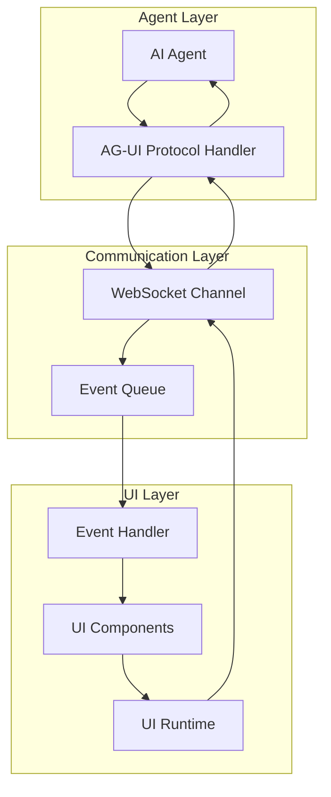

# AG-UI Protocol Specification

## Overview

The Agent-UI (AG-UI) Protocol is a standardized communication protocol that enables seamless interaction between AI agents and dynamically generated user interfaces. It provides a structured way for agents to request, update, and respond to UI interactions, ensuring consistent behavior across different UI frameworks and implementations.

## Protocol Goals

1. **Standardization**: Consistent interface for agent-UI communication
2. **Extensibility**: Support for new UI types and interaction patterns
3. **Reliability**: Guaranteed message delivery and error handling
4. **Real-time**: Low-latency bidirectional communication
5. **Type Safety**: Strong typing for contracts and payloads

## Architecture



## Message Structure

### Base Message Format

```typescript
interface AGUIMessage {
  id: string;                    // Unique message identifier (UUID v4)
  timestamp: string;             // ISO 8601 timestamp
  type: AGUIMessageType;        // Message type
  source: MessageSource;        // Message source (agent or ui)
  sessionId: string;            // Workflow session identifier
  correlationId?: string;       // Correlates related messages
  payload: AGUIPayload;         // Message payload
  metadata: MessageMetadata;    // Additional metadata
}
```

### Message Metadata

```typescript
interface MessageMetadata {
  version: string;              // Protocol version
  priority: MessagePriority;    // Message priority
  retryCount: number;           // Number of retry attempts
  timeout: number;              // Message timeout in milliseconds
  tags?: Record<string, string>; // Optional tags for routing/filtering
}
```

### Message Types

```typescript
enum AGUIMessageType {
  // UI Request/Creation
  UI_CREATE_REQUEST = 'ui.create.request',
  UI_CREATE_RESPONSE = 'ui.create.response',
  UI_UPDATE_REQUEST = 'ui.update.request',
  UI_UPDATE_RESPONSE = 'ui.update.response',
  UI_DESTROY_REQUEST = 'ui.destroy.request',
  UI_DESTROY_RESPONSE = 'ui.destroy.response',

  // Interaction Events
  UI_INTERACTION = 'ui.interaction',
  UI_INPUT_REQUEST = 'ui.input.request',
  UI_INPUT_RESPONSE = 'ui.input.response',
  UI_OUTPUT_DATA = 'ui.output.data',

  // Workflow Events
  WORKFLOW_STEP_START = 'workflow.step.start',
  WORKFLOW_STEP_COMPLETE = 'workflow.step.complete',
  WORKFLOW_APPROVAL_REQUEST = 'workflow.approval.request',
  WORKFLOW_APPROVAL_RESPONSE = 'workflow.approval.response',
  WORKFLOW_ERROR = 'workflow.error',

  // System Events
  HEARTBEAT = 'system.heartbeat',
  ERROR = 'system.error',
  STATUS_UPDATE = 'system.status.update'
}

enum MessagePriority {
  LOW = 'low',
  NORMAL = 'normal',
  HIGH = 'high',
  CRITICAL = 'critical'
}

enum MessageSource {
  AGENT = 'agent',
  UI = 'ui',
  SYSTEM = 'system'
}
```

## Event Specifications

### UI Creation Request

```typescript
interface UICreateRequestPayload {
  uiType: UIType;               // Type of UI (streamlit, gradio, react)
  template?: string;            // UI template identifier
  config: UIConfiguration;      // UI configuration
  data?: any;                   // Initial data for the UI
  layout?: LayoutConfiguration; // Layout specifications
  components?: ComponentSpec[]; // Component specifications
}

interface UIConfiguration {
  title: string;
  description?: string;
  theme?: string;
  width?: number;
  height?: number;
  resizable?: boolean;
  theme?: ThemeConfiguration;
  permissions?: UIPermissions;
}

interface ThemeConfiguration {
  primaryColor?: string;
  backgroundColor?: string;
  textColor?: string;
  fontFamily?: string;
  customCSS?: string;
}

interface UIPermissions {
  allowFileUpload?: boolean;
  allowFileDownload?: boolean;
  allowCamera?: boolean;
  allowMicrophone?: boolean;
  allowGeolocation?: boolean;
}
```

### UI Interaction Event

```typescript
interface UIInteractionPayload {
  componentId: string;          // ID of the component that triggered the event
  eventType: InteractionType;   // Type of interaction
  data: any;                    // Interaction data
  context?: InteractionContext; // Additional context
}

enum InteractionType {
  CLICK = 'click',
  INPUT_CHANGE = 'input.change',
  SUBMIT = 'submit',
  CANCEL = 'cancel',
  FILE_UPLOAD = 'file.upload',
  FILE_DOWNLOAD = 'file.download',
  DRAG_DROP = 'drag.drop',
  RESIZE = 'resize',
  FOCUS = 'focus',
  BLUR = 'blur'
}

interface InteractionContext {
  timestamp: string;
  userAgent: string;
  sessionId: string;
  userId: string;
  pageUrl?: string;
  referrer?: string;
}
```

### Workflow Approval Request

```typescript
interface WorkflowApprovalRequestPayload {
  workflowId: string;           // Workflow identifier
  stepId: string;               // Current step identifier
  approvalType: ApprovalType;   // Type of approval required
  title: string;                // Approval title
  description: string;          // Detailed description
  data?: any;                   // Data requiring approval
  options?: ApprovalOption[];   // Available approval options
  deadline?: string;            // Approval deadline (ISO 8601)
  requiredLevel: ApprovalLevel; // Required approval level
}

enum ApprovalType {
  SIMPLE = 'simple',           // Simple yes/no approval
  OPTION_SELECT = 'option_select', // Select from options
  TEXT_INPUT = 'text_input',   // Text-based approval
  FILE_UPLOAD = 'file_upload', // File-based approval
  MULTI_STEP = 'multi_step'    // Multi-step approval process
}

enum ApprovalLevel {
  INFO = 'info',               // Informational only
  WARNING = 'warning',         // Warning level
  CRITICAL = 'critical'        // Critical approval required
}

interface ApprovalOption {
  id: string;
  label: string;
  description?: string;
  icon?: string;
  style?: 'primary' | 'secondary' | 'danger';
  requiresConfirmation?: boolean;
}
```

## Component Specification

### Component Types

```typescript
enum ComponentType {
  INPUT = 'input',
  BUTTON = 'button',
  SELECT = 'select',
  CHECKBOX = 'checkbox',
  RADIO = 'radio',
  TEXTAREA = 'textarea',
  FILE_UPLOAD = 'file_upload',
  DATA_TABLE = 'data_table',
  CHART = 'chart',
  MARKDOWN = 'markdown',
  IMAGE = 'image',
  VIDEO = 'video',
  SLIDER = 'slider',
  DATE_PICKER = 'date_picker',
  COLOR_PICKER = 'color_picker'
}
```

### Component Specification

```typescript
interface ComponentSpec {
  id: string;                  // Unique component identifier
  type: ComponentType;         // Component type
  label?: string;              // Component label
  description?: string;        // Component description
  config: ComponentConfig;     // Component-specific configuration
  validation?: ValidationRule[]; // Validation rules
  dependencies?: string[];     // Dependencies on other components
  layout?: LayoutInfo;         // Layout information
}

interface ComponentConfig {
  [key: string]: any;          // Type-specific configuration
}

interface ValidationRule {
  type: ValidationType;
  params: any;
  message?: string;
}

enum ValidationType {
  REQUIRED = 'required',
  MIN_LENGTH = 'min_length',
  MAX_LENGTH = 'max_length',
  REGEX = 'regex',
  EMAIL = 'email',
  NUMBER = 'number',
  RANGE = 'range',
  CUSTOM = 'custom'
}
```

## Error Handling

### Error Message Format

```typescript
interface ErrorPayload {
  code: ErrorCode;              // Error code
  message: string;              // Human-readable error message
  details?: ErrorDetails;       // Detailed error information
  suggestions?: string[];       // Suggested resolutions
  stack?: string;               // Stack trace (development only)
}

enum ErrorCode {
  VALIDATION_ERROR = 'validation.error',
  AUTHENTICATION_ERROR = 'authentication.error',
  AUTHORIZATION_ERROR = 'authorization.error',
  NOT_FOUND = 'not_found',
  TIMEOUT = 'timeout',
  RATE_LIMIT = 'rate_limit',
  INTERNAL_ERROR = 'internal.error',
  UI_GENERATION_ERROR = 'ui.generation.error',
  WORKFLOW_ERROR = 'workflow.error',
  COMMUNICATION_ERROR = 'communication.error'
}

interface ErrorDetails {
  field?: string;               // Field with error (for validation errors)
  component?: string;           // Component with error
  step?: string;                // Workflow step with error
  context?: Record<string, any>; // Additional context
}
```

### Error Handling Strategy

1. **Graceful Degradation**: UI should remain functional even with errors
2. **User Feedback**: Clear, actionable error messages for users
3. **Logging**: Comprehensive error logging for debugging
4. **Recovery**: Automatic recovery when possible
5. **Escalation**: Escalate critical errors to administrators

## Real-time Communication

### WebSocket Connection Management

```typescript
interface WebSocketConfig {
  url: string;                  // WebSocket URL
  protocols?: string[];         // Sub-protocols
  reconnect: ReconnectConfig;   // Reconnection configuration
  heartbeat: HeartbeatConfig;   // Heartbeat configuration
}

interface ReconnectConfig {
  enabled: boolean;
  maxAttempts: number;
  initialDelay: number;         // Initial delay in milliseconds
  maxDelay: number;             // Maximum delay in milliseconds
  backoffFactor: number;        // Exponential backoff factor
}

interface HeartbeatConfig {
  enabled: boolean;
  interval: number;             // Interval in milliseconds
  timeout: number;              // Timeout in milliseconds
}
```

### Connection Lifecycle

1. **Connection Establishment**: Authenticate and establish WebSocket connection
2. **Session Management**: Maintain session state across reconnections
3. **Message Queuing**: Queue messages during disconnections
4. **Reconnection**: Automatic reconnection with exponential backoff
5. **Cleanup**: Clean up resources on connection termination

## Security Considerations

### Authentication

```typescript
interface AuthenticationPayload {
  token: string;                // JWT token
  expiresAt: string;            // Token expiration
  permissions: string[];        // User permissions
  sessionId: string;            // Session identifier
}
```

### Message Validation

1. **Schema Validation**: Validate all messages against schemas
2. **Rate Limiting**: Prevent message flooding
3. **Input Sanitization**: Sanitize all user inputs
4. **Permission Checks**: Verify user permissions for operations

### Data Protection

1. **Encryption**: Encrypt sensitive data in transit
2. **PII Handling**: Special handling for personally identifiable information
3. **Audit Logging**: Log all access and modifications
4. **Data Retention**: Define appropriate data retention policies

## Implementation Guidelines

### Client-Side Implementation

```typescript
class AGUIClient {
  private ws: WebSocket;
  private messageQueue: AGUIMessage[] = [];
  private messageHandlers: Map<AGUIMessageType, MessageHandler>;

  constructor(config: WebSocketConfig) {
    this.connect(config);
    this.setupMessageHandlers();
  }

  async createUI(payload: UICreateRequestPayload): Promise<AGUIMessage> {
    const message: AGUIMessage = {
      id: generateUUID(),
      timestamp: new Date().toISOString(),
      type: AGUIMessageType.UI_CREATE_REQUEST,
      source: MessageSource.UI,
      sessionId: this.sessionId,
      payload,
      metadata: {
        version: '1.0.0',
        priority: MessagePriority.NORMAL,
        retryCount: 0,
        timeout: 10000
      }
    };

    return this.sendMessage(message);
  }

  private async sendMessage(message: AGUIMessage): Promise<AGUIMessage> {
    return new Promise((resolve, reject) => {
      this.messageHandlers.set(message.id, {
        resolve,
        reject,
        timeout: setTimeout(() => {
          reject(new Error('Message timeout'));
        }, message.metadata.timeout)
      });

      this.ws.send(JSON.stringify(message));
    });
  }
}
```

### Server-Side Implementation

```typescript
class AGUIServer {
  private clients: Map<string, WebSocket> = new Map();
  private handlers: Map<AGUIMessageType, MessageHandler> = new Map();

  async handleClientMessage(ws: WebSocket, message: AGUIMessage) {
    try {
      // Validate message
      await this.validateMessage(message);

      // Route to appropriate handler
      const handler = this.handlers.get(message.type);
      if (!handler) {
        throw new Error(`No handler for message type: ${message.type}`);
      }

      // Process message
      const response = await handler.handle(message);

      // Send response
      this.sendResponse(ws, response);

    } catch (error) {
      this.sendError(ws, message, error);
    }
  }

  private async validateMessage(message: AGUIMessage): Promise<void> {
    // Implement message validation logic
    // Schema validation, authentication, authorization, etc.
  }
}
```

## Testing Strategy

### Unit Tests

- Test message serialization/deserialization
- Test validation rules
- Test error handling
- Test client/server implementations

### Integration Tests

- Test end-to-end message flow
- Test WebSocket communication
- Test UI generation workflows
- Test error recovery scenarios

### Performance Tests

- Test message throughput
- Test concurrent connections
- Test memory usage
- Test response times

## Future Extensions

### Planned Features

1. **Multi-UI Support**: Support for multiple UI frameworks simultaneously
2. **Collaborative UIs**: Multi-user collaborative interfaces
3. **Voice Interactions**: Voice-based UI interactions
4. **AR/VR Support**: Augmented and virtual reality interfaces
5. **AI-Powered UI**: AI-assisted UI generation and optimization

### Extension Points

1. **Custom Components**: Plugin system for custom UI components
2. **Message Middleware**: Middleware system for message processing
3. **Storage Adapters**: Pluggable storage backends
4. **Authentication Providers**: Multiple authentication methods

---

This AG-UI Protocol specification provides a comprehensive foundation for building reliable, extensible, and secure agent-UI communication systems. It balances flexibility with consistency, enabling diverse use cases while maintaining standardization.