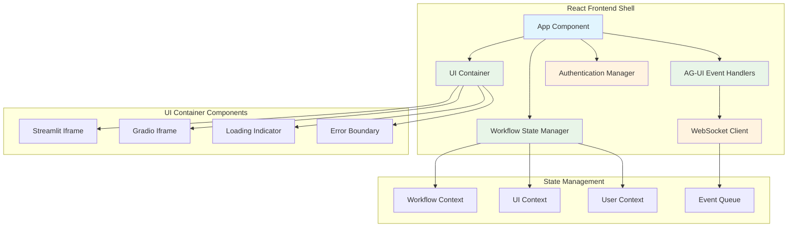
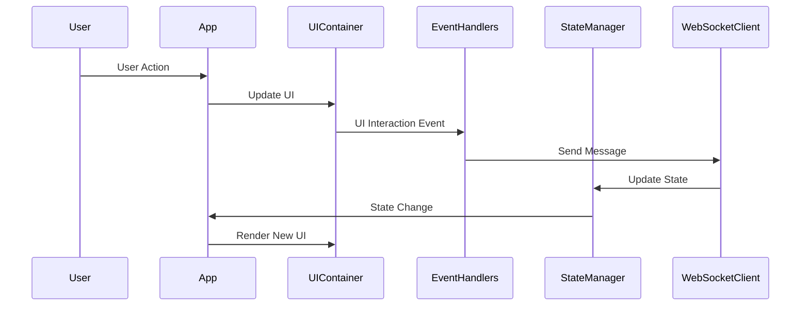
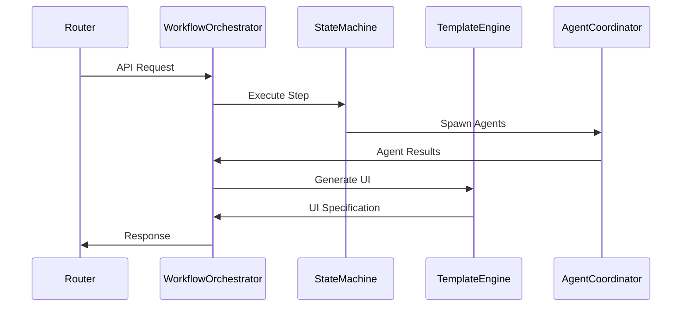
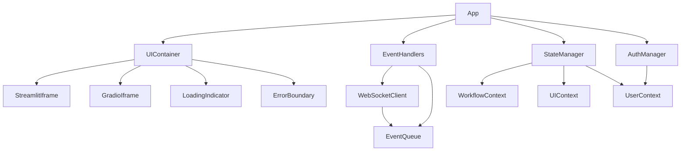
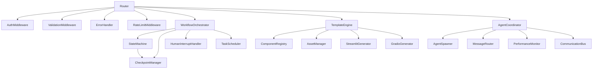

# C4 Model: Component Diagram - GUI-LOP

## Level 3: Component Architecture

### Frontend Components



### Backend Components



```mermaid
graph TB
    subgraph "Express API Server"
        Router[API Router]
        AuthMiddleware[Authentication Middleware]
        ValidationMiddleware[Validation Middleware]
        ErrorHandler[Error Handler]
        RateLimitMiddleware[Rate Limiting]
    end

    subgraph "Workflow Engine Components"
        StateMachine[State Machine Engine]
        CheckpointManager[Checkpoint Manager]
        WorkflowOrchestrator[Workflow Orchestrator]
        HumanInterruptHandler[Human Interrupt Handler]
        TaskScheduler[Task Scheduler]
    end

    subgraph "UI Generation Components"
        TemplateEngine[Template Engine]
        StreamletGenerator[Streamlit Generator]
        GradioGenerator[Gradio Generator]
        ComponentRegistry[Component Registry]
        AssetManager[Asset Manager]
    end

    subgraph "Agent Components"
        AgentSpawner[Agent Spawner]
        AgentCoordinator[Agent Coordinator]
        MessageRouter[Message Router]
        PerformanceMonitor[Performance Monitor]
        CommunicationBus[Communication Bus]
    end

    Router --> AuthMiddleware
    Router --> ValidationMiddleware
    Router --> ErrorHandler
    Router --> RateLimitMiddleware
    WorkflowOrchestrator --> StateMachine
    WorkflowOrchestrator --> CheckpointManager
    WorkflowOrchestrator --> HumanInterruptHandler
    WorkflowOrchestrator --> TaskScheduler
    TemplateEngine --> StreamletGenerator
    TemplateEngine --> GradioGenerator
    TemplateEngine --> ComponentRegistry
    TemplateEngine --> AssetManager
    AgentCoordinator --> AgentSpawner
    AgentCoordinator --> MessageRouter
    AgentCoordinator --> PerformanceMonitor
    AgentCoordinator --> CommunicationBus

    style Router fill:#E1F5FE
    style AuthMiddleware fill:#E8F5E8
    style ValidationMiddleware fill:#E8F5E8
    style ErrorHandler fill:#E8F5E8
    style RateLimitMiddleware fill:#E8F5E8
    style StateMachine fill:#FFF3E0
    style CheckpointManager fill:#FFF3E0
    style WorkflowOrchestrator fill:#FFF3E0
    style HumanInterruptHandler fill:#FFF3E0
    style TaskScheduler fill:#FFF3E0
```

## Component Specifications

### Frontend Components

#### 1. App Component
**Technology:** React 18+, TypeScript

**Purpose:** Root component that orchestrates the entire frontend application

**Key Features:**
- Route management and navigation
- Global state initialization
- Service provider setup
- Error boundary implementation

**Responsibilities:**
- Initialize application services
- Manage routing configuration
- Provide global error handling
- Setup authentication flow
- Configure theme and internationalization

**Interfaces:**
- **Dependencies:** React Router, State Management
- **Props:** Configuration object, theme settings
- **Events:** Application lifecycle events

#### 2. UI Container
**Technology:** React, Iframes, TypeScript

**Purpose:** Container for dynamically generated UI components

**Key Features:**
- Iframe management for Streamlit/Gradio
- Loading state management
- Error handling for UI failures
- Responsive layout handling

**Responsibilities:**
- Render UI components in appropriate containers
- Handle iframe communication via postMessage
- Manage loading and error states
- Ensure responsive design
- Handle UI lifecycle events

**Interfaces:**
- **Dependencies:** AG-UI Protocol, Event Handlers
- **Props:** UI configuration, event callbacks
- **Events:** UI lifecycle events, interaction events

#### 3. AG-UI Event Handlers
**Technology:** React Hooks, WebSocket, TypeScript

**Purpose:** Handle all AG-UI protocol events and communication

**Key Features:**
- WebSocket connection management
- Event routing and processing
- Message validation and serialization
- Automatic reconnection handling

**Responsibilities:**
- Establish and maintain WebSocket connections
- Route incoming events to appropriate handlers
- Validate and serialize messages
- Handle connection errors and reconnection
- Queue messages during disconnections

**Interfaces:**
- **Dependencies:** WebSocket Client, Event Queue
- **Props:** Connection configuration, event handlers
- **Events:** All AG-UI protocol events

#### 4. Workflow State Manager
**Technology:** React Context, Redux Toolkit, TypeScript

**Purpose:** Manage workflow state and transitions

**Key Features:**
- Centralized state management
- State persistence and recovery
- Optimistic updates
- Time-travel debugging

**Responsibilities:**
- Maintain current workflow state
- Handle state transitions
- Persist state to local storage
- Provide state to components
- Handle state recovery on page reload

**Interfaces:**
- **Dependencies:** Workflow Context, Local Storage
- **Props:** Initial state, reducers, middleware
- **Events:** State change events, persistence events

### Backend Components

#### 1. API Router
**Technology:** Express.js, TypeScript

**Purpose:** Route and dispatch incoming API requests

**Key Features:**
- Request routing and versioning
- Middleware integration
- Response formatting
- API documentation generation

**Responsibilities:**
- Define API routes and handlers
- Apply middleware to routes
- Format API responses consistently
- Generate API documentation
- Handle route-level errors

**Interfaces:**
- **Dependencies:** Express, Middleware components
- **Props:** Route definitions, middleware stack
- **Events:** Request/response events, error events

#### 2. State Machine Engine
**Technology:** LangGraph, Python, TypeScript definitions

**Purpose:** Execute and manage workflow state machines

**Key Features:**
- State graph execution
- Checkpoint management
- Interrupt handling
- State visualization

**Responsibilities:**
- Execute workflow state graphs
- Manage state transitions
- Handle interrupt points
- Create and restore checkpoints
- Track execution history

**Interfaces:**
- **Dependencies:** LangGraph, Checkpoint Manager
- **Props:** State graph definition, initial state
- **Events:** State transition events, interrupt events

#### 3. Template Engine
**Technology:** Jinja2, Python, TypeScript definitions

**Purpose:** Generate UI scripts from templates

**Key Features:**
- Template rendering and caching
- Component library management
- Asset optimization
- Code generation

**Responsibilities:**
- Render UI templates with data
- Manage template cache
- Optimize generated assets
- Validate generated code
- Provide template versioning

**Interfaces:**
- **Dependencies:** Component Registry, Asset Manager
- **Props:** Template definitions, data context
- **Events:** Template rendering events, cache events

#### 4. Agent Spawner
**Technology:** Python, asyncio, TypeScript definitions

**Purpose:** Create and manage agent instances

**Key Features:**
- Agent lifecycle management
- Resource allocation
- Performance monitoring
- Health checking

**Responsibilities:**
- Spawn new agent instances
- Manage agent lifecycle
- Allocate system resources
- Monitor agent health
- Handle agent failures

**Interfaces:**
- **Dependencies:** Agent Coordinator, Performance Monitor
- **Props:** Agent specifications, resource limits
- **Events:** Agent lifecycle events, performance events

## Data Flow Between Components

### Frontend Data Flow



### Backend Data Flow



## Component Dependencies

### Frontend Dependency Graph



### Backend Dependency Graph



## Component Interfaces and Contracts

### Frontend Component Contracts

#### UI Container Interface

```typescript
interface UIContainerProps {
  uiType: 'streamlit' | 'gradio' | 'react';
  config: UIConfiguration;
  eventHandlers: EventHandlers;
  loadingComponent?: React.ComponentType;
  errorComponent?: React.ComponentType;
}

interface UIContainerState {
  isLoading: boolean;
  error: Error | null;
  uiInstance: UIInstance | null;
  isReady: boolean;
}

interface UIInstance {
  id: string;
  type: string;
  url: string;
  config: UIConfiguration;
  status: 'loading' | 'ready' | 'error';
}
```

#### Event Handler Interface

```typescript
interface EventHandlers {
  onUIInteraction: (event: UIInteractionEvent) => void;
  onUIUpdate: (update: UIUpdateEvent) => void;
  onWorkflowStep: (step: WorkflowStepEvent) => void;
  onError: (error: ErrorEvent) => void;
  onConnectionChange: (connected: boolean) => void;
}

interface AGUIClientInterface {
  connect: () => Promise<void>;
  disconnect: () => void;
  send: (message: AGUIMessage) => Promise<AGUIMessage>;
  subscribe: (eventType: AGUIMessageType, handler: MessageHandler) => void;
  unsubscribe: (eventType: AGUIMessageType, handler: MessageHandler) => void;
}
```

### Backend Component Contracts

#### Workflow Orchestrator Interface

```typescript
interface WorkflowOrchestrator {
  startWorkflow: (workflowId: string, initialData: any) => Promise<string>;
  executeStep: (sessionId: string, stepId: string) => Promise<WorkflowStepResult>;
  pauseWorkflow: (sessionId: string) => Promise<void>;
  resumeWorkflow: (sessionId: string) => Promise<void>;
  getWorkflowStatus: (sessionId: string) => Promise<WorkflowStatus>;
  handleHumanInput: (sessionId: string, input: any) => Promise<void>;
}

interface WorkflowStepResult {
  stepId: string;
  status: 'completed' | 'paused' | 'error';
  data: any;
  nextSteps?: string[];
  uiSpecification?: UISpecification;
  humanInputRequired?: boolean;
}
```

#### Template Engine Interface

```typescript
interface TemplateEngine {
  renderTemplate: (templateId: string, data: any, config: RenderConfig) => Promise<GeneratedUI>;
  registerTemplate: (template: UITemplate) => void;
  getTemplate: (templateId: string) => UITemplate | null;
  invalidateCache: (templateId?: string) => void;
  validateTemplate: (template: string) => ValidationResult;
}

interface GeneratedUI {
  id: string;
  type: 'streamlit' | 'gradio' | 'react';
  code: string;
  assets: Asset[];
  config: UIConfiguration;
  dependencies: string[];
}
```

## Component Testing Strategy

### Frontend Component Testing

#### Unit Tests
- **React Component Testing**: Jest + React Testing Library
- **Hook Testing**: Test custom hooks in isolation
- **State Management Testing**: Test reducers and selectors
- **Event Handler Testing**: Mock WebSocket and test event flow

#### Integration Tests
- **Component Integration**: Test component interactions
- **API Integration**: Test frontend-backend communication
- **WebSocket Integration**: Test real-time communication
- **End-to-End Tests**: Playwright for complete user flows

### Backend Component Testing

#### Unit Tests
- **API Route Testing**: Supertest for HTTP endpoints
- **Business Logic Testing**: Pure Python functions
- **Database Testing**: Test repositories and models
- **Agent Testing**: Mock agent interactions

#### Integration Tests
- **Service Integration**: Test service interactions
- **Database Integration**: Test with real database
- **External Service Integration**: Test with external APIs
- **Workflow Integration**: Test complete workflows

## Component Performance Considerations

### Frontend Performance
- **Code Splitting**: Lazy load components and routes
- **Memoization**: React.memo and useMemo for expensive operations
- **Virtualization**: For large lists and tables
- **Bundle Optimization**: Tree shaking and minification

### Backend Performance
- **Caching**: Redis for frequently accessed data
- **Database Optimization**: Indexing and query optimization
- **Connection Pooling**: Database and external service connections
- **Async Processing**: Background jobs for long-running tasks

---

This component diagram provides a detailed view of the internal structure of each container in the GUI-LOP system. It shows how components are organized, how they interact, and what their responsibilities are, providing a clear blueprint for implementation.