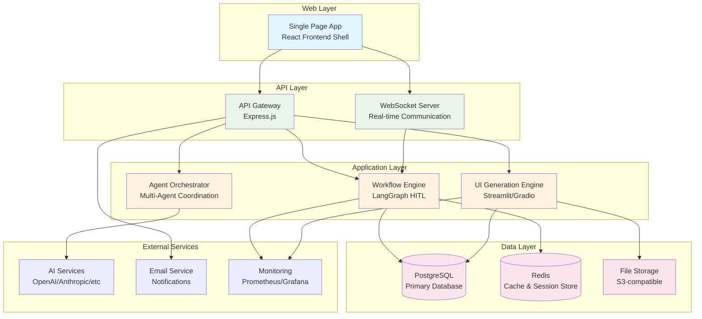

# C4 Model: Container Diagram - GUI-LOP

## Level 2: Container Architecture

## Container Specifications

### 1. Single Page App (React Frontend Shell)
**Technology:** React 18+, TypeScript, Vite

**Purpose:** Host container for dynamically generated user interfaces

**Key Features:**
- Iframe/container integration for Streamlit/Gradio apps
- AG-UI protocol event handling
- Real-time WebSocket communication
- State management for workflows
- Authentication and session management

**Responsibilities:**
- Display dynamically generated UIs
- Handle user interactions and events
- Maintain connection state with backend
- Manage user authentication tokens
- Provide responsive and accessible interface

**External Interfaces:**
- **Users:** HTTPS/WebSocket
- **API Gateway:** HTTPS REST API, WebSocket

**Data Storage:**
- Local state (React state, context)
- Session storage (authentication tokens)
- IndexedDB (caching, offline support)

### 2. API Gateway (Express.js)
**Technology:** Node.js, Express, TypeScript

**Purpose:** Central entry point for all API requests with routing, authentication, and rate limiting

**Key Features:**
- Request routing and load balancing
- Authentication and authorization
- Rate limiting and throttling
- Request/response validation
- API versioning
- CORS handling

**Responsibilities:**
- Route incoming requests to appropriate services
- Validate and authenticate requests
- Transform requests/responses as needed
- Handle error responses consistently
- Log all API interactions

**External Interfaces:**
- **SPA:** HTTPS REST API
- **Application Services:** Internal HTTP communication

**Data Storage:**
- Redis (rate limiting counters, temporary caches)

### 3. WebSocket Server (Real-time Communication)
**Technology:** Node.js, ws library, Socket.io

**Purpose:** Real-time bidirectional communication for live updates

**Key Features:**
- Persistent connections for real-time updates
- Room-based communication
- Connection management and health checks
- Message queuing and delivery guarantees
- Automatic reconnection handling

**Responsibilities:**
- Maintain WebSocket connections with clients
- Route real-time messages to appropriate handlers
- Handle connection lifecycle events
- Manage client rooms and permissions
- Ensure message delivery reliability

**External Interfaces:**
- **SPA:** WebSocket connections
- **Application Services:** Event bus integration

**Data Storage:**
- Redis (connection state, message queues)

### 4. Workflow Engine (LangGraph HITL)
**Technology:** Python, LangGraph, LangChain

**Purpose:** Orchestrate human-in-the-loop workflows with interrupt points

**Key Features:**
- State graph management with checkpoints
- Human interrupt and resume capabilities
- Agent coordination and delegation
- Workflow versioning and rollback
- Performance monitoring and optimization

**Responsibilities:**
- Execute workflow state machines
- Manage workflow checkpoints and state
- Coordinate agent interactions
- Handle human approval/interrupt points
- Track workflow execution metrics

**External Interfaces:**
- **API Gateway:** REST API
- **WebSocket Server:** Event communication
- **PostgreSQL:** State persistence

**Data Storage:**
- PostgreSQL (workflow state, checkpoints, history)
- Redis (runtime state, temporary data)

### 5. UI Generation Engine (Streamlit/Gradio)
**Technology:** Python, Streamlit, Gradio, Jinja2

**Purpose:** Dynamically generate user interfaces based on agent requirements

**Key Features:**
- Template-based UI generation
- Streamlit and Gradio runtime management
- Interactive component creation
- Real-time UI updates
- Asset management and optimization

**Responsibilities:**
- Generate UI scripts from templates
- Manage UI runtime environments
- Handle UI component events
- Process file uploads/downloads
- Optimize UI performance

**External Interfaces:**
- **API Gateway:** REST API
- **File Storage:** Asset management
- **SPA:** UI delivery via iframes

**Data Storage:**
- PostgreSQL (UI templates, instances)
- File Storage (static assets, generated files)

### 6. Agent Orchestrator (Multi-Agent Coordination)
**Technology:** Python, asyncio, message queues

**Purpose:** Coordinate multiple specialized agents for complex tasks

**Key Features:**
- Agent lifecycle management
- Task distribution and load balancing
- Inter-agent communication
- Performance monitoring
- Fault tolerance and recovery

**Responsibilities:**
- Spawn and manage agent instances
- Distribute tasks among agents
- Facilitate agent communication
- Monitor agent performance
- Handle agent failures and recovery

**External Interfaces:**
- **API Gateway:** REST API
- **AI Services:** External AI model access
- **Workflow Engine:** Task integration

**Data Storage:**
- PostgreSQL (agent configurations, performance data)
- Redis (agent state, message queues)

## Data Flow Between Containers

### User Interaction Flow
1. **SPA** receives user action via AG-UI event
2. **SPA** sends event to **WebSocket Server**
3. **WebSocket Server** forwards to **Workflow Engine**
4. **Workflow Engine** processes state change
5. **Workflow Engine** may spawn tasks in **Agent Orchestrator**
6. **Agent Orchestrator** coordinates with **AI Services**
7. **Workflow Engine** may request UI from **UI Generation Engine**
8. **UI Generation Engine** creates UI and stores in **File Storage**
9. **Workflow Engine** notifies **SPA** via **WebSocket Server**
10. **SPA** updates UI display

### Data Persistence Strategy
- **PostgreSQL**: Long-term storage for workflows, configurations, audit trails
- **Redis**: Short-term caching, session data, message queues
- **File Storage**: Static assets, generated UI files, user uploads

## Communication Protocols

### HTTP/HTTPS REST APIs
- **Format:** JSON with OpenAPI specification
- **Authentication:** JWT tokens with refresh mechanism
- **Versioning:** URL-based versioning (/api/v1/)
- **Documentation:** Swagger/OpenAPI with interactive console

### WebSocket Communication
- **Protocol:** Socket.io with fallback to raw WebSocket
- **Events:** Structured JSON messages with type and payload
- **Authentication:** Token-based on connection establishment
- **Error Handling:** Standardized error codes and messages

### Internal Service Communication
- **Protocol:** HTTP/2 with gRPC for high-performance services
- **Service Discovery:** Consul or Kubernetes service discovery
- **Load Balancing:** Internal load balancer with health checks
- **Circuit Breaker:** Hystrix or resilience4j patterns

## Container Deployment Architecture

### Containerization Strategy
- **Base Images:** Official images with security scanning
- **Multi-stage Builds:** Optimized final images
- **Resource Limits:** CPU and memory limits per container
- **Health Checks:** Comprehensive health check endpoints

### Orchestration Platform
- **Kubernetes:** Container orchestration and scaling
- **Helm Charts:** Package management and deployment
- **ConfigMaps/Secrets:** Configuration and secret management
- **Persistent Volumes:** Database and file storage

### Scaling Strategies
- **Horizontal Scaling:** Stateless services scale based on load
- **Vertical Scaling:** Stateful services with resource allocation
- **Auto-scaling:** Metrics-based scaling policies
- **Blue-Green Deployment:** Zero-downtime deployments

## Security Architecture by Container

### Network Security
- **Network Policies:** Kubernetes network policies for isolation
- **TLS Encryption:** End-to-end encryption for all communication
- **VPN Access:** Secure access to management interfaces
- **WAF Protection:** Web Application Firewall for external services

### Container Security
- **Image Scanning:** Vulnerability scanning for all images
- **Runtime Protection:** Container runtime monitoring
- **Secret Management:** Kubernetes secrets with encryption
- **Access Control:** RBAC for container and pod access

### Data Security
- **Encryption at Rest:** Database and file encryption
- **Encryption in Transit:** TLS for all network communication
- **Data Classification:** Sensitivity-based access controls
- **Audit Logging:** Comprehensive audit trails

---

This container diagram provides a detailed view of the GUI-LOP system architecture, showing how different containers interact to deliver the complete platform functionality. Each container has well-defined responsibilities and interfaces, enabling independent development, deployment, and scaling.