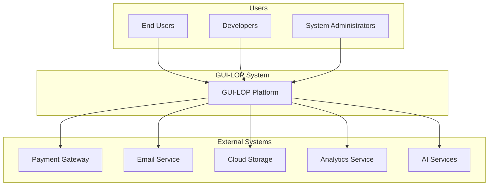

# C4 Model: Context Diagram - GUI-LOP

## Level 1: System Context

## User Personas and Interactions

### End Users
- **Role**: Primary users who interact with generated UIs
- **Goals**: Complete tasks through dynamic interfaces, collaborate with AI agents
- **Interactions**:
  - Access dynamically generated interfaces
  - Provide input and approval at workflow checkpoints
  - Monitor workflow progress
  - View results and insights

### Developers
- **Role**: Build and extend the GUI-LOP platform
- **Goals**: Create workflows, design UI templates, integrate services
- **Interactions**:
  - Configure workflow definitions
  - Create UI generation templates
  - Monitor system performance
  - Debug and troubleshoot issues

### System Administrators
- **Role**: Manage and maintain the GUI-LOP infrastructure
- **Goals**: Ensure system reliability, security, and performance
- **Interactions**:
  - Monitor system health
  - Manage user accounts and permissions
  - Configure system settings
  - Perform maintenance tasks

## External System Integrations

### Payment Gateway
- **Purpose**: Process payments for premium features
- **Protocol**: REST API with webhooks
- **Data**: Payment information, billing records

### Email Service
- **Purpose**: Send notifications and alerts
- **Protocol**: SMTP or REST API
- **Data**: Email addresses, notification content

### Cloud Storage
- **Purpose**: Store files and generated UI assets
- **Protocol**: S3-compatible API
- **Data**: User files, UI assets, backups

### Analytics Service
- **Purpose**: Track usage metrics and system performance
- **Protocol**: HTTPS API
- **Data**: Usage statistics, performance metrics

### AI Services
- **Purpose**: Provide AI capabilities for agents
- **Protocol**: REST API or gRPC
- **Data**: Model inputs/outputs, agent communications

## System Boundaries and Interfaces

### External Interfaces
| Interface | Protocol | Purpose | Data Format |
|-----------|----------|---------|-------------|
| User Interface | HTTPS/WebSocket | Dynamic UI interaction | HTML/JSON |
| Payment Gateway | HTTPS | Payment processing | JSON |
| Email Service | SMTP/HTTPS | Notifications | Text/HTML |
| Cloud Storage | HTTPS | File storage | Binary/JSON |
| Analytics | HTTPS | Metrics collection | JSON |
| AI Services | HTTPS/gRPC | AI capabilities | JSON/Protobuf |

### Data Exchange Patterns
- **Request-Response**: Synchronous API calls
- **Event-Driven**: Asynchronous message passing
- **Streaming**: Real-time data updates
- **Batch Processing**: Bulk data operations

## Security and Compliance

### Trust Boundaries
- **Internet**: Untrusted external network
- **DMZ**: Semi-trusted zone for web services
- **Internal Network**: Trusted internal infrastructure
- **Database**: Highly trusted data storage

### Compliance Requirements
- **GDPR**: User data protection and privacy
- **SOC 2**: Security and availability controls
- **HIPAA**: Healthcare data protection (if applicable)
- **PCI DSS**: Payment card security

### Security Measures
- **Encryption**: End-to-end encryption for data in transit and at rest
- **Authentication**: Multi-factor authentication for sensitive operations
- **Authorization**: Role-based access control
- **Audit Logging**: Comprehensive audit trails for compliance

## Business Context and Value

### Value Proposition
GUI-LOP enables a paradigm shift in human-AI collaboration by allowing agents to dynamically generate interfaces tailored to specific workflow needs, resulting in:
- **Enhanced User Experience**: Interfaces perfectly matched to task requirements
- **Improved Efficiency**: Streamlined workflows with minimal friction
- **Greater Flexibility**: Adaptable interfaces for diverse use cases
- **Better Outcomes**: Higher quality results through optimized interactions

### Business Metrics
- **User Satisfaction**: Net Promoter Score (NPS) > 8
- **System Performance**: 99.9% uptime, < 2s UI generation time
- **User Adoption**: 50%+ monthly active users
- **Revenue Growth**: 25%+ year-over-year growth

### Strategic Goals
1. **Market Leadership**: Become the dominant platform for agent-driven UI generation
2. **Technical Excellence**: Set industry standards for HITL workflows
3. **User Success**: Achieve > 90% user success rate
4. **Sustainable Growth**: Profitable scaling with controlled infrastructure costs

---

This context diagram provides the high-level view of GUI-LOP's place in the broader ecosystem, establishing the foundation for understanding the system's role and interactions.