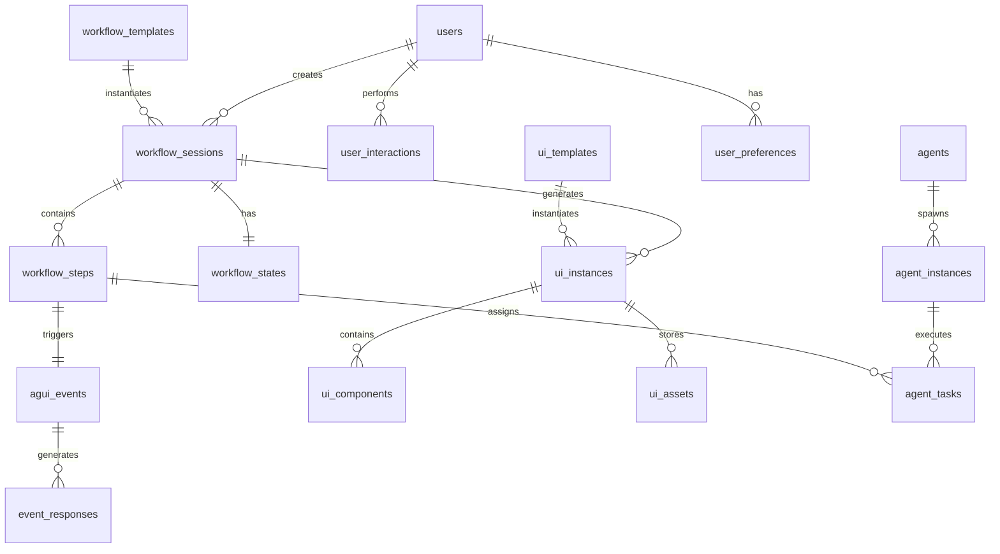

# PostgreSQL Database Schema and Data Models

## Overview

The PostgreSQL database serves as the persistent storage layer for GUI-LOP, storing workflow state, UI instances, user interactions, and system metadata. The schema is designed for scalability, performance, and data integrity while supporting the complex relationships between workflows, UIs, and agents.

## Design Principles

1. **Normalization**: Proper normalization to avoid data redundancy
2. **Performance**: Optimized indexes and query patterns for common access patterns
3. **Scalability**: Partitioning strategies for large tables
4. **Auditability**: Comprehensive audit trails and versioning
5. **Flexibility**: JSONB fields for semi-structured data
6. **Security**: Row-level security and data encryption

## Schema Overview



## Core Tables

### 1. Users Table
```sql
CREATE TABLE users (
    id UUID PRIMARY KEY DEFAULT gen_random_uuid(),
    email VARCHAR(255) UNIQUE NOT NULL,
    username VARCHAR(100) UNIQUE NOT NULL,
    full_name VARCHAR(255),
    password_hash VARCHAR(255) NOT NULL,
    avatar_url VARCHAR(500),
    is_active BOOLEAN DEFAULT true,
    is_verified BOOLEAN DEFAULT false,
    role user_role DEFAULT 'user',
    created_at TIMESTAMP WITH TIME ZONE DEFAULT NOW(),
    updated_at TIMESTAMP WITH TIME ZONE DEFAULT NOW(),
    last_login_at TIMESTAMP WITH TIME ZONE,
    email_verified_at TIMESTAMP WITH TIME ZONE,
    metadata JSONB DEFAULT '{}'
);

CREATE TYPE user_role AS ENUM ('admin', 'user', 'developer', 'agent');

-- Indexes
CREATE INDEX idx_users_email ON users(email);
CREATE INDEX idx_users_username ON users(username);
CREATE INDEX idx_users_created_at ON users(created_at);
CREATE INDEX idx_users_role ON users(role);
```

### 2. Workflow Sessions Table
```sql
CREATE TABLE workflow_sessions (
    id UUID PRIMARY KEY DEFAULT gen_random_uuid(),
    user_id UUID NOT NULL REFERENCES users(id) ON DELETE CASCADE,
    template_id UUID REFERENCES workflow_templates(id),
    name VARCHAR(255) NOT NULL,
    description TEXT,
    status workflow_status DEFAULT 'created',
    current_step_id UUID,
    state JSONB NOT NULL DEFAULT '{}',
    context JSONB DEFAULT '{}',
    config JSONB DEFAULT '{}',
    started_at TIMESTAMP WITH TIME ZONE,
    completed_at TIMESTAMP WITH TIME ZONE,
    paused_at TIMESTAMP WITH TIME ZONE,
    expires_at TIMESTAMP WITH TIME ZONE,
    created_at TIMESTAMP WITH TIME ZONE DEFAULT NOW(),
    updated_at TIMESTAMP WITH TIME ZONE DEFAULT NOW(),
    metadata JSONB DEFAULT '{}'
);

CREATE TYPE workflow_status AS ENUM (
    'created', 'running', 'paused', 'waiting_for_input',
    'completed', 'failed', 'cancelled', 'expired'
);

-- Indexes
CREATE INDEX idx_workflow_sessions_user_id ON workflow_sessions(user_id);
CREATE INDEX idx_workflow_sessions_status ON workflow_sessions(status);
CREATE INDEX idx_workflow_sessions_template_id ON workflow_sessions(template_id);
CREATE INDEX idx_workflow_sessions_created_at ON workflow_sessions(created_at);
CREATE INDEX idx_workflow_sessions_updated_at ON workflow_sessions(updated_at);

-- Partitioning by created_at for large datasets
CREATE TABLE workflow_sessions_y2024 PARTITION OF workflow_sessions
FOR VALUES FROM ('2024-01-01') TO ('2025-01-01');
```

### 3. UI Instances Table
```sql
CREATE TABLE ui_instances (
    id UUID PRIMARY KEY DEFAULT gen_random_uuid(),
    workflow_session_id UUID NOT NULL REFERENCES workflow_sessions(id) ON DELETE CASCADE,
    template_id UUID REFERENCES ui_templates(id),
    type ui_type NOT NULL,
    title VARCHAR(255) NOT NULL,
    description TEXT,
    config JSONB NOT NULL DEFAULT '{}',
    components JSONB DEFAULT '[]',
    layout JSONB DEFAULT '{}',
    theme JSONB DEFAULT '{}',
    url VARCHAR(500),
    status ui_status DEFAULT 'created',
    created_at TIMESTAMP WITH TIME ZONE DEFAULT NOW(),
    updated_at TIMESTAMP WITH TIME ZONE DEFAULT NOW(),
    expires_at TIMESTAMP WITH TIME ZONE,
    metadata JSONB DEFAULT '{}'
);

CREATE TYPE ui_type AS ENUM ('streamlit', 'gradio', 'react', 'custom');
CREATE TYPE ui_status AS ENUM ('created', 'generating', 'ready', 'error', 'expired');

-- Indexes
CREATE INDEX idx_ui_instances_workflow_session_id ON ui_instances(workflow_session_id);
CREATE INDEX idx_ui_instances_type ON ui_instances(type);
CREATE INDEX idx_ui_instances_status ON ui_instances(status);
CREATE INDEX idx_ui_instances_template_id ON ui_instances(template_id);
CREATE INDEX idx_ui_instances_created_at ON ui_instances(created_at);

-- GIN indexes for JSONB fields
CREATE INDEX idx_ui_instances_config_gin ON ui_instances USING GIN(config);
CREATE INDEX idx_ui_instances_components_gin ON ui_instances USING GIN(components);
```

### 4. AG-UI Events Table
```sql
CREATE TABLE agui_events (
    id UUID PRIMARY KEY DEFAULT gen_random_uuid(),
    session_id UUID REFERENCES workflow_sessions(id) ON DELETE CASCADE,
    ui_instance_id UUID REFERENCES ui_instances(id) ON DELETE SET NULL,
    message_id VARCHAR(255) UNIQUE NOT NULL,
    type VARCHAR(100) NOT NULL,
    source VARCHAR(50) NOT NULL, -- 'agent', 'ui', 'system'
    payload JSONB NOT NULL,
    metadata JSONB DEFAULT '{}',
    processed BOOLEAN DEFAULT false,
    error_message TEXT,
    created_at TIMESTAMP WITH TIME ZONE DEFAULT NOW(),
    processed_at TIMESTAMP WITH TIME ZONE
);

-- Indexes
CREATE INDEX idx_agui_events_session_id ON agui_events(session_id);
CREATE INDEX idx_agui_events_ui_instance_id ON agui_events(ui_instance_id);
CREATE INDEX idx_agui_events_type ON agui_events(type);
CREATE INDEX idx_agui_events_source ON agui_events(source);
CREATE INDEX idx_agui_events_created_at ON agui_events(created_at);
CREATE INDEX idx_agui_events_processed ON agui_events(processed);

-- Partitioning by created_at for high-volume events
CREATE TABLE agui_events_y2024 PARTITION OF agui_events
FOR VALUES FROM ('2024-01-01') TO ('2025-01-01');
```

### 5. Workflow States Table
```sql
CREATE TABLE workflow_states (
    id UUID PRIMARY KEY DEFAULT gen_random_uuid(),
    workflow_session_id UUID NOT NULL REFERENCES workflow_sessions(id) ON DELETE CASCADE,
    checkpoint_id VARCHAR(255) NOT NULL,
    state_data JSONB NOT NULL,
    version INTEGER NOT NULL DEFAULT 1,
    created_at TIMESTAMP WITH TIME ZONE DEFAULT NOW(),
    metadata JSONB DEFAULT '{}'
);

-- Indexes
CREATE INDEX idx_workflow_states_workflow_session_id ON workflow_states(workflow_session_id);
CREATE INDEX idx_workflow_states_checkpoint_id ON workflow_states(checkpoint_id);
CREATE INDEX idx_workflow_states_version ON workflow_states(version);
CREATE INDEX idx_workflow_states_created_at ON workflow_states(created_at);
```

### 6. Workflow Steps Table
```sql
CREATE TABLE workflow_steps (
    id UUID PRIMARY KEY DEFAULT gen_random_uuid(),
    workflow_session_id UUID NOT NULL REFERENCES workflow_sessions(id) ON DELETE CASCADE,
    step_type VARCHAR(100) NOT NULL,
    step_name VARCHAR(255) NOT NULL,
    description TEXT,
    config JSONB DEFAULT '{}',
    status step_status DEFAULT 'pending',
    input_data JSONB DEFAULT '{}',
    output_data JSONB DEFAULT '{}',
    error_message TEXT,
    started_at TIMESTAMP WITH TIME ZONE,
    completed_at TIMESTAMP WITH TIME ZONE,
    created_at TIMESTAMP WITH TIME ZONE DEFAULT NOW(),
    updated_at TIMESTAMP WITH TIME ZONE DEFAULT NOW(),
    order_index INTEGER NOT NULL,
    parent_step_id UUID REFERENCES workflow_steps(id),
    metadata JSONB DEFAULT '{}'
);

CREATE TYPE step_status AS ENUM (
    'pending', 'running', 'waiting_for_input',
    'completed', 'failed', 'skipped', 'cancelled'
);

-- Indexes
CREATE INDEX idx_workflow_steps_workflow_session_id ON workflow_steps(workflow_session_id);
CREATE INDEX idx_workflow_steps_status ON workflow_steps(status);
CREATE INDEX idx_workflow_steps_step_type ON workflow_steps(step_type);
CREATE INDEX idx_workflow_steps_parent_step_id ON workflow_steps(parent_step_id);
CREATE INDEX idx_workflow_steps_order_index ON workflow_steps(order_index);
```

### 7. Agents Table
```sql
CREATE TABLE agents (
    id UUID PRIMARY KEY DEFAULT gen_random_uuid(),
    name VARCHAR(255) NOT NULL,
    type VARCHAR(100) NOT NULL,
    description TEXT,
    capabilities JSONB DEFAULT '[]',
    config JSONB DEFAULT '{}',
    is_active BOOLEAN DEFAULT true,
    version VARCHAR(50) DEFAULT '1.0.0',
    created_at TIMESTAMP WITH TIME ZONE DEFAULT NOW(),
    updated_at TIMESTAMP WITH TIME ZONE DEFAULT NOW(),
    metadata JSONB DEFAULT '{}'
);

-- Indexes
CREATE INDEX idx_agents_type ON agents(type);
CREATE INDEX idx_agents_is_active ON agents(is_active);
CREATE INDEX idx_agents_created_at ON agents(created_at);
```

### 8. Agent Instances Table
```sql
CREATE TABLE agent_instances (
    id UUID PRIMARY KEY DEFAULT gen_random_uuid(),
    agent_id UUID NOT NULL REFERENCES agents(id) ON DELETE CASCADE,
    workflow_session_id UUID REFERENCES workflow_sessions(id) ON DELETE CASCADE,
    instance_name VARCHAR(255),
    status agent_status DEFAULT 'initializing',
    config JSONB DEFAULT '{}',
    performance_metrics JSONB DEFAULT '{}',
    created_at TIMESTAMP WITH TIME ZONE DEFAULT NOW(),
    updated_at TIMESTAMP WITH TIME ZONE DEFAULT NOW(),
    expires_at TIMESTAMP WITH TIME ZONE,
    metadata JSONB DEFAULT '{}'
);

CREATE TYPE agent_status AS ENUM (
    'initializing', 'running', 'idle', 'busy',
    'error', 'terminated', 'expired'
);

-- Indexes
CREATE INDEX idx_agent_instances_agent_id ON agent_instances(agent_id);
CREATE INDEX idx_agent_instances_workflow_session_id ON agent_instances(workflow_session_id);
CREATE INDEX idx_agent_instances_status ON agent_instances(status);
CREATE INDEX idx_agent_instances_created_at ON agent_instances(created_at);
```

## Template Tables

### 9. Workflow Templates Table
```sql
CREATE TABLE workflow_templates (
    id UUID PRIMARY KEY DEFAULT gen_random_uuid(),
    name VARCHAR(255) NOT NULL,
    description TEXT,
    category VARCHAR(100),
    definition JSONB NOT NULL,
    config_schema JSONB DEFAULT '{}',
    is_public BOOLEAN DEFAULT false,
    version VARCHAR(50) DEFAULT '1.0.0',
    author_id UUID REFERENCES users(id),
    tags JSONB DEFAULT '[]',
    usage_count INTEGER DEFAULT 0,
    created_at TIMESTAMP WITH TIME ZONE DEFAULT NOW(),
    updated_at TIMESTAMP WITH TIME ZONE DEFAULT NOW(),
    metadata JSONB DEFAULT '{}'
);

-- Indexes
CREATE INDEX idx_workflow_templates_category ON workflow_templates(category);
CREATE INDEX idx_workflow_templates_is_public ON workflow_templates(is_public);
CREATE INDEX idx_workflow_templates_author_id ON workflow_templates(author_id);
CREATE INDEX idx_workflow_templates_usage_count ON workflow_templates(usage_count);
```

### 10. UI Templates Table
```sql
CREATE TABLE ui_templates (
    id UUID PRIMARY KEY DEFAULT gen_random_uuid(),
    name VARCHAR(255) NOT NULL,
    description TEXT,
    type ui_type NOT NULL,
    template_content TEXT NOT NULL,
    variables JSONB DEFAULT '{}',
    config JSONB DEFAULT '{}',
    is_public BOOLEAN DEFAULT false,
    version VARCHAR(50) DEFAULT '1.0.0',
    author_id UUID REFERENCES users(id),
    tags JSONB DEFAULT '[]',
    usage_count INTEGER DEFAULT 0,
    created_at TIMESTAMP WITH TIME ZONE DEFAULT NOW(),
    updated_at TIMESTAMP WITH TIME ZONE DEFAULT NOW(),
    metadata JSONB DEFAULT '{}'
);

-- Indexes
CREATE INDEX idx_ui_templates_type ON ui_templates(type);
CREATE INDEX idx_ui_templates_is_public ON ui_templates(is_public);
CREATE INDEX idx_ui_templates_author_id ON ui_templates(author_id);
CREATE INDEX idx_ui_templates_usage_count ON ui_templates(usage_count);
```

## User Interaction Tables

### 11. User Interactions Table
```sql
CREATE TABLE user_interactions (
    id UUID PRIMARY KEY DEFAULT gen_random_uuid(),
    user_id UUID NOT NULL REFERENCES users(id) ON DELETE CASCADE,
    workflow_session_id UUID REFERENCES workflow_sessions(id) ON DELETE CASCADE,
    ui_instance_id UUID REFERENCES ui_instances(id) ON DELETE SET NULL,
    interaction_type VARCHAR(100) NOT NULL,
    component_id VARCHAR(255),
    interaction_data JSONB DEFAULT '{}',
    context JSONB DEFAULT '{}',
    ip_address INET,
    user_agent TEXT,
    created_at TIMESTAMP WITH TIME ZONE DEFAULT NOW()
);

-- Indexes
CREATE INDEX idx_user_interactions_user_id ON user_interactions(user_id);
CREATE INDEX idx_user_interactions_workflow_session_id ON user_interactions(workflow_session_id);
CREATE INDEX idx_user_interactions_ui_instance_id ON user_interactions(ui_instance_id);
CREATE INDEX idx_user_interactions_interaction_type ON user_interactions(interaction_type);
CREATE INDEX idx_user_interactions_created_at ON user_interactions(created_at);

-- Partitioning by created_at for high-volume interactions
CREATE TABLE user_interactions_y2024 PARTITION OF user_interactions
FOR VALUES FROM ('2024-01-01') TO ('2025-01-01');
```

### 12. User Preferences Table
```sql
CREATE TABLE user_preferences (
    id UUID PRIMARY KEY DEFAULT gen_random_uuid(),
    user_id UUID NOT NULL REFERENCES users(id) ON DELETE CASCADE,
    preference_key VARCHAR(255) NOT NULL,
    preference_value JSONB NOT NULL,
    created_at TIMESTAMP WITH TIME ZONE DEFAULT NOW(),
    updated_at TIMESTAMP WITH TIME ZONE DEFAULT NOW(),
    UNIQUE(user_id, preference_key)
);

-- Indexes
CREATE INDEX idx_user_preferences_user_id ON user_preferences(user_id);
CREATE INDEX idx_user_preferences_preference_key ON user_preferences(preference_key);
```

## Asset and Media Tables

### 13. UI Assets Table
```sql
CREATE TABLE ui_assets (
    id UUID PRIMARY KEY DEFAULT gen_random_uuid(),
    ui_instance_id UUID NOT NULL REFERENCES ui_instances(id) ON DELETE CASCADE,
    asset_type VARCHAR(100) NOT NULL,
    filename VARCHAR(255) NOT NULL,
    file_path VARCHAR(500) NOT NULL,
    file_size BIGINT,
    mime_type VARCHAR(255),
    checksum VARCHAR(64),
    metadata JSONB DEFAULT '{}',
    created_at TIMESTAMP WITH TIME ZONE DEFAULT NOW()
);

-- Indexes
CREATE INDEX idx_ui_assets_ui_instance_id ON ui_assets(ui_instance_id);
CREATE INDEX idx_ui_assets_asset_type ON ui_assets(asset_type);
CREATE INDEX idx_ui_assets_created_at ON ui_assets(created_at);
```

## Monitoring and Analytics Tables

### 14. Performance Metrics Table
```sql
CREATE TABLE performance_metrics (
    id UUID PRIMARY KEY DEFAULT gen_random_uuid(),
    entity_type VARCHAR(100) NOT NULL,
    entity_id UUID NOT NULL,
    metric_name VARCHAR(255) NOT NULL,
    metric_value NUMERIC NOT NULL,
    unit VARCHAR(50),
    tags JSONB DEFAULT '{}',
    created_at TIMESTAMP WITH TIME ZONE DEFAULT NOW()
);

-- Indexes
CREATE INDEX idx_performance_metrics_entity ON performance_metrics(entity_type, entity_id);
CREATE INDEX idx_performance_metrics_metric_name ON performance_metrics(metric_name);
CREATE INDEX idx_performance_metrics_created_at ON performance_metrics(created_at);

-- Time-series partitioning
CREATE TABLE performance_metrics_y2024_m01 PARTITION OF performance_metrics
FOR VALUES FROM ('2024-01-01') TO ('2024-02-01');
```

### 15. Audit Logs Table
```sql
CREATE TABLE audit_logs (
    id UUID PRIMARY KEY DEFAULT gen_random_uuid(),
    user_id UUID REFERENCES users(id) ON DELETE SET NULL,
    entity_type VARCHAR(100) NOT NULL,
    entity_id UUID NOT NULL,
    action VARCHAR(100) NOT NULL,
    old_values JSONB,
    new_values JSONB,
    ip_address INET,
    user_agent TEXT,
    created_at TIMESTAMP WITH TIME ZONE DEFAULT NOW()
);

-- Indexes
CREATE INDEX idx_audit_logs_user_id ON audit_logs(user_id);
CREATE INDEX idx_audit_logs_entity ON audit_logs(entity_type, entity_id);
CREATE INDEX idx_audit_logs_action ON audit_logs(action);
CREATE INDEX idx_audit_logs_created_at ON audit_logs(created_at);

-- Partitioning by created_at for audit data
CREATE TABLE audit_logs_y2024 PARTITION OF audit_logs
FOR VALUES FROM ('2024-01-01') TO ('2025-01-01');
```

## Views and Materialized Views

### 1. Workflow Summary View
```sql
CREATE VIEW workflow_summary AS
SELECT
    ws.id,
    ws.name,
    ws.status,
    u.username as created_by,
    u.email as created_by_email,
    ws.created_at,
    ws.started_at,
    ws.completed_at,
    COUNT(DISTINCT ui.id) as ui_count,
    COUNT(DISTINCT ag.id) as agent_count,
    COUNT(DISTINCT ui_i.id) as interaction_count
FROM workflow_sessions ws
LEFT JOIN users u ON ws.user_id = u.id
LEFT JOIN ui_instances ui ON ws.id = ui.workflow_session_id
LEFT JOIN agent_instances ag ON ws.id = ag.workflow_session_id
LEFT JOIN user_interactions ui_i ON ws.id = ui_i.workflow_session_id
GROUP BY ws.id, u.username, u.email;
```

### 2. User Activity Dashboard View
```sql
CREATE MATERIALIZED VIEW user_activity_dashboard AS
SELECT
    u.id as user_id,
    u.username,
    u.email,
    COUNT(DISTINCT ws.id) as workflow_count,
    COUNT(DISTINCT ws.id FILTER WHERE ws.status = 'completed') as completed_workflows,
    COUNT(DISTINCT ui.id) as ui_count,
    COUNT(DISTINCT ui_i.id) as interaction_count,
    MAX(ws.created_at) as last_workflow_date,
    MAX(ui_i.created_at) as last_interaction_date
FROM users u
LEFT JOIN workflow_sessions ws ON u.id = ws.user_id
LEFT JOIN ui_instances ui ON ws.id = ui.workflow_session_id
LEFT JOIN user_interactions ui_i ON u.id = ui_i.user_id
GROUP BY u.id, u.username, u.email;

-- Create unique index for concurrent refresh
CREATE UNIQUE INDEX idx_user_activity_dashboard_user_id ON user_activity_dashboard(user_id);
```

## Triggers and Functions

### 1. Update Timestamp Trigger
```sql
CREATE OR REPLACE FUNCTION update_updated_at_column()
RETURNS TRIGGER AS $$
BEGIN
    NEW.updated_at = NOW();
    RETURN NEW;
END;
$$ language 'plpgsql';

-- Apply to all tables with updated_at column
CREATE TRIGGER update_workflow_sessions_updated_at
    BEFORE UPDATE ON workflow_sessions
    FOR EACH ROW EXECUTE FUNCTION update_updated_at_column();

CREATE TRIGGER update_ui_instances_updated_at
    BEFORE UPDATE ON ui_instances
    FOR EACH ROW EXECUTE FUNCTION update_updated_at_column();

CREATE TRIGGER update_workflow_steps_updated_at
    BEFORE UPDATE ON workflow_steps
    FOR EACH ROW EXECUTE FUNCTION update_updated_at_column();
```

### 2. Workflow State Validation Function
```sql
CREATE OR REPLACE FUNCTION validate_workflow_state()
RETURNS TRIGGER AS $$
BEGIN
    -- Validate that completed_at is after started_at
    IF NEW.completed_at IS NOT NULL AND NEW.started_at IS NOT NULL THEN
        IF NEW.completed_at < NEW.started_at THEN
            RAISE EXCEPTION 'completed_at must be after started_at';
        END IF;
    END IF;

    -- Validate status transitions
    IF OLD.status IS NOT NULL AND NEW.status IS NOT NULL THEN
        IF OLD.status = 'completed' AND NEW.status != 'completed' THEN
            RAISE EXCEPTION 'Cannot change status from completed to %', NEW.status;
        END IF;
    END IF;

    RETURN NEW;
END;
$$ language 'plpgsql';

CREATE TRIGGER validate_workflow_state_trigger
    BEFORE INSERT OR UPDATE ON workflow_sessions
    FOR EACH ROW EXECUTE FUNCTION validate_workflow_state();
```

### 3. Audit Logging Trigger
```sql
CREATE OR REPLACE FUNCTION audit_trigger_function()
RETURNS TRIGGER AS $$
BEGIN
    IF TG_OP = 'INSERT' THEN
        INSERT INTO audit_logs (entity_type, entity_id, action, new_values)
        VALUES (TG_TABLE_NAME, NEW.id, 'INSERT', row_to_json(NEW));
        RETURN NEW;
    ELSIF TG_OP = 'UPDATE' THEN
        INSERT INTO audit_logs (entity_type, entity_id, action, old_values, new_values)
        VALUES (TG_TABLE_NAME, NEW.id, 'UPDATE', row_to_json(OLD), row_to_json(NEW));
        RETURN NEW;
    ELSIF TG_OP = 'DELETE' THEN
        INSERT INTO audit_logs (entity_type, entity_id, action, old_values)
        VALUES (TG_TABLE_NAME, OLD.id, 'DELETE', row_to_json(OLD));
        RETURN OLD;
    END IF;
    RETURN NULL;
END;
$$ LANGUAGE plpgsql;

-- Apply to critical tables
CREATE TRIGGER audit_workflow_sessions_trigger
    AFTER INSERT OR UPDATE OR DELETE ON workflow_sessions
    FOR EACH ROW EXECUTE FUNCTION audit_trigger_function();

CREATE TRIGGER audit_ui_instances_trigger
    AFTER INSERT OR UPDATE OR DELETE ON ui_instances
    FOR EACH ROW EXECUTE FUNCTION audit_trigger_function();
```

## Security and Row-Level Policies

### 1. Enable Row-Level Security
```sql
-- Enable RLS on user-specific tables
ALTER TABLE workflow_sessions ENABLE ROW LEVEL SECURITY;
ALTER TABLE ui_instances ENABLE ROW LEVEL SECURITY;
ALTER TABLE user_interactions ENABLE ROW LEVEL SECURITY;
ALTER TABLE user_preferences ENABLE ROW LEVEL SECURITY;
```

### 2. Row-Level Security Policies
```sql
-- Users can only access their own data
CREATE POLICY user_workflow_sessions_policy ON workflow_sessions
    FOR ALL TO authenticated_user
    USING (user_id = current_setting('app.current_user_id')::uuid);

CREATE POLICY user_ui_instances_policy ON ui_instances
    FOR ALL TO authenticated_user
    USING (workflow_session_id IN (
        SELECT id FROM workflow_sessions
        WHERE user_id = current_setting('app.current_user_id')::uuid
    ));

-- Admins can access all data
CREATE POLICY admin_workflow_sessions_policy ON workflow_sessions
    FOR ALL TO admin_role
    USING (true);

CREATE POLICY admin_ui_instances_policy ON ui_instances
    FOR ALL TO admin_role
    USING (true);
```

## Performance Optimization

### 1. Composite Indexes
```sql
-- Frequently queried combinations
CREATE INDEX idx_workflow_sessions_user_status
    ON workflow_sessions(user_id, status);

CREATE INDEX idx_agui_events_session_type
    ON agui_events(session_id, type);

CREATE INDEX idx_ui_instances_workflow_status
    ON ui_instances(workflow_session_id, status);
```

### 2. Partial Indexes
```sql
-- Index only active sessions
CREATE INDEX idx_active_workflow_sessions
    ON workflow_sessions(user_id, created_at)
    WHERE status IN ('running', 'paused', 'waiting_for_input');

-- Index only recent events
CREATE INDEX idx_recent_agui_events
    ON agui_events(session_id, created_at)
    WHERE created_at > NOW() - INTERVAL '30 days';
```

### 3. Tablespaces for Performance
```sql
-- Create separate tablespaces for different access patterns
CREATE TABLESPACE fast_storage LOCATION '/var/lib/postgresql/fast';
CREATE TABLESPACE slow_storage LOCATION '/var/lib/postgresql/slow';

-- Move high-traffic tables to fast storage
ALTER TABLE agui_events SET TABLESPACE fast_storage;
ALTER TABLE user_interactions SET TABLESPACE fast_storage;

-- Move historical data to slow storage
ALTER TABLE audit_logs SET TABLESPACE slow_storage;
```

## Backup and Maintenance

### 1. Backup Strategy
```sql
-- Create backup roles and permissions
CREATE ROLE backup_user WITH LOGIN PASSWORD 'secure_backup_password';
GRANT SELECT ON ALL TABLES IN SCHEMA public TO backup_user;
GRANT USAGE ON ALL SEQUENCES IN SCHEMA public TO backup_user;

-- Create backup function
CREATE OR REPLACE FUNCTION create_backup(table_name TEXT)
RETURNS BOOLEAN AS $$
BEGIN
    EXECUTE format('CREATE TABLE %s_backup AS SELECT * FROM %s', table_name, table_name);
    RETURN true;
EXCEPTION WHEN OTHERS THEN
    RETURN false;
END;
$$ LANGUAGE plpgsql;
```

### 2. Maintenance Jobs
```sql
-- Clean up old data
CREATE OR REPLACE FUNCTION cleanup_old_data()
RETURNS VOID AS $$
BEGIN
    -- Delete old audit logs (keep 1 year)
    DELETE FROM audit_logs WHERE created_at < NOW() - INTERVAL '1 year';

    -- Delete old performance metrics (keep 6 months)
    DELETE FROM performance_metrics WHERE created_at < NOW() - INTERVAL '6 months';

    -- Delete expired UI instances
    DELETE FROM ui_instances WHERE expires_at < NOW();

    -- Delete expired agent instances
    DELETE FROM agent_instances WHERE expires_at < NOW();
END;
$$ LANGUAGE plpgsql;

-- Schedule maintenance job (requires pg_cron extension)
SELECT cron.schedule('cleanup-old-data', '0 2 * * *', 'SELECT cleanup_old_data();');
```

## Data Migration and Versioning

### 1. Schema Versioning Table
```sql
CREATE TABLE schema_versions (
    version VARCHAR(50) PRIMARY KEY,
    description TEXT,
    applied_at TIMESTAMP WITH TIME ZONE DEFAULT NOW(),
    applied_by VARCHAR(100) DEFAULT CURRENT_USER
);

-- Initial version
INSERT INTO schema_versions (version, description)
VALUES ('1.0.0', 'Initial GUI-LOP schema');
```

### 2. Migration Script Template
```sql
-- Migration: add_new_feature.sql
-- Version: 1.1.0
-- Description: Add new feature X

BEGIN;

-- Add new columns
ALTER TABLE workflow_sessions ADD COLUMN new_feature JSONB DEFAULT '{}';

-- Create new indexes
CREATE INDEX idx_workflow_sessions_new_feature ON workflow_sessions USING GIN(new_feature);

-- Update schema version
INSERT INTO schema_versions (version, description)
VALUES ('1.1.0', 'Add new feature X');

COMMIT;
```

## Monitoring and Metrics

### 1. Database Health Monitoring
```sql
-- Create monitoring view
CREATE VIEW database_health AS
SELECT
    schemaname,
    tablename,
    attname as column_name,
    n_distinct,
    correlation
FROM pg_stats
WHERE schemaname = 'public';

-- Table size monitoring
CREATE VIEW table_sizes AS
SELECT
    schemaname,
    tablename,
    pg_size_pretty(pg_total_relation_size(schemaname||'.'||tablename)) as size,
    pg_total_relation_size(schemaname||'.'||tablename) as size_bytes
FROM pg_tables
WHERE schemaname = 'public'
ORDER BY size_bytes DESC;
```

---

This PostgreSQL schema provides a comprehensive, scalable, and maintainable foundation for the GUI-LOP system. It supports complex relationships between workflows, UIs, and agents while ensuring data integrity, performance, and security. The schema is designed to handle high-volume events and user interactions while maintaining good query performance through proper indexing and partitioning strategies.