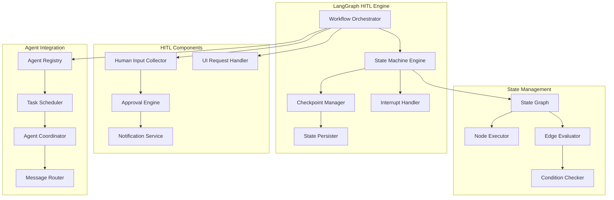

# LangGraph HITL Workflow Engine Architecture

## Overview

The LangGraph Human-in-the-Loop (HITL) Workflow Engine serves as the orchestration layer for GUI-LOP, enabling sophisticated workflows that seamlessly integrate AI agents with human decision-making. Built on LangGraph's state machine capabilities, this engine provides robust workflow management with interrupt points, checkpointing, and collaborative execution.

## Architecture Goals

1. **HITL Integration**: Natural integration of human approval and decision points
2. **State Management**: Comprehensive state tracking and persistence
3. **Flexibility**: Support for complex, multi-branch workflows
4. **Reliability**: Error handling, recovery, and rollback capabilities
5. **Performance**: Efficient execution and resource management
6. **Scalability**: Support for concurrent workflow execution

## High-Level Architecture



## Core Components

### 1. State Machine Engine
**Technology:** LangGraph, Python, NetworkX

**Purpose:** Core state machine that executes workflow graphs with HITL capabilities

**Key Features:**
- Graph-based workflow execution
- Interrupt point management
- State transitions and validation
- Error handling and recovery
- Parallel execution support

**Implementation:**

```python
# src/backend/workflow/state_machine.py
from typing import Dict, Any, Optional, List, Callable
from langgraph.graph import StateGraph, END
from langgraph.checkpoint import MemoryCheckpointSaver
from dataclasses import dataclass
from enum import Enum
import asyncio
import logging

logger = logging.getLogger(__name__)

class WorkflowStatus(Enum):
    CREATED = "created"
    RUNNING = "running"
    PAUSED = "paused"
    WAITING_FOR_INPUT = "waiting_for_input"
    COMPLETED = "completed"
    FAILED = "failed"
    CANCELLED = "cancelled"

@dataclass
class WorkflowState:
    """Core workflow state structure"""
    session_id: str
    workflow_id: str
    current_step: str
    status: WorkflowStatus
    data: Dict[str, Any]
    context: Dict[str, Any]
    interrupts: List[str]
    checkpoints: Dict[str, Dict[str, Any]]
    error: Optional[str] = None
    metadata: Dict[str, Any] = None

class StateMachineEngine:
    """Core state machine engine for workflow execution"""

    def __init__(self):
        self.graphs: Dict[str, StateGraph] = {}
        self.checkpoint_saver = MemoryCheckpointSaver()
        self.active_sessions: Dict[str, WorkflowState] = {}
        self.interrupt_handlers: Dict[str, Callable] = {}

    def register_workflow(self, workflow_id: str, graph: StateGraph) -> None:
        """Register a workflow graph"""
        self.graphs[workflow_id] = graph
        logger.info(f"Registered workflow: {workflow_id}")

    async def execute_workflow(
        self,
        session_id: str,
        workflow_id: str,
        initial_state: Dict[str, Any]
    ) -> WorkflowState:
        """Execute a workflow with HITL support"""

        if workflow_id not in self.graphs:
            raise ValueError(f"Workflow {workflow_id} not found")

        graph = self.graphs[workflow_id]

        # Initialize workflow state
        state = WorkflowState(
            session_id=session_id,
            workflow_id=workflow_id,
            current_step="start",
            status=WorkflowStatus.CREATED,
            data=initial_state,
            context={},
            interrupts=[],
            checkpoints={},
            metadata={}
        )

        self.active_sessions[session_id] = state

        try:
            # Create compiled graph with checkpointing
            compiled_graph = graph.compile(
                checkpointer=self.checkpoint_saver,
                interrupt_before=self._get_interrupt_nodes(workflow_id)
            )

            # Execute workflow
            state.status = WorkflowStatus.RUNNING
            result = await compiled_graph.ainvoke(
                initial_state,
                config={"configurable": {"thread_id": session_id}}
            )

            # Update final state
            state.data.update(result)
            state.status = WorkflowStatus.COMPLETED

        except InterruptedError as e:
            logger.info(f"Workflow {session_id} interrupted: {e}")
            state.status = WorkflowStatus.WAITING_FOR_INPUT
            state.interrupts.append(str(e))

        except Exception as e:
            logger.error(f"Workflow {session_id} failed: {e}")
            state.status = WorkflowStatus.FAILED
            state.error = str(e)

        return state

    async def resume_workflow(
        self,
        session_id: str,
        user_input: Dict[str, Any]
    ) -> WorkflowState:
        """Resume a paused workflow with user input"""

        if session_id not in self.active_sessions:
            raise ValueError(f"Session {session_id} not found")

        state = self.active_sessions[session_id]

        if state.status != WorkflowStatus.WAITING_FOR_INPUT:
            raise ValueError(f"Cannot resume workflow in status: {state.status}")

        try:
            # Update state with user input
            state.data.update(user_input)
            state.status = WorkflowStatus.RUNNING

            # Resume execution
            workflow_id = state.workflow_id
            graph = self.graphs[workflow_id]
            compiled_graph = graph.compile(
                checkpointer=self.checkpoint_saver
            )

            # Get the last checkpoint and resume
            checkpoint = self.checkpoint_saver.get({"configurable": {"thread_id": session_id}})

            result = await compiled_graph.ainvoke(
                state.data,
                config={
                    "configurable": {"thread_id": session_id}
                }
            )

            # Update final state
            state.data.update(result)
            state.status = WorkflowStatus.COMPLETED

        except InterruptedError as e:
            logger.info(f"Workflow {session_id} interrupted again: {e}")
            state.status = WorkflowStatus.WAITING_FOR_INPUT
            state.interrupts.append(str(e))

        except Exception as e:
            logger.error(f"Workflow {session_id} resume failed: {e}")
            state.status = WorkflowStatus.FAILED
            state.error = str(e)

        return state

    def _get_interrupt_nodes(self, workflow_id: str) -> List[str]:
        """Get nodes that should interrupt execution"""
        # This would be configured based on workflow definition
        return ["human_approval", "user_input", "confirmation"]
```

### 2. Workflow Orchestrator
**Technology:** Python, asyncio, dependency injection

**Purpose:** High-level orchestration of workflow execution, agent coordination, and HITL integration

**Key Features:**
- Workflow lifecycle management
- Agent coordination and task distribution
- UI request handling
- Human input collection and validation
- Error handling and recovery

**Implementation:**

```python
# src/backend/workflow/orchestrator.py
from typing import Dict, Any, Optional, List
from dataclasses import dataclass
from enum import Enum
import asyncio
import logging
from datetime import datetime, timedelta

from .state_machine import StateMachineEngine, WorkflowState, WorkflowStatus
from ..agents.coordinator import AgentCoordinator
from ..ui.generator import UIGenerator
from ..models.database import get_db_session

logger = logging.getLogger(__name__)

class TaskType(Enum):
    AGENT_TASK = "agent_task"
    UI_GENERATION = "ui_generation"
    HUMAN_INPUT = "human_input"
    APPROVAL = "approval"

@dataclass
class WorkflowTask:
    """Represents a task within a workflow"""
    id: str
    type: TaskType
    description: str
    data: Dict[str, Any]
    dependencies: List[str]
    timeout: Optional[timedelta] = None
    retry_count: int = 0
    max_retries: int = 3

class WorkflowOrchestrator:
    """Orchestrates workflow execution with HITL support"""

    def __init__(
        self,
        state_machine: StateMachineEngine,
        agent_coordinator: AgentCoordinator,
        ui_generator: UIGenerator
    ):
        self.state_machine = state_machine
        self.agent_coordinator = agent_coordinator
        self.ui_generator = ui_generator
        self.active_workflows: Dict[str, WorkflowState] = {}
        self.pending_tasks: Dict[str, WorkflowTask] = {}

    async def start_workflow(
        self,
        session_id: str,
        workflow_id: str,
        initial_data: Dict[str, Any],
        user_id: str
    ) -> WorkflowState:
        """Start a new workflow session"""

        logger.info(f"Starting workflow {workflow_id} for session {session_id}")

        try:
            # Save initial state to database
            with get_db_session() as db:
                self._save_workflow_state(db, session_id, workflow_id, initial_data, user_id)

            # Execute workflow
            state = await self.state_machine.execute_workflow(
                session_id, workflow_id, initial_data
            )

            self.active_workflows[session_id] = state

            # Handle post-execution state
            if state.status == WorkflowStatus.WAITING_FOR_INPUT:
                await self._handle_interrupt(state)
            elif state.status == WorkflowStatus.FAILED:
                await self._handle_failure(state)
            elif state.status == WorkflowStatus.COMPLETED:
                await self._handle_completion(state)

            return state

        except Exception as e:
            logger.error(f"Failed to start workflow {workflow_id}: {e}")
            raise

    async def resume_workflow(
        self,
        session_id: str,
        user_input: Dict[str, Any]
    ) -> WorkflowState:
        """Resume a paused workflow with user input"""

        logger.info(f"Resuming workflow for session {session_id}")

        try:
            # Validate user input
            await self._validate_user_input(session_id, user_input)

            # Resume workflow execution
            state = await self.state_machine.resume_workflow(session_id, user_input)

            self.active_workflows[session_id] = state

            # Handle post-resume state
            if state.status == WorkflowStatus.WAITING_FOR_INPUT:
                await self._handle_interrupt(state)
            elif state.status == WorkflowStatus.FAILED:
                await self._handle_failure(state)
            elif state.status == WorkflowStatus.COMPLETED:
                await self._handle_completion(state)

            return state

        except Exception as e:
            logger.error(f"Failed to resume workflow {session_id}: {e}")
            raise

    async def pause_workflow(self, session_id: str) -> bool:
        """Pause a running workflow"""

        if session_id not in self.active_workflows:
            return False

        state = self.active_workflows[session_id]

        if state.status == WorkflowStatus.RUNNING:
            state.status = WorkflowStatus.PAUSED
            logger.info(f"Paused workflow {session_id}")
            return True

        return False

    async def cancel_workflow(self, session_id: str) -> bool:
        """Cancel a workflow"""

        if session_id not in self.active_workflows:
            return False

        state = self.active_workflows[session_id]
        state.status = WorkflowStatus.CANCELLED

        # Clean up resources
        await self.agent_coordinator.cleanup_session(session_id)
        await self.ui_generator.cleanup_session(session_id)

        del self.active_workflows[session_id]
        logger.info(f"Cancelled workflow {session_id}")
        return True

    async def _handle_interrupt(self, state: WorkflowState) -> None:
        """Handle workflow interrupt for human input"""

        interrupt_type = state.interrupts[-1] if state.interrupts else "unknown"

        if interrupt_type == "human_approval":
            await self._request_approval(state)
        elif interrupt_type == "user_input":
            await self._request_user_input(state)
        elif interrupt_type == "ui_generation":
            await self._generate_ui(state)
        else:
            logger.warning(f"Unknown interrupt type: {interrupt_type}")

    async def _request_approval(self, state: WorkflowState) -> None:
        """Request human approval for workflow continuation"""

        approval_data = state.data.get("approval_request", {})

        # Generate approval UI
        ui_spec = await self.ui_generator.generate_approval_ui(
            session_id=state.session_id,
            title=approval_data.get("title", "Workflow Approval Required"),
            description=approval_data.get("description", ""),
            options=approval_data.get("options", ["Approve", "Reject"]),
            deadline=approval_data.get("deadline")
        )

        # Store UI specification
        state.data["ui_spec"] = ui_spec

        # Send notification
        await self._send_notification(state, "approval_required", {
            "ui_spec": ui_spec,
            "approval_data": approval_data
        })

    async def _request_user_input(self, state: WorkflowState) -> None:
        """Request user input for workflow continuation"""

        input_request = state.data.get("input_request", {})

        # Generate input UI
        ui_spec = await self.ui_generator.generate_input_ui(
            session_id=state.session_id,
            title=input_request.get("title", "Input Required"),
            fields=input_request.get("fields", []),
            validation=input_request.get("validation", {})
        )

        # Store UI specification
        state.data["ui_spec"] = ui_spec

        # Send notification
        await self._send_notification(state, "input_required", {
            "ui_spec": ui_spec,
            "input_request": input_request
        })

    async def _generate_ui(self, state: WorkflowState) -> None:
        """Generate UI for workflow step"""

        ui_request = state.data.get("ui_request", {})

        # Generate UI based on request
        ui_spec = await self.ui_generator.generate_ui(
            session_id=state.session_id,
            ui_type=ui_request.get("type", "streamlit"),
            template=ui_request.get("template"),
            data=ui_request.get("data", {}),
            config=ui_request.get("config", {})
        )

        # Store UI specification
        state.data["ui_spec"] = ui_spec

        # Send notification
        await self._send_notification(state, "ui_ready", {
            "ui_spec": ui_spec
        })

    async def _handle_failure(self, state: WorkflowState) -> None:
        """Handle workflow failure"""

        logger.error(f"Workflow {state.session_id} failed: {state.error}")

        # Generate error UI
        ui_spec = await self.ui_generator.generate_error_ui(
            session_id=state.session_id,
            error=state.error,
            recovery_options=state.data.get("recovery_options", [])
        )

        state.data["ui_spec"] = ui_spec

        # Send notification
        await self._send_notification(state, "workflow_failed", {
            "error": state.error,
            "ui_spec": ui_spec
        })

    async def _handle_completion(self, state: WorkflowState) -> None:
        """Handle workflow completion"""

        logger.info(f"Workflow {state.session_id} completed successfully")

        # Generate completion UI
        ui_spec = await self.ui_generator.generate_completion_ui(
            session_id=state.session_id,
            results=state.data.get("results", {}),
            summary=state.data.get("summary", "")
        )

        state.data["ui_spec"] = ui_spec

        # Send notification
        await self._send_notification(state, "workflow_completed", {
            "results": state.data.get("results", {}),
            "ui_spec": ui_spec
        })

        # Clean up resources
        await self.agent_coordinator.cleanup_session(state.session_id)
        await self.ui_generator.cleanup_session(state.session_id)

        # Remove from active workflows
        del self.active_workflows[state.session_id]

    async def _validate_user_input(self, session_id: str, user_input: Dict[str, Any]) -> None:
        """Validate user input before resuming workflow"""

        state = self.active_workflows.get(session_id)
        if not state:
            raise ValueError(f"Session {session_id} not found")

        # Get validation rules from workflow state
        validation_rules = state.data.get("validation_rules", {})

        # Validate input against rules
        for field, rules in validation_rules.items():
            if field not in user_input:
                if rules.get("required", False):
                    raise ValueError(f"Required field missing: {field}")
                continue

            value = user_input[field]

            # Type validation
            if "type" in rules:
                expected_type = rules["type"]
                if not isinstance(value, expected_type):
                    raise ValueError(f"Field {field} must be of type {expected_type}")

            # Range validation
            if "range" in rules:
                min_val, max_val = rules["range"]
                if not (min_val <= value <= max_val):
                    raise ValueError(f"Field {field} must be between {min_val} and {max_val}")

            # Pattern validation
            if "pattern" in rules:
                import re
                if not re.match(rules["pattern"], str(value)):
                    raise ValueError(f"Field {field} does not match required pattern")

    async def _send_notification(
        self,
        state: WorkflowState,
        notification_type: str,
        data: Dict[str, Any]
    ) -> None:
        """Send notification about workflow state change"""

        notification = {
            "type": notification_type,
            "session_id": state.session_id,
            "workflow_id": state.workflow_id,
            "status": state.status.value,
            "timestamp": datetime.utcnow().isoformat(),
            "data": data
        }

        # Send via notification service
        # This would integrate with email, push notifications, etc.
        logger.info(f"Notification sent: {notification}")

    def _save_workflow_state(
        self,
        db,
        session_id: str,
        workflow_id: str,
        data: Dict[str, Any],
        user_id: str
    ) -> None:
        """Save workflow state to database"""

        # This would use the database models to save the state
        # Implementation depends on your ORM/database setup
        pass
```

### 3. Interrupt Handler
**Technology:** Python, event-driven architecture

**Purpose:** Manage workflow interrupts and human interaction points

**Key Features:**
- Interrupt point registration
- Context preservation
- Input validation
- Resume coordination

**Implementation:**

```python
# src/backend/workflow/interrupt_handler.py
from typing import Dict, Any, Optional, Callable, List
from dataclasses import dataclass
from enum import Enum
import asyncio
import logging

logger = logging.getLogger(__name__)

class InterruptType(Enum):
    HUMAN_APPROVAL = "human_approval"
    USER_INPUT = "user_input"
    EXTERNAL_VALIDATION = "external_validation"
    MANUAL_STEP = "manual_step"

@dataclass
class InterruptPoint:
    """Defines an interrupt point in a workflow"""
    id: str
    type: InterruptType
    description: str
    data: Dict[str, Any]
    validation_rules: Dict[str, Any]
    timeout: Optional[int] = None
    required_inputs: List[str] = None

class InterruptHandler:
    """Handles workflow interrupts and human interactions"""

    def __init__(self):
        self.interrupt_points: Dict[str, InterruptPoint] = {}
        self.pending_interrupts: Dict[str, InterruptPoint] = {}
        self.input_handlers: Dict[str, Callable] = {}

    def register_interrupt_point(self, interrupt: InterruptPoint) -> None:
        """Register an interrupt point"""
        self.interrupt_points[interrupt.id] = interrupt
        logger.info(f"Registered interrupt point: {interrupt.id}")

    async def handle_interrupt(
        self,
        interrupt_id: str,
        context: Dict[str, Any]
    ) -> Dict[str, Any]:
        """Handle an interrupt and wait for user input"""

        if interrupt_id not in self.interrupt_points:
            raise ValueError(f"Interrupt point {interrupt_id} not found")

        interrupt = self.interrupt_points[interrupt_id]
        self.pending_interrupts[interrupt_id] = interrupt

        logger.info(f"Handling interrupt {interrupt_id}: {interrupt.description}")

        # Prepare interrupt data
        interrupt_data = {
            "interrupt_id": interrupt_id,
            "type": interrupt.type.value,
            "description": interrupt.description,
            "data": interrupt.data,
            "validation_rules": interrupt.validation_rules,
            "required_inputs": interrupt.required_inputs or [],
            "context": context
        }

        # Raise interrupt to pause workflow
        raise InterruptedError(interrupt_data)

    async def resolve_interrupt(
        self,
        interrupt_id: str,
        user_input: Dict[str, Any]
    ) -> Dict[str, Any]:
        """Resolve an interrupt with user input"""

        if interrupt_id not in self.pending_interrupts:
            raise ValueError(f"No pending interrupt found for {interrupt_id}")

        interrupt = self.pending_interrupts[interrupt_id]

        # Validate user input
        await self._validate_input(interrupt, user_input)

        # Process input based on interrupt type
        result = await self._process_interrupt(interrupt, user_input)

        # Clear pending interrupt
        del self.pending_interrupts[interrupt_id]

        logger.info(f"Resolved interrupt {interrupt_id}")
        return result

    async def _validate_input(
        self,
        interrupt: InterruptPoint,
        user_input: Dict[str, Any]
    ) -> None:
        """Validate user input against interrupt requirements"""

        # Check required inputs
        if interrupt.required_inputs:
            for required_input in interrupt.required_inputs:
                if required_input not in user_input:
                    raise ValueError(f"Required input missing: {required_input}")

        # Apply validation rules
        for field, rules in interrupt.validation_rules.items():
            if field not in user_input:
                continue

            value = user_input[field]

            # Required field validation
            if rules.get("required", False) and not value:
                raise ValueError(f"Field {field} is required")

            # Type validation
            if "type" in rules:
                expected_type = rules["type"]
                if expected_type == "string" and not isinstance(value, str):
                    raise ValueError(f"Field {field} must be a string")
                elif expected_type == "number" and not isinstance(value, (int, float)):
                    raise ValueError(f"Field {field} must be a number")
                elif expected_type == "boolean" and not isinstance(value, bool):
                    raise ValueError(f"Field {field} must be a boolean")

            # Length validation for strings
            if "min_length" in rules and isinstance(value, str):
                if len(value) < rules["min_length"]:
                    raise ValueError(f"Field {field} must be at least {rules['min_length']} characters")

            if "max_length" in rules and isinstance(value, str):
                if len(value) > rules["max_length"]:
                    raise ValueError(f"Field {field} must be no more than {rules['max_length']} characters")

            # Range validation for numbers
            if "min_value" in rules and isinstance(value, (int, float)):
                if value < rules["min_value"]:
                    raise ValueError(f"Field {field} must be at least {rules['min_value']}")

            if "max_value" in rules and isinstance(value, (int, float)):
                if value > rules["max_value"]:
                    raise ValueError(f"Field {field} must be no more than {rules['max_value']}")

            # Pattern validation
            if "pattern" in rules and isinstance(value, str):
                import re
                if not re.match(rules["pattern"], value):
                    raise ValueError(f"Field {field} does not match required pattern")

    async def _process_interrupt(
        self,
        interrupt: InterruptPoint,
        user_input: Dict[str, Any]
    ) -> Dict[str, Any]:
        """Process user input based on interrupt type"""

        if interrupt.type == InterruptType.HUMAN_APPROVAL:
            return await self._process_approval(interrupt, user_input)
        elif interrupt.type == InterruptType.USER_INPUT:
            return await self._process_user_input(interrupt, user_input)
        elif interrupt.type == InterruptType.EXTERNAL_VALIDATION:
            return await self._process_external_validation(interrupt, user_input)
        elif interrupt.type == InterruptType.MANUAL_STEP:
            return await self._process_manual_step(interrupt, user_input)
        else:
            return user_input

    async def _process_approval(
        self,
        interrupt: InterruptPoint,
        user_input: Dict[str, Any]
    ) -> Dict[str, Any]:
        """Process human approval"""

        approval = user_input.get("approval", False)
        reason = user_input.get("reason", "")

        return {
            "approved": approval,
            "reason": reason,
            "approved_at": datetime.utcnow().isoformat()
        }

    async def _process_user_input(
        self,
        interrupt: InterruptPoint,
        user_input: Dict[str, Any]
    ) -> Dict[str, Any]:
        """Process user input"""

        return {
            "input_data": user_input,
            "processed_at": datetime.utcnow().isoformat()
        }

    async def _process_external_validation(
        self,
        interrupt: InterruptPoint,
        user_input: Dict[str, Any]
    ) -> Dict[str, Any]:
        """Process external validation"""

        # This would integrate with external validation services
        # For now, just return the input
        return {
            "validation_result": user_input,
            "validated_at": datetime.utcnow().isoformat()
        }

    async def _process_manual_step(
        self,
        interrupt: InterruptPoint,
        user_input: Dict[str, Any]
    ) -> Dict[str, Any]:
        """Process manual step completion"""

        return {
            "manual_result": user_input,
            "completed_at": datetime.utcnow().isoformat()
        }
```

### 4. Checkpoint Manager
**Technology:** Python, PostgreSQL, Redis

**Purpose:** Manage workflow checkpoints for state persistence and recovery

**Key Features:**
- State checkpointing
- Recovery from failures
- Version management
- Cleanup of old checkpoints

**Implementation:**

```python
# src/backend/workflow/checkpoint_manager.py
from typing import Dict, Any, Optional, List
from dataclasses import dataclass, asdict
import json
import logging
from datetime import datetime, timedelta

from ..models.database import get_db_session

logger = logging.getLogger(__name__)

@dataclass
class Checkpoint:
    """Represents a workflow checkpoint"""
    id: str
    session_id: str
    workflow_id: str
    step_id: str
    state_data: Dict[str, Any]
    context_data: Dict[str, Any]
    timestamp: datetime
    version: int = 1

class CheckpointManager:
    """Manages workflow checkpoints for state persistence"""

    def __init__(self, max_checkpoints: int = 10):
        self.max_checkpoints = max_checkpoints
        self.memory_cache: Dict[str, List[Checkpoint]] = {}

    async def create_checkpoint(
        self,
        session_id: str,
        workflow_id: str,
        step_id: str,
        state_data: Dict[str, Any],
        context_data: Dict[str, Any] = None
    ) -> str:
        """Create a new checkpoint"""

        checkpoint_id = f"{session_id}_{step_id}_{int(datetime.utcnow().timestamp())}"

        checkpoint = Checkpoint(
            id=checkpoint_id,
            session_id=session_id,
            workflow_id=workflow_id,
            step_id=step_id,
            state_data=state_data,
            context_data=context_data or {},
            timestamp=datetime.utcnow()
        )

        # Store in memory cache
        if session_id not in self.memory_cache:
            self.memory_cache[session_id] = []

        self.memory_cache[session_id].append(checkpoint)

        # Limit number of checkpoints in memory
        if len(self.memory_cache[session_id]) > self.max_checkpoints:
            self.memory_cache[session_id] = self.memory_cache[session_id][-self.max_checkpoints:]

        # Store in database
        await self._save_checkpoint_to_db(checkpoint)

        logger.info(f"Created checkpoint {checkpoint_id} for session {session_id}")
        return checkpoint_id

    async def get_latest_checkpoint(self, session_id: str) -> Optional[Checkpoint]:
        """Get the latest checkpoint for a session"""

        # Check memory cache first
        if session_id in self.memory_cache and self.memory_cache[session_id]:
            return self.memory_cache[session_id][-1]

        # Check database
        return await self._get_latest_checkpoint_from_db(session_id)

    async def get_checkpoint(self, checkpoint_id: str) -> Optional[Checkpoint]:
        """Get a specific checkpoint"""

        # Check memory cache
        for session_checkpoints in self.memory_cache.values():
            for checkpoint in session_checkpoints:
                if checkpoint.id == checkpoint_id:
                    return checkpoint

        # Check database
        return await self._get_checkpoint_from_db(checkpoint_id)

    async def get_session_checkpoints(self, session_id: str) -> List[Checkpoint]:
        """Get all checkpoints for a session"""

        # Get from memory cache
        checkpoints = self.memory_cache.get(session_id, []).copy()

        # Get from database and merge
        db_checkpoints = await self._get_session_checkpoints_from_db(session_id)

        # Combine and sort by timestamp
        all_checkpoints = checkpoints + db_checkpoints
        all_checkpoints.sort(key=lambda x: x.timestamp)

        return all_checkpoints

    async def restore_from_checkpoint(
        self,
        checkpoint_id: str
    ) -> Optional[Dict[str, Any]]:
        """Restore workflow state from checkpoint"""

        checkpoint = await self.get_checkpoint(checkpoint_id)
        if not checkpoint:
            return None

        logger.info(f"Restoring state from checkpoint {checkpoint_id}")

        return {
            "state_data": checkpoint.state_data,
            "context_data": checkpoint.context_data,
            "step_id": checkpoint.step_id,
            "timestamp": checkpoint.timestamp.isoformat()
        }

    async def cleanup_old_checkpoints(self, days: int = 30) -> int:
        """Clean up old checkpoints"""

        cutoff_date = datetime.utcnow() - timedelta(days=days)

        # Clean up memory cache
        removed_count = 0
        for session_id, checkpoints in self.memory_cache.items():
            original_count = len(checkpoints)
            self.memory_cache[session_id] = [
                cp for cp in checkpoints
                if cp.timestamp > cutoff_date
            ]
            removed_count += original_count - len(self.memory_cache[session_id])

        # Clean up database
        db_removed = await self._cleanup_checkpoints_from_db(cutoff_date)

        total_removed = removed_count + db_removed
        logger.info(f"Cleaned up {total_removed} old checkpoints")

        return total_removed

    async def _save_checkpoint_to_db(self, checkpoint: Checkpoint) -> None:
        """Save checkpoint to database"""

        try:
            with get_db_session() as db:
                # Convert to JSON for storage
                checkpoint_data = {
                    "id": checkpoint.id,
                    "session_id": checkpoint.session_id,
                    "workflow_id": checkpoint.workflow_id,
                    "step_id": checkpoint.step_id,
                    "state_data": json.dumps(checkpoint.state_data),
                    "context_data": json.dumps(checkpoint.context_data),
                    "timestamp": checkpoint.timestamp,
                    "version": checkpoint.version
                }

                # Insert into database
                db.execute("""
                    INSERT INTO workflow_checkpoints
                    (id, session_id, workflow_id, step_id, state_data, context_data, timestamp, version)
                    VALUES (:id, :session_id, :workflow_id, :step_id, :state_data, :context_data, :timestamp, :version)
                """, checkpoint_data)

        except Exception as e:
            logger.error(f"Failed to save checkpoint to database: {e}")
            raise

    async def _get_latest_checkpoint_from_db(self, session_id: str) -> Optional[Checkpoint]:
        """Get latest checkpoint from database"""

        try:
            with get_db_session() as db:
                result = db.execute("""
                    SELECT * FROM workflow_checkpoints
                    WHERE session_id = :session_id
                    ORDER BY timestamp DESC
                    LIMIT 1
                """, {"session_id": session_id}).fetchone()

                if result:
                    return self._row_to_checkpoint(result)

        except Exception as e:
            logger.error(f"Failed to get latest checkpoint from database: {e}")

        return None

    async def _get_checkpoint_from_db(self, checkpoint_id: str) -> Optional[Checkpoint]:
        """Get specific checkpoint from database"""

        try:
            with get_db_session() as db:
                result = db.execute("""
                    SELECT * FROM workflow_checkpoints
                    WHERE id = :checkpoint_id
                """, {"checkpoint_id": checkpoint_id}).fetchone()

                if result:
                    return self._row_to_checkpoint(result)

        except Exception as e:
            logger.error(f"Failed to get checkpoint from database: {e}")

        return None

    async def _get_session_checkpoints_from_db(self, session_id: str) -> List[Checkpoint]:
        """Get all checkpoints for session from database"""

        try:
            with get_db_session() as db:
                results = db.execute("""
                    SELECT * FROM workflow_checkpoints
                    WHERE session_id = :session_id
                    ORDER BY timestamp ASC
                """, {"session_id": session_id}).fetchall()

                return [self._row_to_checkpoint(row) for row in results]

        except Exception as e:
            logger.error(f"Failed to get session checkpoints from database: {e}")
            return []

    async def _cleanup_checkpoints_from_db(self, cutoff_date: datetime) -> int:
        """Clean up old checkpoints from database"""

        try:
            with get_db_session() as db:
                result = db.execute("""
                    DELETE FROM workflow_checkpoints
                    WHERE timestamp < :cutoff_date
                """, {"cutoff_date": cutoff_date})

                return result.rowcount

        except Exception as e:
            logger.error(f"Failed to cleanup checkpoints from database: {e}")
            return 0

    def _row_to_checkpoint(self, row) -> Checkpoint:
        """Convert database row to Checkpoint object"""

        return Checkpoint(
            id=row["id"],
            session_id=row["session_id"],
            workflow_id=row["workflow_id"],
            step_id=row["step_id"],
            state_data=json.loads(row["state_data"]),
            context_data=json.loads(row["context_data"]),
            timestamp=row["timestamp"],
            version=row["version"]
        )
```

## Workflow Definition Examples

### 1. Data Analysis Workflow
```python
# src/backend/workflows/data_analysis.py
from langgraph.graph import StateGraph, END
from typing import Dict, Any, TypedDict

class DataAnalysisState(TypedDict):
    data: Dict[str, Any]
    analysis_config: Dict[str, Any]
    results: Dict[str, Any]
    human_feedback: Dict[str, Any]
    ui_spec: Dict[str, Any]

def create_data_analysis_workflow() -> StateGraph:
    """Create a data analysis workflow with HITL steps"""

    workflow = StateGraph(DataAnalysisState)

    # Define workflow nodes
    async def load_data(state: DataAnalysisState) -> DataAnalysisState:
        """Load and validate data"""
        # Data loading logic
        state["data"] = {"sample": "data", "rows": 1000}
        return state

    async def generate_analysis_config(state: DataAnalysisState) -> DataAnalysisState:
        """Generate initial analysis configuration"""
        # Config generation logic
        state["analysis_config"] = {
            "type": "statistical",
            "features": ["mean", "median", "std"],
            "visualization": True
        }
        return state

    async def request_approval(state: DataAnalysisState) -> DataAnalysisState:
        """Request human approval for analysis configuration"""
        # This will trigger an interrupt
        raise InterruptedError({
            "type": "human_approval",
            "title": "Analysis Configuration Approval",
            "description": "Please review and approve the analysis configuration",
            "data": state["analysis_config"]
        })

    async def execute_analysis(state: DataAnalysisState) -> DataAnalysisState:
        """Execute data analysis"""
        # Analysis execution logic
        state["results"] = {
            "summary": {"mean": 42.5, "median": 41.2, "std": 8.7},
            "charts": ["chart1.png", "chart2.png"]
        }
        return state

    async def generate_results_ui(state: DataAnalysisState) -> DataAnalysisState:
        """Generate UI for results"""
        state["ui_spec"] = {
            "type": "streamlit",
            "template": "data_analysis_results",
            "data": state["results"]
        }
        return state

    async def request_feedback(state: DataAnalysisState) -> DataAnalysisState:
        """Request human feedback on results"""
        raise InterruptedError({
            "type": "user_input",
            "title": "Analysis Results Feedback",
            "description": "Please provide feedback on the analysis results",
            "fields": [
                {"name": "satisfaction", "type": "rating", "required": True},
                {"name": "comments", "type": "textarea", "required": False}
            ]
        })

    # Add nodes to workflow
    workflow.add_node("load_data", load_data)
    workflow.add_node("generate_config", generate_analysis_config)
    workflow.add_node("request_approval", request_approval)
    workflow.add_node("execute_analysis", execute_analysis)
    workflow.add_node("generate_results_ui", generate_results_ui)
    workflow.add_node("request_feedback", request_feedback)

    # Define workflow edges
    workflow.set_entry_point("load_data")
    workflow.add_edge("load_data", "generate_config")
    workflow.add_edge("generate_config", "request_approval")
    workflow.add_edge("request_approval", "execute_analysis")
    workflow.add_edge("execute_analysis", "generate_results_ui")
    workflow.add_edge("generate_results_ui", "request_feedback")
    workflow.add_edge("request_feedback", END)

    return workflow.compile()
```

## Performance Monitoring

### 1. Workflow Metrics
```python
# src/backend/workflow/monitoring.py
from typing import Dict, Any, List
from dataclasses import dataclass
from datetime import datetime, timedelta
import asyncio

@dataclass
class WorkflowMetrics:
    session_id: str
    workflow_id: str
    start_time: datetime
    end_time: Optional[datetime]
    status: str
    step_metrics: Dict[str, Any]
    error_count: int
    interrupt_count: int

class WorkflowMonitor:
    """Monitor workflow performance and health"""

    def __init__(self):
        self.active_metrics: Dict[str, WorkflowMetrics] = {}
        self.historical_metrics: List[WorkflowMetrics] = []

    def start_monitoring(self, session_id: str, workflow_id: str) -> None:
        """Start monitoring a workflow"""

        metrics = WorkflowMetrics(
            session_id=session_id,
            workflow_id=workflow_id,
            start_time=datetime.utcnow(),
            end_time=None,
            status="running",
            step_metrics={},
            error_count=0,
            interrupt_count=0
        )

        self.active_metrics[session_id] = metrics

    def record_step_completion(
        self,
        session_id: str,
        step_name: str,
        duration: float
    ) -> None:
        """Record step completion metrics"""

        if session_id in self.active_metrics:
            self.active_metrics[session_id].step_metrics[step_name] = {
                "duration": duration,
                "completed_at": datetime.utcnow()
            }

    def record_error(self, session_id: str, error: Exception) -> None:
        """Record workflow error"""

        if session_id in self.active_metrics:
            self.active_metrics[session_id].error_count += 1

    def record_interrupt(self, session_id: str) -> None:
        """Record workflow interrupt"""

        if session_id in self.active_metrics:
            self.active_metrics[session_id].interrupt_count += 1

    def finish_monitoring(
        self,
        session_id: str,
        final_status: str
    ) -> WorkflowMetrics:
        """Finish monitoring and return metrics"""

        if session_id not in self.active_metrics:
            raise ValueError(f"No active monitoring for session {session_id}")

        metrics = self.active_metrics[session_id]
        metrics.end_time = datetime.utcnow()
        metrics.status = final_status

        # Move to historical metrics
        self.historical_metrics.append(metrics)
        del self.active_metrics[session_id]

        return metrics

    def get_performance_summary(self, workflow_id: str) -> Dict[str, Any]:
        """Get performance summary for a workflow"""

        workflow_metrics = [
            m for m in self.historical_metrics
            if m.workflow_id == workflow_id
        ]

        if not workflow_metrics:
            return {}

        total_runs = len(workflow_metrics)
        successful_runs = len([m for m in workflow_metrics if m.status == "completed"])

        # Calculate average duration
        durations = []
        for metrics in workflow_metrics:
            if metrics.end_time:
                duration = (metrics.end_time - metrics.start_time).total_seconds()
                durations.append(duration)

        avg_duration = sum(durations) / len(durations) if durations else 0

        return {
            "total_runs": total_runs,
            "success_rate": successful_runs / total_runs if total_runs > 0 else 0,
            "average_duration": avg_duration,
            "average_errors_per_run": sum(m.error_count for m in workflow_metrics) / total_runs,
            "average_interrupts_per_run": sum(m.interrupt_count for m in workflow_metrics) / total_runs
        }
```

---

This LangGraph HITL Workflow Engine architecture provides a robust foundation for building sophisticated human-in-the-loop workflows. It emphasizes state management, interrupt handling, and recovery mechanisms while integrating seamlessly with the broader GUI-LOP system. The design supports complex workflows with multiple decision points and human interactions while maintaining reliability and performance.