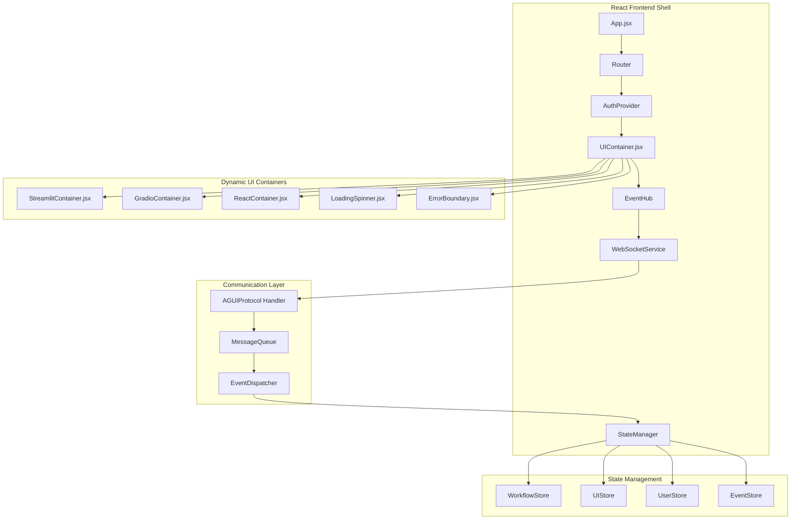

# React Frontend Shell Architecture

## Overview

The React Frontend Shell serves as the host container for dynamically generated user interfaces in GUI-LOP. It provides a seamless integration layer between AI agents and various UI frameworks (Streamlit, Gradio, React), enabling agents to create and manage user interfaces programmatically.

## Architecture Goals

1. **Containerization**: Provide a standardized container for any dynamically generated UI
2. **Seamless Integration**: Invisible integration between shell and generated UIs
3. **Real-time Communication**: Bidirectional communication with backend systems
4. **State Management**: Coordinated state management across shell and UI components
5. **Extensibility**: Support for multiple UI frameworks and custom components

## High-Level Architecture



## Core Components

### 1. App.jsx (Root Component)
**Technology:** React 18+, TypeScript, React Router v6

**Purpose:** Root application component that orchestrates the entire frontend

**Key Features:**
- Application initialization and configuration
- Route management and navigation
- Global providers setup
- Error boundary for entire application
- Theme and internationalization setup

**Implementation:**

```typescript
// src/App.tsx
import React from 'react';
import { BrowserRouter as Router, Routes, Route } from 'react-router-dom';
import { ThemeProvider, createTheme } from '@mui/material';
import { Provider } from 'react-redux';
import { store } from './store';
import { AuthProvider } from './contexts/AuthContext';
import { WebSocketProvider } from './contexts/WebSocketContext';
import { ErrorBoundary } from './components/ErrorBoundary';
import { UIContainer } from './components/UIContainer';
import { Header } from './components/Header';
import { Footer } from './components/Footer';

const theme = createTheme({
  // Custom theme configuration
});

const App: React.FC = () => {
  return (
    <ErrorBoundary>
      <Provider store={store}>
        <ThemeProvider theme={theme}>
          <Router>
            <AuthProvider>
              <WebSocketProvider>
                <div className="app">
                  <Header />
                  <main className="main-content">
                    <Routes>
                      <Route path="/" element={<UIContainer />} />
                      <Route path="/workflows/:id" element={<UIContainer />} />
                      <Route path="/ui/:instanceId" element={<UIContainer />} />
                    </Routes>
                  </main>
                  <Footer />
                </div>
              </WebSocketProvider>
            </AuthProvider>
          </Router>
        </ThemeProvider>
      </Provider>
    </ErrorBoundary>
  );
};

export default App;
```

### 2. UIContainer.jsx (Dynamic UI Container)
**Technology:** React, TypeScript, Iframes, Web Components

**Purpose:** Main container that hosts dynamically generated UI components

**Key Features:**
- Dynamic UI loading and unloading
- Iframe management for isolated execution
- Cross-origin communication via postMessage
- Loading state management
- Error handling and recovery

**Implementation:**

```typescript
// src/components/UIContainer.tsx
import React, { useState, useEffect, useRef } from 'react';
import { useSelector, useDispatch } from 'react-redux';
import { useWebSocket } from '../hooks/useWebSocket';
import { LoadingSpinner } from './LoadingSpinner';
import { ErrorBoundary } from './ErrorBoundary';
import { StreamlitContainer } from './StreamlitContainer';
import { GradioContainer } from './GradioContainer';
import { ReactContainer } from './ReactContainer';
import { AGUIMessageType } from '../types/agui-protocol';
import { uiActions } from '../store/slices/uiSlice';

interface UIContainerProps {
  workflowId?: string;
  instanceId?: string;
}

export const UIContainer: React.FC<UIContainerProps> = ({
  workflowId,
  instanceId
}) => {
  const dispatch = useDispatch();
  const { sendMessage, subscribe, unsubscribe } = useWebSocket();
  const [isLoading, setIsLoading] = useState(true);
  const [error, setError] = useState<Error | null>(null);
  const containerRef = useRef<HTMLDivElement>(null);

  const currentUI = useSelector((state: RootState) => state.ui.currentUI);
  const workflowState = useSelector((state: RootState) => state.workflow.current);

  useEffect(() => {
    // Subscribe to AG-UI events
    subscribe(AGUIMessageType.UI_CREATE_RESPONSE, handleUIResponse);
    subscribe(AGUIMessageType.UI_UPDATE_REQUEST, handleUIUpdate);
    subscribe(AGUIMessageType.UI_DESTROY_REQUEST, handleUIDestroy);

    // Request initial UI if workflow is active
    if (workflowState?.id && !currentUI) {
      requestUI(workflowState.id);
    }

    return () => {
      unsubscribe(AGUIMessageType.UI_CREATE_RESPONSE, handleUIResponse);
      unsubscribe(AGUIMessageType.UI_UPDATE_REQUEST, handleUIUpdate);
      unsubscribe(AGUIMessageType.UI_DESTROY_REQUEST, handleUIDestroy);
    };
  }, [workflowState?.id, currentUI]);

  const requestUI = async (workflowId: string) => {
    try {
      setIsLoading(true);
      await sendMessage({
        type: AGUIMessageType.UI_CREATE_REQUEST,
        payload: {
          workflowId,
          uiType: 'streamlit', // Default, can be dynamic
          config: {
            title: 'Dynamic UI',
            theme: 'light'
          }
        }
      });
    } catch (err) {
      setError(err as Error);
      setIsLoading(false);
    }
  };

  const handleUIResponse = (message: AGUIMessage) => {
    if (message.type === AGUIMessageType.UI_CREATE_RESPONSE) {
      dispatch(uiActions.setCurrentUI(message.payload));
      setIsLoading(false);
    }
  };

  const handleUIUpdate = (message: AGUIMessage) => {
    // Handle UI update requests
    dispatch(uiActions.updateUI(message.payload));
  };

  const handleUIDestroy = (message: AGUIMessage) => {
    // Handle UI destruction
    dispatch(uiActions.clearCurrentUI());
  };

  const renderUIContainer = () => {
    if (!currentUI) return null;

    switch (currentUI.type) {
      case 'streamlit':
        return <StreamlitContainer ui={currentUI} />;
      case 'gradio':
        return <GradioContainer ui={currentUI} />;
      case 'react':
        return <ReactContainer ui={currentUI} />;
      default:
        return <div>Unsupported UI type: {currentUI.type}</div>;
    }
  };

  if (isLoading) {
    return <LoadingSpinner />;
  }

  if (error) {
    return (
      <ErrorBoundary>
        <div className="error-container">
          <h2>UI Loading Error</h2>
          <p>{error.message}</p>
          <button onClick={() => window.location.reload()}>
            Retry
          </button>
        </div>
      </ErrorBoundary>
    );
  }

  return (
    <div ref={containerRef} className="ui-container">
      <ErrorBoundary>
        {renderUIContainer()}
      </ErrorBoundary>
    </div>
  );
};
```

### 3. StreamlitContainer.jsx
**Technology:** React, Iframes, TypeScript

**Purpose:** Container for Streamlit-based UIs with secure iframe isolation

**Key Features:**
- Secure iframe sandboxing
- PostMessage communication
- Loading state management
- Responsive iframe sizing
- Error handling

**Implementation:**

```typescript
// src/components/StreamlitContainer.tsx
import React, { useEffect, useRef, useState } from 'react';
import { useSelector, useDispatch } from 'react-redux';
import { UISpecification } from '../types/ui';
import { useWebSocket } from '../hooks/useWebSocket';

interface StreamlitContainerProps {
  ui: UISpecification;
}

export const StreamlitContainer: React.FC<StreamlitContainerProps> = ({ ui }) => {
  const iframeRef = useRef<HTMLIFrameElement>(null);
  const [isLoaded, setIsLoaded] = useState(false);
  const [error, setError] = useState<string | null>(null);
  const { sendMessage } = useWebSocket();
  const dispatch = useDispatch();

  useEffect(() => {
    const iframe = iframeRef.current;
    if (!iframe) return;

    // Handle iframe load events
    const handleLoad = () => {
      setIsLoaded(true);
      setError(null);
    };

    const handleError = () => {
      setError('Failed to load Streamlit UI');
      setIsLoaded(false);
    };

    iframe.addEventListener('load', handleLoad);
    iframe.addEventListener('error', handleError);

    // Set up postMessage listener
    const handleMessage = (event: MessageEvent) => {
      if (event.source !== iframe.contentWindow) return;

      // Verify origin for security
      if (!event.origin.includes(window.location.hostname)) return;

      const { type, payload } = event.data;

      switch (type) {
        case 'streamlit_interaction':
          handleStreamlitInteraction(payload);
          break;
        case 'streamlit_ready':
          handleStreamlitReady(payload);
          break;
        case 'streamlit_error':
          handleStreamlitError(payload);
          break;
      }
    };

    window.addEventListener('message', handleMessage);

    return () => {
      iframe.removeEventListener('load', handleLoad);
      iframe.removeEventListener('error', handleError);
      window.removeEventListener('message', handleMessage);
    };
  }, [ui.url]);

  const handleStreamlitInteraction = (payload: any) => {
    // Forward interaction to backend via WebSocket
    sendMessage({
      type: 'ui.interaction',
      payload: {
        componentId: payload.componentId,
        interaction: payload.interaction,
        data: payload.data,
        timestamp: new Date().toISOString()
      }
    });
  };

  const handleStreamlitReady = (payload: any) => {
    // Handle Streamlit app ready state
    console.log('Streamlit app ready:', payload);
  };

  const handleStreamlitError = (payload: any) => {
    // Handle Streamlit app errors
    setError(payload.error);
    setIsLoaded(false);
  };

  const iframeStyle: React.CSSProperties = {
    width: '100%',
    height: '600px',
    border: 'none',
    borderRadius: '8px',
    boxShadow: '0 2px 8px rgba(0,0,0,0.1)',
    display: isLoaded ? 'block' : 'none'
  };

  if (error) {
    return (
      <div className="streamlit-error">
        <h3>Streamlit Error</h3>
        <p>{error}</p>
        <button onClick={() => window.location.reload()}>
          Reload UI
        </button>
      </div>
    );
  }

  return (
    <div className="streamlit-container">
      {!isLoaded && (
        <div className="loading-placeholder">
          <div className="loading-spinner" />
          <p>Loading Streamlit interface...</p>
        </div>
      )}
      <iframe
        ref={iframeRef}
        src={ui.url}
        style={iframeStyle}
        sandbox="allow-scripts allow-same-origin allow-forms allow-popups allow-popups-to-escape-sandbox"
        title="Streamlit UI"
        allow="camera *; microphone *; geolocation *"
      />
    </div>
  );
};
```

### 4. EventHub (Central Event Coordinator)
**Technology:** React Context, Event Emitter, TypeScript

**Purpose:** Central event coordination and management system

**Key Features:**
- Event subscription and broadcasting
- Event deduplication and batching
- Event persistence and replay
- Error handling and recovery
- Performance monitoring

**Implementation:**

```typescript
// src/events/EventHub.tsx
import React, { createContext, useContext, useEffect, useRef } from 'react';
import { EventEmitter } from 'events';
import { AGUIMessage } from '../types/agui-protocol';

interface EventHubContextType {
  subscribe: (eventType: string, handler: (data: any) => void) => () => void;
  publish: (eventType: string, data: any) => void;
  unsubscribe: (eventType: string, handler: (data: any) => void) => void;
  getEventHistory: (eventType?: string) => AGUIMessage[];
}

const EventHubContext = createContext<EventHubContextType | null>(null);

export const useEventHub = () => {
  const context = useContext(EventHubContext);
  if (!context) {
    throw new Error('useEventHub must be used within an EventHubProvider');
  }
  return context;
};

interface EventHubProviderProps {
  children: React.ReactNode;
}

export const EventHubProvider: React.FC<EventHubProviderProps> = ({ children }) => {
  const eventEmitterRef = useRef<EventEmitter>(new EventEmitter());
  const eventHistoryRef = useRef<AGUIMessage[]>([]);
  const subscribersRef = useRef<Map<string, Set<Function>>>(new Map());

  const subscribe = (eventType: string, handler: (data: any) => void) => {
    if (!subscribersRef.current.has(eventType)) {
      subscribersRef.current.set(eventType, new Set());
    }
    subscribersRef.current.get(eventType)!.add(handler);

    eventEmitterRef.current.on(eventType, handler);

    // Return unsubscribe function
    return () => {
      eventEmitterRef.current.off(eventType, handler);
      subscribersRef.current.get(eventType)?.delete(handler);
    };
  };

  const publish = (eventType: string, data: any) => {
    // Add to history
    const event: AGUIMessage = {
      id: generateId(),
      timestamp: new Date().toISOString(),
      type: eventType as any,
      source: 'ui' as any,
      sessionId: getCurrentSessionId(),
      payload: data,
      metadata: {
        version: '1.0.0',
        priority: 'normal',
        retryCount: 0,
        timeout: 5000
      }
    };

    eventHistoryRef.current.push(event);

    // Emit event
    eventEmitterRef.current.emit(eventType, data);

    // Clean up old events (keep last 1000)
    if (eventHistoryRef.current.length > 1000) {
      eventHistoryRef.current = eventHistoryRef.current.slice(-1000);
    }
  };

  const unsubscribe = (eventType: string, handler: (data: any) => void) => {
    eventEmitterRef.current.off(eventType, handler);
    subscribersRef.current.get(eventType)?.delete(handler);
  };

  const getEventHistory = (eventType?: string) => {
    if (eventType) {
      return eventHistoryRef.current.filter(event => event.type === eventType);
    }
    return [...eventHistoryRef.current];
  };

  return (
    <EventHubContext.Provider
      value={{
        subscribe,
        publish,
        unsubscribe,
        getEventHistory
      }}
    >
      {children}
    </EventHubContext.Provider>
  );
};
```

### 5. WebSocket Service
**Technology:** WebSocket, RxJS, TypeScript

**Purpose:** Real-time communication service with connection management

**Key Features:**
- WebSocket connection management
- Automatic reconnection
- Message queuing
- Connection state monitoring
- Performance metrics

**Implementation:**

```typescript
// src/services/WebSocketService.ts
import { BehaviorSubject, Observable, Subject, timer } from 'rxjs';
import { retry, takeUntil, filter, tap } from 'rxjs/operators';
import { AGUIMessage } from '../types/agui-protocol';

export class WebSocketService {
  private socket: WebSocket | null = null;
  private connectionState$ = new BehaviorSubject<'disconnected' | 'connecting' | 'connected'>('disconnected');
  private messageQueue: AGUIMessage[] = [];
  private messageSubject$ = new Subject<AGUIMessage>();
  private destroy$ = new Subject<void>();
  private reconnectAttempts = 0;
  private maxReconnectAttempts = 5;
  private reconnectDelay = 1000;

  constructor(private url: string) {
    this.connect();
  }

  connect() {
    if (this.socket?.readyState === WebSocket.OPEN) return;

    this.connectionState$.next('connecting');

    try {
      this.socket = new WebSocket(this.url);

      this.socket.onopen = () => {
        console.log('WebSocket connected');
        this.connectionState$.next('connected');
        this.reconnectAttempts = 0;
        this.flushMessageQueue();
      };

      this.socket.onmessage = (event) => {
        try {
          const message: AGUIMessage = JSON.parse(event.data);
          this.messageSubject$.next(message);
        } catch (error) {
          console.error('Failed to parse WebSocket message:', error);
        }
      };

      this.socket.onclose = () => {
        console.log('WebSocket disconnected');
        this.connectionState$.next('disconnected');
        this.attemptReconnect();
      };

      this.socket.onerror = (error) => {
        console.error('WebSocket error:', error);
        this.connectionState$.next('disconnected');
      };

    } catch (error) {
      console.error('Failed to create WebSocket connection:', error);
      this.connectionState$.next('disconnected');
      this.attemptReconnect();
    }
  }

  private attemptReconnect() {
    if (this.reconnectAttempts >= this.maxReconnectAttempts) {
      console.error('Max reconnect attempts reached');
      return;
    }

    this.reconnectAttempts++;
    const delay = this.reconnectDelay * Math.pow(2, this.reconnectAttempts - 1);

    console.log(`Attempting to reconnect in ${delay}ms (attempt ${this.reconnectAttempts})`);

    timer(delay).pipe(
      takeUntil(this.destroy$)
    ).subscribe(() => {
      this.connect();
    });
  }

  sendMessage(message: AGUIMessage): Promise<void> {
    return new Promise((resolve, reject) => {
      if (this.socket?.readyState === WebSocket.OPEN) {
        this.socket.send(JSON.stringify(message));
        resolve();
      } else {
        this.messageQueue.push(message);
        // Reject after timeout
        setTimeout(() => {
          reject(new Error('WebSocket not connected'));
        }, 5000);
      }
    });
  }

  private flushMessageQueue() {
    if (this.socket?.readyState !== WebSocket.OPEN) return;

    const messages = [...this.messageQueue];
    this.messageQueue = [];

    messages.forEach(message => {
      try {
        this.socket!.send(JSON.stringify(message));
      } catch (error) {
        console.error('Failed to send queued message:', error);
      }
    });
  }

  get connectionState$(): Observable<'disconnected' | 'connecting' | 'connected'> {
    return this.connectionState$.asObservable();
  }

  get messages$(): Observable<AGUIMessage> {
    return this.messageSubject$.asObservable();
  }

  disconnect() {
    this.destroy$.next();
    this.destroy$.complete();
    if (this.socket) {
      this.socket.close();
      this.socket = null;
    }
  }
}
```

## State Management Architecture

### Redux Store Structure

```typescript
// src/store/index.ts
import { configureStore, ThunkAction, Action } from '@reduxjs/toolkit';
import workflowSlice from './slices/workflowSlice';
import uiSlice from './slices/uiSlice';
import userSlice from './slices/userSlice';
import eventSlice from './slices/eventSlice';

export const store = configureStore({
  reducer: {
    workflow: workflowSlice,
    ui: uiSlice,
    user: userSlice,
    events: eventSlice,
  },
  middleware: (getDefaultMiddleware) =>
    getDefaultMiddleware({
      serializableCheck: {
        ignoredActions: ['persist/PERSIST', 'persist/REHYDRATE'],
      },
    }),
});

export type RootState = ReturnType<typeof store.getState>;
export type AppDispatch = typeof store.dispatch;
export type AppThunk<ReturnType = void> = ThunkAction<
  ReturnType,
  RootState,
  unknown,
  Action<string>
>;

// src/store/slices/uiSlice.ts
import { createSlice, PayloadAction } from '@reduxjs/toolkit';
import { UISpecification } from '../../types/ui';

interface UIState {
  currentUI: UISpecification | null;
  loading: boolean;
  error: string | null;
  instances: Record<string, UISpecification>;
  theme: 'light' | 'dark';
}

const initialState: UIState = {
  currentUI: null,
  loading: false,
  error: null,
  instances: {},
  theme: 'light',
};

const uiSlice = createSlice({
  name: 'ui',
  initialState,
  reducers: {
    setCurrentUI: (state, action: PayloadAction<UISpecification>) => {
      state.currentUI = action.payload;
      state.instances[action.payload.id] = action.payload;
      state.loading = false;
      state.error = null;
    },
    updateUI: (state, action: PayloadAction<Partial<UISpecification>>) => {
      if (state.currentUI) {
        state.currentUI = { ...state.currentUI, ...action.payload };
        state.instances[state.currentUI.id] = state.currentUI;
      }
    },
    clearCurrentUI: (state) => {
      state.currentUI = null;
      state.loading = false;
    },
    setLoading: (state, action: PayloadAction<boolean>) => {
      state.loading = action.payload;
    },
    setError: (state, action: PayloadAction<string | null>) => {
      state.error = action.payload;
      state.loading = false;
    },
    setTheme: (state, action: PayloadAction<'light' | 'dark'>) => {
      state.theme = action.payload;
    },
  },
});

export const { actions: uiActions, reducer: uiReducer } = uiSlice;
```

## Performance Optimization

### 1. Code Splitting
```typescript
// Dynamic imports for heavy components
const StreamlitContainer = React.lazy(() => import('./StreamlitContainer'));
const GradioContainer = React.lazy(() => import('./GradioContainer'));
const ReactContainer = React.lazy(() => import('./ReactContainer'));
```

### 2. Virtualization
```typescript
// For large lists or data-heavy components
import { FixedSizeList as List } from 'react-window';

const VirtualizedList: React.FC<{ items: any[] }> = ({ items }) => (
  <List
    height={600}
    itemCount={items.length}
    itemSize={50}
    width="100%"
  >
    {({ index, style }) => (
      <div style={style}>
        {items[index]}
      </div>
    )}
  </List>
);
```

### 3. Memoization
```typescript
// Use React.memo and useMemo for expensive operations
const ExpensiveComponent = React.memo(({ data }) => {
  const processedData = useMemo(() => {
    return heavyProcessing(data);
  }, [data]);

  return <div>{processedData}</div>;
});
```

## Security Considerations

### 1. Iframe Sandboxing
```typescript
// Secure iframe configuration
const iframeConfig = {
  sandbox: 'allow-scripts allow-same-origin allow-forms allow-popups allow-popups-to-escape-sandbox',
  allow: 'camera *; microphone *; geolocation *',
  referrerPolicy: 'strict-origin-when-cross-origin'
};
```

### 2. Content Security Policy
```typescript
// CSP headers for security
const cspHeaders = {
  'Content-Security-Policy': [
    "default-src 'self'",
    "script-src 'self' 'unsafe-inline' 'unsafe-eval'",
    "style-src 'self' 'unsafe-inline'",
    "img-src 'self' data: https:",
    "connect-src 'self' wss:",
    "frame-src 'self' https:",
    "form-action 'self'"
  ].join('; ')
};
```

### 3. Input Validation
```typescript
// Validate all external inputs
const validateMessage = (message: any): message is AGUIMessage => {
  return (
    typeof message === 'object' &&
    typeof message.id === 'string' &&
    typeof message.type === 'string' &&
    typeof message.payload === 'object'
  );
};
```

## Testing Strategy

### Unit Tests
```typescript
// UIContainer.test.tsx
import { render, screen, waitFor } from '@testing-library/react';
import { UIContainer } from './UIContainer';
import { Provider } from 'react-redux';
import { store } from '../store';

test('renders loading spinner when loading', () => {
  render(
    <Provider store={store}>
      <UIContainer />
    </Provider>
  );

  expect(screen.getByTestId('loading-spinner')).toBeInTheDocument();
});

test('handles UI errors gracefully', async () => {
  render(
    <Provider store={store}>
      <UIContainer />
    </Provider>
  );

  // Simulate error
  await waitFor(() => {
    expect(screen.getByText('UI Loading Error')).toBeInTheDocument();
  });
});
```

### Integration Tests
```typescript
// WebSocketService.test.ts
import { WebSocketService } from './WebSocketService';

test('connects to WebSocket and sends messages', async () => {
  const service = new WebSocketService('ws://localhost:3000');

  // Mock WebSocket
  const mockSend = jest.fn();
  (global as any).WebSocket = jest.fn(() => ({
    send: mockSend,
    readyState: WebSocket.OPEN,
    addEventListener: jest.fn(),
    removeEventListener: jest.fn()
  }));

  const message = { type: 'test', payload: { data: 'test' } };
  await service.sendMessage(message);

  expect(mockSend).toHaveBeenCalledWith(JSON.stringify(message));
});
```

## Deployment Considerations

### 1. Build Configuration
```typescript
// vite.config.ts
import { defineConfig } from 'vite';
import react from '@vitejs/plugin-react';
import { resolve } from 'path';

export default defineConfig({
  plugins: [react()],
  build: {
    outDir: 'dist',
    sourcemap: true,
    rollupOptions: {
      output: {
        manualChunks: {
          vendor: ['react', 'react-dom'],
          ui: ['./src/components/UIContainer'],
          utils: ['./src/utils']
        }
      }
    }
  },
  server: {
    port: 3000,
    proxy: {
      '/api': 'http://localhost:8000',
      '/ws': {
        target: 'ws://localhost:8000',
        ws: true
      }
    }
  }
});
```

### 2. Docker Configuration
```dockerfile
# Dockerfile
FROM node:18-alpine as builder

WORKDIR /app
COPY package*.json ./
RUN npm ci

COPY . .
RUN npm run build

FROM nginx:alpine
COPY --from=builder /app/dist /usr/share/nginx/html
COPY nginx.conf /etc/nginx/nginx.conf

EXPOSE 80
CMD ["nginx", "-g", "daemon off;"]
```

---

This React Frontend Shell architecture provides a robust, scalable, and secure foundation for hosting dynamically generated UIs. It emphasizes modularity, performance, and maintainability while ensuring seamless integration with the broader GUI-LOP system.