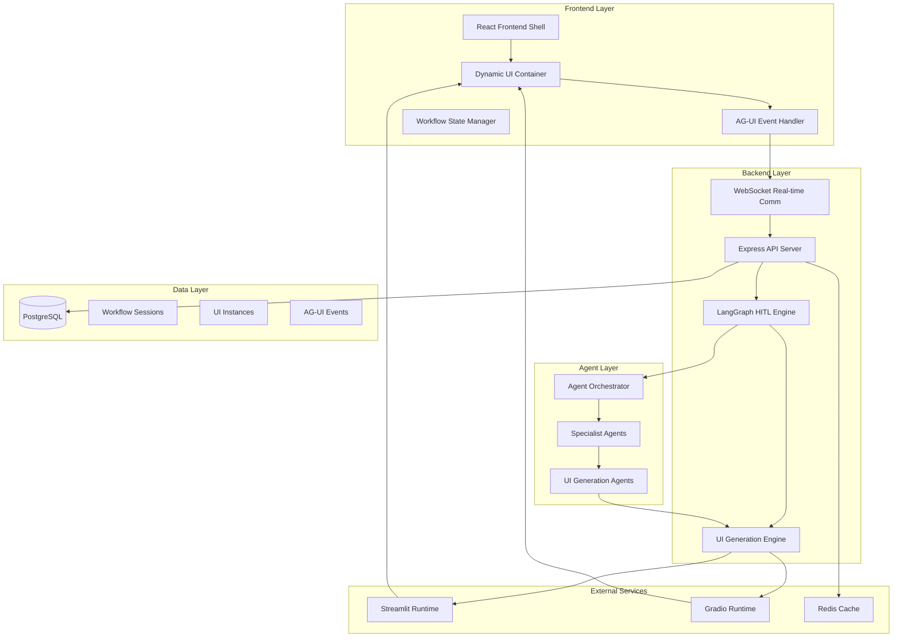
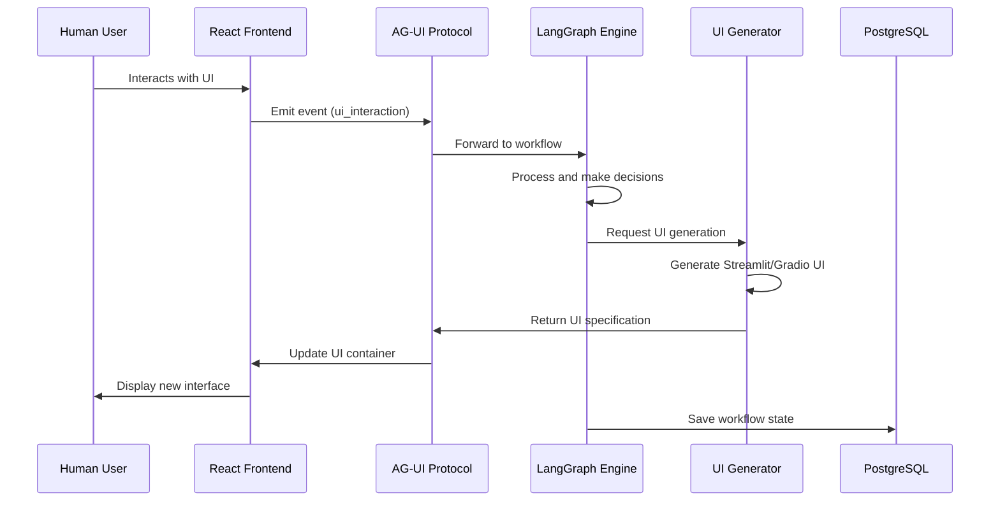
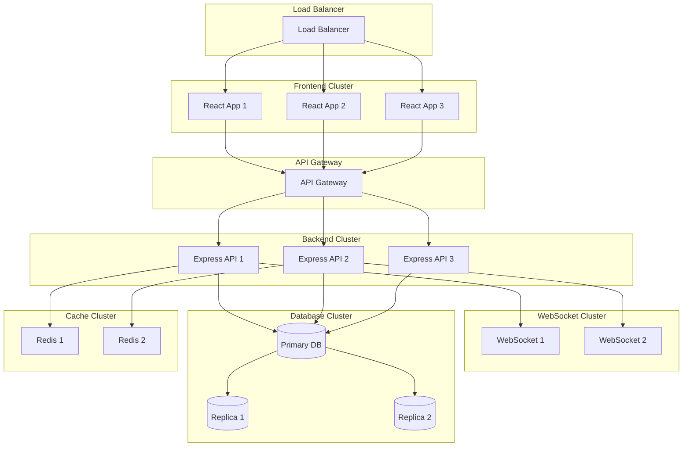

# GUI-LOP System Architecture Overview

## Vision Statement

GUI-LOP inverts the traditional human-computer interaction paradigm: instead of humans using static UIs to interact with agents, GUI-LOP enables agents to dynamically generate their own user interfaces for richer collaboration with human partners.

## Architecture Philosophy

**Core Principles:**
1. **Agent-First Design**: Agents are the primary drivers of interface generation
2. **Dynamic UI Generation**: Interfaces are created programmatically based on context and workflow needs
3. **Human-in-the-Loop (HITL)**: Human collaboration is integrated seamlessly at decision points
4. **Event-Driven Communication**: All interactions follow standardized AG-UI protocol
5. **Modular Extensibility**: Each component can be extended or replaced independently

## High-Level System Architecture

## Core Components

### 1. React Frontend Shell
- **Purpose**: Host container for dynamically generated UIs
- **Key Features**:
  - Iframe/container integration for Streamlit/Gradio apps
  - AG-UI event handling and routing
  - Workflow state management
  - Real-time communication via WebSocket

### 2. LangGraph HITL Engine
- **Purpose**: Orchestrate human-in-the-loop workflows
- **Key Features**:
  - State graph with interrupt points
  - Collaborative checkpoints
  - Pause and resume capabilities
  - Agent coordination

### 3. UI Generation Engine
- **Purpose**: Dynamically create interfaces based on agent needs
- **Key Features**:
  - Streamlit/Gradio script generation
  - Template-based UI creation
  - Interactive component generation
  - Real-time UI updates

### 4. AG-UI Protocol
- **Purpose**: Standardized communication between agents and UIs
- **Key Features**:
  - Event-driven messaging
  - Type-safe contracts
  - Real-time synchronization
  - Error handling and recovery

### 5. Express API Backend
- **Purpose**: RESTful services and real-time communication
- **Key Features**:
  - AG-UI protocol endpoints
  - Workflow management APIs
  - Authentication and authorization
  - File upload/download handling

### 6. PostgreSQL Database
- **Purpose**: Persistent storage for workflow state and UI instances
- **Key Features**:
  - Workflow session management
  - UI instance tracking
  - Event logging and auditing
  - User interaction history

## Data Flow Architecture

## Key Architectural Patterns

### 1. Event-Driven Architecture
- All components communicate through events
- Loose coupling between services
- Asynchronous processing for scalability
- Event sourcing for audit trails

### 2. Microservices Architecture
- Each core component is independently deployable
- Service boundaries align with business capabilities
- API Gateway for external access
- Service mesh for internal communication

### 3. Hexagonal Architecture
- Core business logic isolated from external concerns
- Dependency inversion for testability
- Adapters for external integrations
- Ports for defined interfaces

### 4. CQRS (Command Query Responsibility Segregation)
- Separate models for commands and queries
- Optimized read and write operations
- Eventual consistency where acceptable
- Complex business logic handling

## Non-Functional Requirements

### Performance
- **UI Generation Time**: < 2 seconds for simple interfaces
- **Response Time**: < 100ms for API calls
- **Throughput**: 1000+ concurrent workflows
- **Latency**: < 50ms for WebSocket communication

### Scalability
- **Horizontal Scaling**: Stateless services scale independently
- **Database Sharding**: Workflow sessions distributed across shards
- **Caching**: Redis for frequently accessed data
- **Load Balancing**: Multiple instances with auto-scaling

### Security
- **Authentication**: JWT-based with refresh tokens
- **Authorization**: Role-based access control
- **Data Encryption**: End-to-end encryption for sensitive data
- **UI Sandboxing**: Isolated execution of generated UIs

### Reliability
- **High Availability**: 99.9% uptime target
- **Fault Tolerance**: Graceful degradation
- **Disaster Recovery**: Automated backups and failover
- **Monitoring**: Comprehensive health checks and metrics

### Maintainability
- **Code Organization**: Modular structure with clear boundaries
- **Testing**: Comprehensive test coverage (85%+)
- **Documentation**: Living documentation with code examples
- **CI/CD**: Automated testing and deployment pipelines

## Technology Stack Justification

### Frontend (React)
- **Why React**: Component-based architecture aligns with dynamic UI generation
- **Benefits**: Large ecosystem, strong typing with TypeScript, excellent performance
- **Alternatives Considered**: Vue.js, Angular (React chosen for flexibility)

### Backend (Node.js/Express)
- **Why Node.js**: Event-driven architecture suits real-time communication
- **Benefits**: JavaScript across stack, excellent package ecosystem, fast execution
- **Alternatives Considered**: Python/FastAPI, Go (Node.js chosen for ecosystem)

### Workflow Engine (LangGraph)
- **Why LangGraph**: Purpose-built for agent workflows with interrupt points
- **Benefits**: State management, checkpointing, agent coordination
- **Alternatives Considered: Temporal, custom workflow engine**

### UI Generation (Streamlit/Gradio)
- **Why Both**: Different strengths for different use cases
- **Streamlit**: Rapid prototyping, data visualization
- **Gradio**: Machine learning interfaces, interactive demos
- **Benefits**: Python-based, quick generation, rich components

### Database (PostgreSQL)
- **Why PostgreSQL**: Reliability, advanced features, JSON support
- **Benefits**: ACID compliance, scalability, strong typing
- **Alternatives Considered**: MongoDB (PostgreSQL chosen for consistency)

## Integration Patterns

### 1. API Gateway Pattern
- Single entry point for all client requests
- Request routing, rate limiting, authentication
- Protocol translation (HTTP to WebSocket)

### 2. Saga Pattern
- Distributed transaction management across services
- Compensating transactions for rollback
- Event choreography for coordination

### 3. Circuit Breaker Pattern
- Fault tolerance for external service calls
- Graceful degradation when services fail
- Automatic recovery and health checking

### 4. Event Sourcing Pattern
- All state changes captured as events
- Complete audit trail and debugging
- Time travel and replay capabilities

## Deployment Architecture

## Monitoring and Observability

### Key Metrics
- **UI Generation Success Rate**: > 95%
- **Workflow Completion Rate**: > 90%
- **Response Times**: 50th, 95th, 99th percentiles
- **Error Rates**: By service and error type
- **Resource Utilization**: CPU, memory, disk, network

### Logging Strategy
- **Structured Logging**: JSON format with correlation IDs
- **Log Levels**: ERROR, WARN, INFO, DEBUG
- **Log Aggregation**: Centralized logging with Elasticsearch
- **Log Retention**: 30 days for INFO, 1 year for ERROR

### Tracing
- **Distributed Tracing**: Jaeger for request tracing
- **Span Context**: Propagated across service boundaries
- **Performance Analysis**: Identify bottlenecks
- **Error Correlation**: Connect errors to root causes

## Next Steps

1. **Detailed Component Design**: Deep dive into each core component
2. **API Specification**: Define all REST and WebSocket APIs
3. **Database Schema**: Detailed table and relationship design
4. **Security Architecture**: Authentication, authorization, and encryption
5. **Testing Strategy**: Unit, integration, and E2E testing approach
6. **Deployment Pipeline**: CI/CD configuration and infrastructure as code

---

This architecture provides a solid foundation for building GUI-LOP, enabling seamless human-agent collaboration through dynamically generated interfaces. The design prioritizes scalability, maintainability, and performance while keeping the core vision of agent-driven UI generation at the forefront.